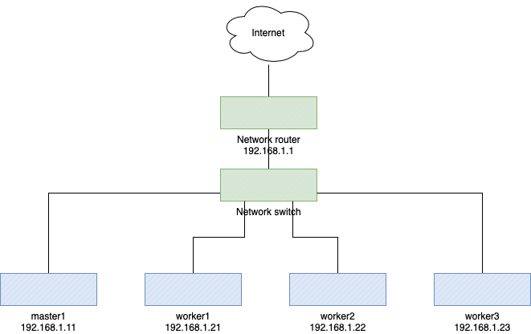
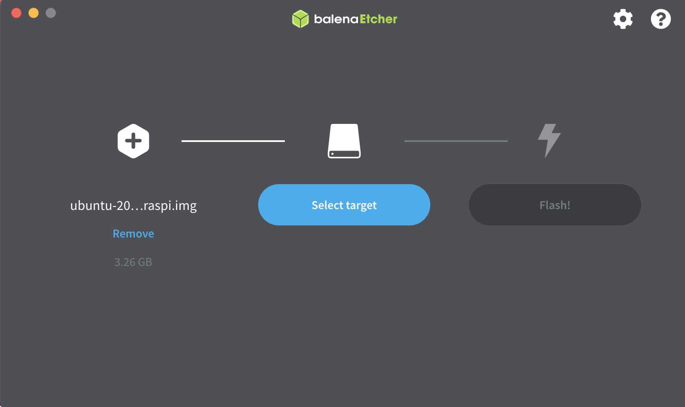

## Introducion

With following steps, you will be able to get a Kubernetes Cluster.

Creating a Kubernetes Cluster at your own hand would help you understanding how it works without keep paying to a cloud services. This article is for creating a K3s Cluster on a Raspberry Pi 4B.  
With managed services, the Master Node is not visible (which makes it difficult to understand), so would be easier to understand, if it is physically visible.

*It is recommended to read other articles to understand the basics of Kubernetes itself, Pod, Deployment, StatefulSet, Namespace, CNI, etc. Finally, you need to know those words, if you want to understand Kubernetes as a Cluster.*

## Purpose
Selected K3s because we wanted to reduce the learning cost as much as possible. You don't need worry about installing the original Kubernetes and which CNI you should use.
When I started to learn Kubernetes, I followed step by step and installed Kubernetes manually, but I strongly suggest you to learn with below steps, if you want to learn Kubernetes as a cluster. If you are ok to use as a single node, Minikube or Docker for Desktop would be enough.

## 1. Prerequisites

- Internet access environment
- Knowledge of Linux using CLI commands

## 2. Prepare the Environment
### Hardwaare
- Raspberry Pi 4B 4GB Memory 4 units (you can install K3s to 3B/3B+, but not work very well.)
- One set of keyboard, mouse and display is enough
- Wired LAN or Wireless LAN
- MAC or Windows (Host for OS image creation and Host for SSH access)

### Software
- OS: [Ubuntu Server 20.04.2 LTS 64 bits](https://ubuntu.com/download/raspberry-pi)
- OS Image Creation Tool: [balenaEthcher](https://www.balena.io/etcher)
- K3s: [v1.20.6+k3s1](https://k3s.io)  
OK to install native Kubernetes, but using K3s would be the best for learning without spending lots of time to dealing with details like what kind of CNI that you want to use, etc.

### Configuration diagram
If you want to understand cluster operations including failure happened, one master and three workers would be nice. Of course, one master and one worker would be enough to understand the functionality.




## 3. Preparations
### Create OS image
- Prepare SD cards as much as you need
- Download and run balenaEtcher on MAC or Windows for OS image creation
- From the left, specify the OS image, specify the drive (SD card), and click the Run button



### Boot and OS Setup
- Insert the SD card into the Raspberry Pi and start it up  
*There is also a way to specify the network settings in advance, but in this case, specified them after the OS was booted.*

- Initial login

```shell:Initial login
Username: ubuntu
Password: ubuntu #Prompted to change it after logging in
```

- Modify the network configuration file

```shell:cloud-init.yaml
sudo cp /etc/netplan/50-cloud-init.yaml /etc/netplan/99-cloud-init.yaml # Copy the file
sudo vi /etc/netplan/99-cloud-init.yaml
```
- Modify 99-cloud-init.yaml

```shell:Example of modification
# to it will not persist across an instance reboot.  To disable cloud-init's
# network configuration capabilities, write a file
# /etc/cloud/cloud.cfg.d/99-disable-network-config.cfg with the following:
# network: {config: disabled}
network:
    version: 2
    ethernets: # Wired LAN Settings
        eth0:
            dhcp4: false           # Provide a static IP
            addresses:             #
            - 192.168.1.11/24       # Provide the IP address
            gateway4: 192.168.1.1  # Default gateway for IPv4
            nameservers:           # DNS server specification
                addresses:         #
                - 192.168.1.1      # Provide the IP address for DNS server
    wifis: # Wireless LAN Settings
        wlan0:
            dhcp4: true # For static IP, set to false
            optional: true
            access-points:
              <yourssid>: # Provide the SSID in the <youssid> field, followed by a colon and a new line
                password: “<yourpassword>” # Enclose the password in double quotes

```

- Run netplan apply

```shell:Apply network configuration changes
sudo netplan apply # Apply configuration changes
```

- Keyboard settings

```shell:Keyboard settings
sudo dpkg-reconfigure keyboard-configuration
```

- Check other settings

```shell:Check other settings
sudo ufw status
Status: inactive # If it is active, sort out the communication requirements of k3s and set it appropriately
```
## 4. K3s Installation
Preparations of the foundation has been completed, but the installation is almost completed.

### Setting K3s Running Conditions
- Add control group settings  
Put `"cgroup_memory=1 cgroup_enable=memory"` in `/boot/firmware/cmdline.txt` with **one line without line break**.  
Reboot after added the settings.

```shell:Add control group settings
sudo vi /boot/firmware/cmdline.txt # In the error result, it is /boot/cmdline.txt, but in this environment, it is as follows
net.ifnames=0 dwc_otg.lpm_enable=0 console=serial0,115200 console=tty1 root=LABEL=writable rootfstype=ext4 elevator=deadline rootwait fixrtc cgroup_memory=1 cgroup_enable=memory
```

*If installing K3s without the above settings, K3s Server will not start. If booting it manually, an error will be occurred. However, there is no file named `/boot/cmdline.txt`.To be correct, in Ubuntu 20.04.2 LTS, the path is `/boot/firemware/cmdline.txt`.*  
*If running the installation script before this configuration, no error will be displayed.The following is the error that will be displayed when running explicitly.*

```shell:k3s runtime error
sudo k3s server &
# omission (of middle part)
INFO[2021-05-01T09:31:09.012475490Z] Run: k3s kubectl                             
ERRO[2021-05-01T09:31:09.012840509Z] Failed to find memory cgroup, you may need to add "cgroup_memory=1 cgroup_enable=memory" to your linux cmdline (/boot/cmdline.txt on a Raspberry Pi)
FATA[2021-05-01T09:31:09.012916768Z] failed to find memory cgroup, you may need to add "cgroup_memory=1 cgroup_enable=memory" to your linux cmdline (/boot/cmdline.txt on a Raspberry Pi)

```

### K3s Master Node installation
According to the [K3s](https://k3s.io), the procedure is super simple. Run the install command, and wait a moment (30 seconds?),  then use the ```k3s kubectl get node``` to confirm that the node is ready. This is true. Compared to the native K8s, there is no other word for it but awesome.  
But here is what we want to do, so let's proceed with options.

```shell:installation commnad
curl -sfL https://get.k3s.io | sh -s - --write-kubeconfig-mode 644
[INFO]  Finding release for channel stable
[INFO]  Using v1.20.6+k3s1 as release
[INFO]  Downloading hash https://github.com/k3s-io/k3s/releases/download/v1.20.6+k3s1/sha256sum-arm64.txt
[INFO]  Downloading binary https://github.com/k3s-io/k3s/releases/download/v1.20.6+k3s1/k3s-arm64
[INFO]  Verifying binary download
[INFO]  Installing k3s to /usr/local/bin/k3s
[INFO]  Creating /usr/local/bin/kubectl symlink to k3s
[INFO]  Creating /usr/local/bin/crictl symlink to k3s
[INFO]  Creating /usr/local/bin/ctr symlink to k3s
[INFO]  Creating killall script /usr/local/bin/k3s-killall.sh
[INFO]  Creating uninstall script /usr/local/bin/k3s-uninstall.sh
[INFO]  env: Creating environment file /etc/systemd/system/k3s.service.env
[INFO]  systemd: Creating service file /etc/systemd/system/k3s.service
[INFO]  systemd: Enabling k3s unit
Created symlink /etc/systemd/system/multi-user.target.wants/k3s.service → /etc/systemd/system/k3s.service.
[INFO]  systemd: Starting k3s
```

Check the status of the K3s service  
If it looks like the following, it is running correctly.

```shell:Check the status of the K3s service
systemctl status k3s.service
● k3s.service - Lightweight Kubernetes
     Loaded: loaded (/etc/systemd/system/k3s.service; enabled; vendor preset: enabled)
     Active: active (running) since Sun 2021-06-06 07:29:58 UTC; 4min 15s ago
       Docs: https://k3s.io
    Process: 57278 ExecStartPre=/sbin/modprobe br_netfilter (code=exited, status=0/SUCCESS)
    Process: 57279 ExecStartPre=/sbin/modprobe overlay (code=exited, status=0/SUCCESS)
   Main PID: 57280 (k3s-server)
      Tasks: 79
     Memory: 838.1M
     CGroup: /system.slice/k3s.service
             ├─57280 /usr/local/bin/k3s server
             ├─57327 containerd
             ├─57752 /var/lib/rancher/k3s/data/0dcf6a30692cdc1e18883dd61731c3409485860ca27bfade8ecaf05cf64b72d0/bin/con>
             ├─57783 /var/lib/rancher/k3s/data/0dcf6a30692cdc1e18883dd61731c3409485860ca27bfade8ecaf05cf64b72d0/bin/con>
             ├─57792 /pause
             ├─57819 /var/lib/rancher/k3s/data/0dcf6a30692cdc1e18883dd61731c3409485860ca27bfade8ecaf05cf64b72d0/bin/con>
             ├─57851 /pause
             ├─57858 /pause
             ├─57945 local-path-provisioner start --config /etc/config/config.json
             ├─58012 /metrics-server
             └─58019 /coredns -conf /etc/coredns/Corefile

```

Check the status of the Master Node (in K3s, it is called Server Node, but here it is called Master) and that the Pod has been deployed.

```shell:check node status
sudo kubectl get nodes
NAME     STATUS   ROLES                  AGE   VERSION
ubuntu   Ready    control-plane,master   18h   v1.20.6+k3s1
```

```shell:check pods' status
sudo kubectl get pods -A
NAMESPACE     NAME                                      READY   STATUS      RESTARTS   AGE
kube-system   metrics-server-86cbb8457f-vgw9n           1/1     Running     0          18h
kube-system   local-path-provisioner-5ff76fc89d-tjmgp   1/1     Running     0          18h
kube-system   coredns-854c77959c-vqscp                  1/1     Running     0          18h
kube-system   helm-install-traefik-gp4kc                0/1     Completed   0          18h
kube-system   svclb-traefik-wh5s6                       2/2     Running     0          18h
kube-system   traefik-6f9cbd9bd4-zt8pd                  1/1     Running     0          18h
```
Now that you have set up the first Server Node (Master Node). For use with a single unit, this is all you need to do.

## 5. Cluster configuration of K3s<a id="5-cluster-configuration-of-k3s"></a>
Here is the setup for the cluster configuration.
*This procedure is for making the Master Node a redundant configuration.This procedure can be skipped if configuring the Master in a single configuration.*

### Setting up a Cluster configuration with Master and Worker
Set the hostname of each Node with a unique name

```shell:/etc/hostname
sudo vi /etc/hostname
master1
```
Edit the hosts file on each node and configure it to allow communication by hostname

```shell:/etc/hosts
sudo vi /etc/hosts
192.68.1.11 master1
192.168.1.21 agent1
192.168.1.22 agent2
192.168.1.23 agent3
```

Check the node-token of K3s Master Node

```shell:Check node-token
sudo cat /var/lib/rancher/k3s/server/node-token
K10***0f # It is omitted
```
Install K3s agent nodes (Install for 3 Agents)  
*The spell and control group settings required for the Raspberry Pi must be done on all nodes*  
*Host names need to be able to be name resolved between nodes*

```shell:Uninstallaton Agent
curl -sfL https://get.k3s.io | K3S_URL=https://master1:6443 K3S_TOKEN=K10****0f sh -f
```
Check Nodes' status

```
kubectl get nodes -o wide
NAME      STATUS   ROLES                  AGE     VERSION        INTERNAL-IP    EXTERNAL-IP   OS-IMAGE             KERNEL-VERSION     CONTAINER-RUNTIME
worker3   Ready    <none>                 73s     v1.21.1+k3s1   192.168.1.23   <none>        Ubuntu 20.04.2 LTS   5.4.0-1035-raspi   containerd://1.4.4-k3s2
worker1   Ready    <none>                 11m     v1.21.1+k3s1   192.168.1.21   <none>        Ubuntu 20.04.2 LTS   5.4.0-1035-raspi   containerd://1.4.4-k3s2
master1   Ready    control-plane,master   39m     v1.21.1+k3s1   192.168.1.11   <none>        Ubuntu 20.04.2 LTS   5.4.0-1035-raspi   containerd://1.4.4-k3s2
worker2   Ready    <none>                 5m23s   v1.21.1+k3s1   192.168.1.22   <none>        Ubuntu 20.04.2 LTS   5.4.0-1028-raspi   containerd://1.4.4-k3s2
```

##
## Note
How to Uninstall K3s

```shell:K3s uninstallaton command
/usr/local/bin/k3s-uninstall.sh       # For Master Node
/usr/local/bin/k3s-agent-uninstall.sh # For Worker Node
```
## References
[RANCHER's K3s Reference](https://rancher.com/docs/k3s/latest/en/)  
[RANCHER Labs K3s Manual (Japanese)](https://rancher.co.jp/pdfs/K3s-eBook4Styles0507.pdf)
