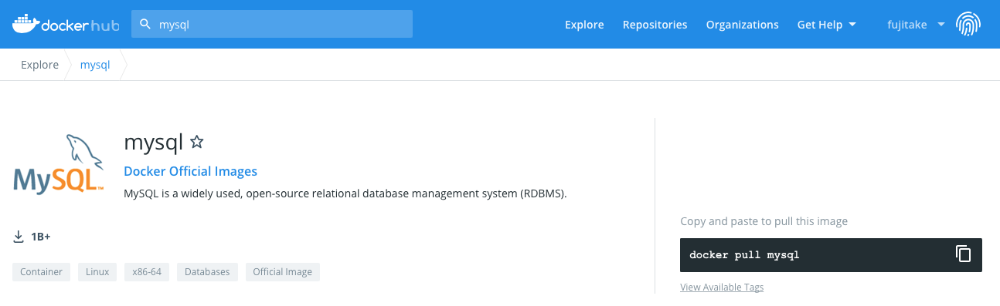
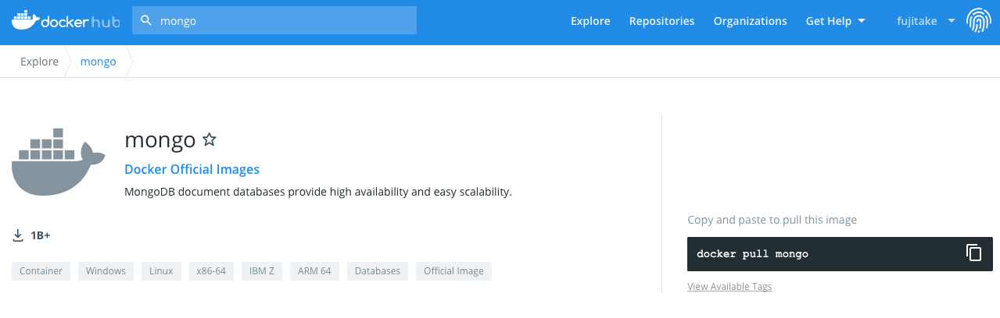
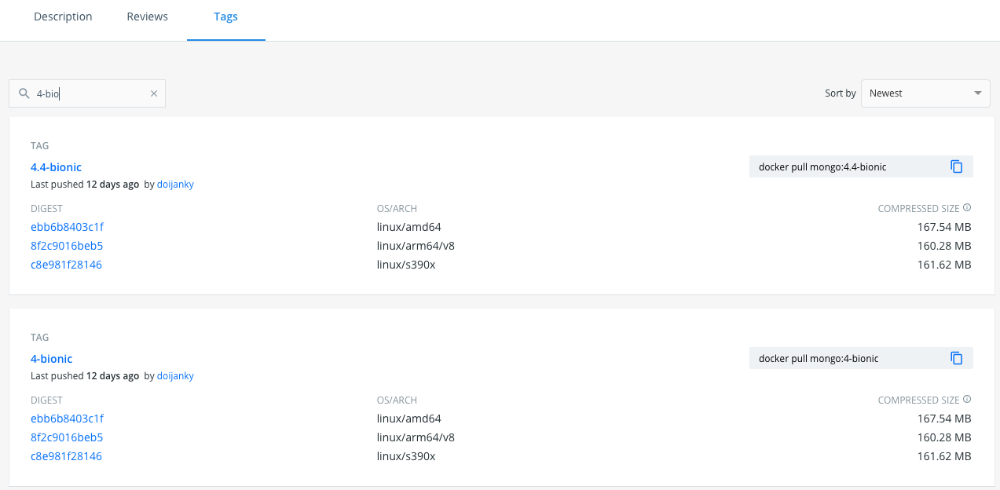
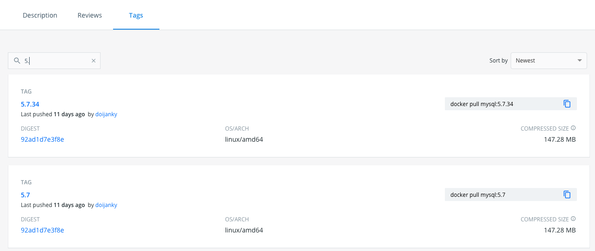
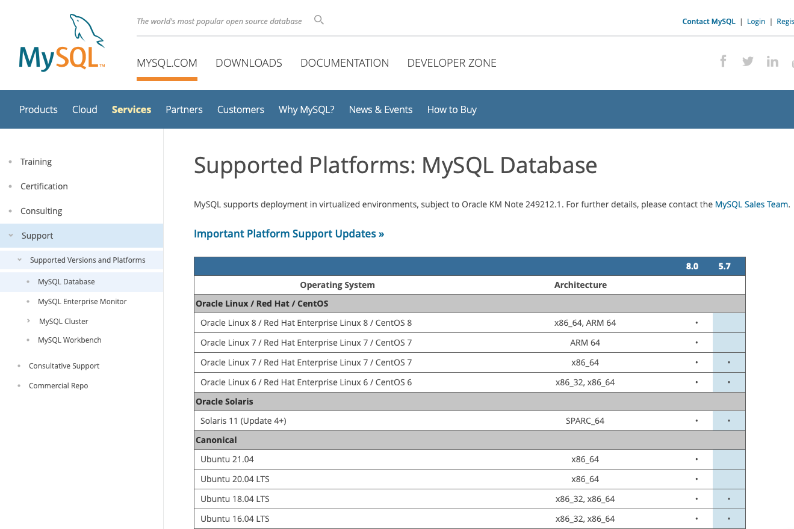
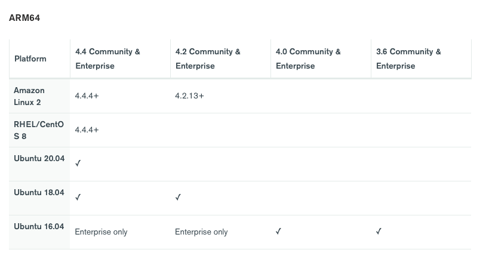
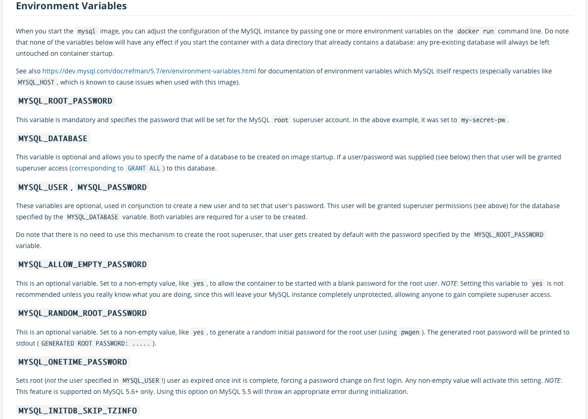
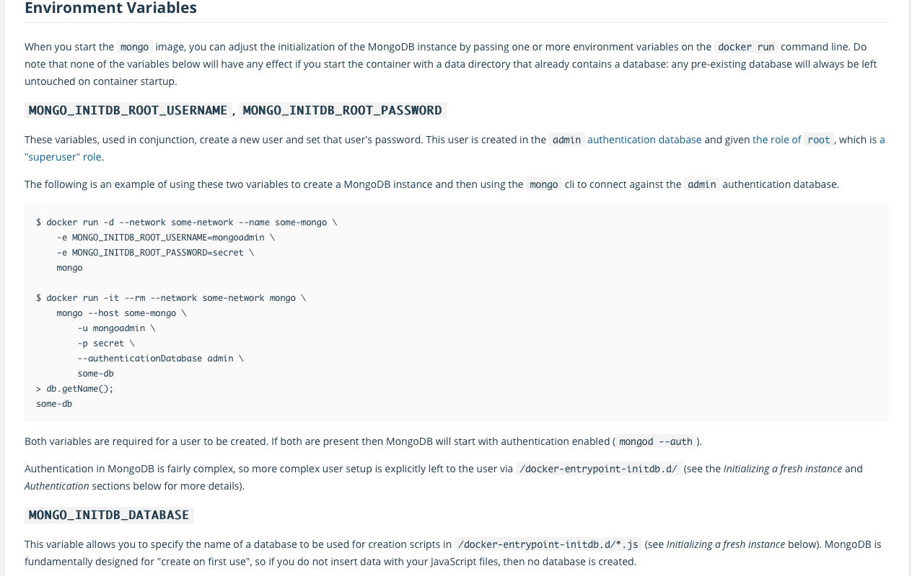

## Introduction
With following these steps, it will be able to start a database pod from a Docker Official Image on ARM64 Kubernetes.

## Purpose
To learn Kubernetes in a practical way, described this article on creating a Pod.

## Prerequisites
The environment I used to write this article is as follows.

- [K3s: v1.20.6+k3s1](https://k3s.io)
- Raspberry Pi 4B 4GB Memory
- Internet access environment
- Knowledge of Linux with CLI only or Guts

### Software
- K3s: [v1.20.6+k3s1](https://k3s.io)  
- MongoDB: 4-bionic (docker.io/mongo:4-bionic)
- This article does not cover the 32-bit Raspbian OS, Windows environment, or Mac environment.

## Organize preliminary confirmation items
### Check the system architecture of the hardware
- Check if the database pod is set up for X86-64 (AMD64) or ARM64  
- AMD64 for Intel and AMD CPUs, ARM64 for the Raspberry Pi
- Pods with system architectures that are not supported by the container image will not be started. It should be careful.

### Check the support status of Official Docker Image
Make sure that the target container image corresponds to the Kubernetes system architecture you have.

When searching for **mysql** in docker hub, it can see that it supports x86-64, but there is no mention of ARM64 support.


Searching for **mongo** in docker hub as well. It will see that it supports both x86-64 and ARM64.


### Check the version of the Database provided
Check the version of the database you want to use by searching for it.

The following is the result of searching for **a specific version of mongo** on docker hub.It can be confirmed that the same version provides images for multiple architectures.


In the similar way, here is the result of searching for **a specific version of mysql** in docker hub.It can be confirmed that only amd64 (x86-64) is found.
This means that it will not work with Kubernetes built on a Raspberry Pi.


### Check the supported versions as defined by the software provider
This step is optional and can be skipped, but it's good to know.

Check the supported platforms, versions and dependencies of the software.
Check the information provided by the software provider about the recommended platform and version to run the software in a production environment. It is easy to find by `supported version mysql` or `suppored platforms mysql`.
Also, none of the following is support information for containerized cases.

[MySQL Supported Platfolrm Information](https://www.mysql.com/support/supportedplatforms/database.html)


[MongoDB Recommended Platform Information/ARM64](https://docs.mongodb.com/manual/administration/production-notes/#std-label-prod-notes-recommended-platforms)


## Preparing and Executing a Deployment
### Check the Environment Variables of each container image
Check the conditions of the environment variables that are passed as initial values when launching the container image. This is an element that is determined when the container image is created, so it needs to be checked every time. Otherwise, it will be necessary to configure it individually after the container (Pod) is started, so it is considered a mandatory check item.
In Docker Official Images, environment variables are described in the following way. It is necessary to check this information each time because the way it is described differs depending on the image description page provided.

Docker Official Images: Description of MySQL environment



Docker Official Images: Description of Mongo environment


### Preparation for Creating a Pod
For the following steps, there is no difference in system architecture.Only the MySQL (x86-64) example is described.
By note, this example is not secure.
Passwords should be used individually with secret for each case, but for illustrative purposes, here is a guide to both using secret and direct writing.
If set as follows, the password for MySQL ROOT will be `rootpass01`. Please change it to suit your needs.

```shell:command
kubectl create secret generic mysql-pass --from-literal=password=rootpass01
```

Prepare yaml for creating a pod.

```yaml:mysql-pod.yaml
apiVersion: v1
kind: Pod
metadata:
  name: watashino-mysql
  labels:
    name: label-mysql
spec:
  containers:
  - name: mysql
    image: mysql:5.7   # If specifying it like this, it will be MySQL 5.7 on docker hub
    env:
    - name: MYSQL_USER       # Specify environment variable directly
      value: user01          # User name
    - name: MYSQL_PASSWORD   # Specify environment variable directly
      value: password01      # Password of the user to be set above
    - name: MYSQL_DATABASE   # Specify environment variable directly
      value: database01      # Database name
    - name: MYSQL_ROOT_PASSWORD # Specifying environment variable using secret
      valueFrom:                #
        secretKeyRef:           # Refer to the secrets
          name: mysql-pass      # Name of secrets
          key: password         # Key of secrets
    ports:
    - name: mysql
      containerPort: 3306    # Port number of the container
      protocol: TCP
    volumeMounts:
    - name: watashino-mysql-storage
      mountPath: /var/lib/mysql
  volumes:
  - name: watashino-mysql-storage
    emptyDir: {}
```

### Deploy and Verify the Pod
Create a Pod using the secret and yaml created above.

```shell:command
kubectl apply -f mysql-pod.yaml
```

Now let's check.

```shell:command
kubectl get pods
NAME                                READY   STATUS      RESTARTS   AGE
watashino-mysql                     1/1     Running     0          3m

```

After the Pod is launched, check its contents.

```shell:command
kubectl exec -it pods/watashino-mysql -- /bin/sh
# mysql -u user01 -h localhost -p
Enter password:
Welcome to the MySQL monitor.  Commands end with ; or \g.
Your MySQL connection id is 188
Server version: 5.7.34 MySQL Community Server (GPL)

Copyright (c) 2000, 2021, Oracle and/or its affiliates.

Oracle is a registered trademark of Oracle Corporation and/or its
affiliates. Other names may be trademarks of their respective
owners.

Type 'help;' or '\h' for help. Type '\c' to clear the current input statement.

mysql> show databases;
+--------------------+
| Database           |
+--------------------+
| information_schema |
| database01         |
+--------------------+
2 rows in set (0.00 sec)

mysql> \q
Bye
#

```


## Note
How to Uninstall Pod

```shell:command
kubectl delete pods/watashino-mysql
```

How to Uninstall Secret

```shell:command
kubectl delete secrets/mysql-pass
```
