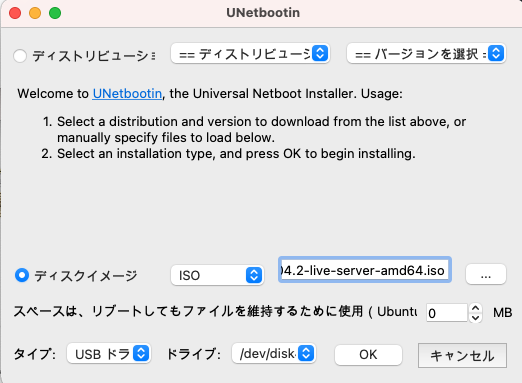

## はじめに
この手順を辿れば、Kubernetes Clusterが完成します。
後半の手順は、他の記事を参照しています。

Kubernetes Clusterを手元で作れば、クラウドのマネージドサービスに費用を払い続けることなく、動作を理解することができるんじゃないかな〜ってことで[Raspberry Pi 4BでK3s Cluster環境を作ってみる](https://github.com/fujitake/k8slearn/blob/main/docs/20210614_configure_k3s_w_rasppi_jp.md)を用意しました。こちらは、ClusterをノートPC作ってみた版(コンテナイメージ的にはX86-64版)となります。

*Kubernetes自体、Pod、Deployment、StatefulSet、Namespace、CNIなど、基本を理解したい場合は、他の記事を読むことをお勧めします。最終的には理解してないとClusterとしての動作がわからんのですが、、、*

## この記事について
学習コストを極力下げるという意図もあり、K3sを使いました。
オリジナルのKubernetesをインストールするとか、CNIは何にしよう、とか面倒なことは省きます。

## 前提条件
- インターネットアクセス環境
- LinuxをCLIのみで触る程度の知識か根性

## 環境を用意
### ハードウェア
- Lenovo E460 Intel Core i5-6200U 2 core/4 thread 16GB Memory  
*今後使う予定のないPCの方が良いと思います*
- 有線LAN
- MACかWindows (OSイメージ作成用とSSHアクセス用のホスト)

### ソフトウェア
- OS: [Ubuntu Server 20.04.2 LTS 64ビット](https://ubuntu.com/download/server)
- OSイメージ作成ツール: [UNetbootin](https://unetbootin.github.io)
- K3s: [v1.20.6+k3s1](https://k3s.io)  
*ネイティブKubernetesをインストールしても良いですが、CNI何にしよう、とか色々考える必要のないK3sが手元で試すKubernetes Clusterとしてはベストだと思います。たぶん。*

## 下準備
### OSイメージ作成
- ノートPCを工場出荷時に戻せるよう、USBリカバリドライブなどを作成  
工場出荷時OS(Windowsなど)に戻すにはUSBリカバリードライブなどが必要なケースが大半です。この手順をスキップしてしまうと、ノートPCを元に戻すために`有償サポートをメーカーに依頼する必要が起きるかもしれません。ご注意の上、ご実施下さい。`
- Ubuntu Serverを上記リンクよりダウンロード
- USBメモリ 2GB以上を用意 (Desktopなどをインストールする場合、2GBでは足りない)
- UNetbootinにて起動可能なUSBメモリを作成  
事前にダウンロードしたOSイメージファイル(ISOファイル)を指定し、USBドライブを指定してOKをクリック
USBドライブは事前にFAT32フォーマットしておくと選択肢に表示される  


### 起動とOSセットアップ
- PC起動時にUEFI/BIOS起動設定で上記にて作成したUSBメモリから起動を選択  
*まだ、戻れます。工場出荷時に戻せますか？*
- インストールステップの各種質問に適宜答え、インストールを完了  
- (必要に応じて)ネットワーク設定ファイルの修正

```shell:cloud-init.yaml
sudo cp /etc/netplan/50-cloud-init.yaml /etc/netplan/99-cloud-init.yaml # ファイルをコピー
sudo vi /etc/netplan/99-cloud-init.yaml
sudo netplan apply # 設定変更の適用
```
- 99-cloud-init.yamlの修正

```shell:修正例
# to it will not persist across an instance reboot.  To disable cloud-init's
# network configuration capabilities, write a file
# /etc/cloud/cloud.cfg.d/99-disable-network-config.cfg with the following:
# network: {config: disabled}
network:
    version: 2
    ethernets: # 有線LANの設定
        eth0:
            dhcp4: true
            optional: true
    wifis: # 無線LANの設定
        wlan0:
            dhcp4: true # 固定IPの場合、falseにする
            optional: true
            access-points:
              <yourssid>: # SSIDを<youssid>の箇所に入力、コロンの後に改行
                password: “<yourpassword>” # パスワードはダブルクオートで囲む

```
- 初期ログイン

```shell:初期ログイン
Username: ubuntu
Password: ubuntu #ログイン後変更を促される
```
- キーボード設定

```shell:キーボード設定
sudo dpkg-reconfigure keyboard-configuration
```
- その他設定の確認

```shell:その他設定の確認
sudo ufw status
Status: inactive # activeになっている場合はk3sの通信要件などを整理し、適切に設定すること
```
## K3sインストール
ここからが本番ですが、準備あらかた終わったとも言える
### K3s Master Nodeインストール 1台目
[K3sのページ](https://k3s.io)では、手順は超シンプル、とガイドされています。インストールコマンド叩いて、ちょっとまって(30秒?)、k3s kubectl get nodeでノードがReadyになったことを確認する、と。これは本当です。ネイティブのK8sと比較すると、すごい、以外の言葉はありません。
が、ここでは、やりたいことがあるので、オプション付きで進めます。

```shell:インストールコマンド
curl -sfL https://get.k3s.io | sh -s - --write-kubeconfig-mode 644
[sudo] password for ubuntu:
[INFO]  Finding release for channel stable
[INFO]  Using v1.20.6+k3s1 as release
[INFO]  Downloading hash https://github.com/k3s-io/k3s/releases/download/v1.20.6+k3s1/sha256sum-amd64.txt
[INFO]  Downloading binary https://github.com/k3s-io/k3s/releases/download/v1.20.6+k3s1/k3s
[INFO]  Verifying binary download
[INFO]  Installing k3s to /usr/local/bin/k3s
[INFO]  Creating /usr/local/bin/kubectl symlink to k3s
[INFO]  Creating /usr/local/bin/crictl symlink to k3s
[INFO]  Creating /usr/local/bin/ctr symlink to k3s
[INFO]  Creating killall script /usr/local/bin/k3s-killall.sh
[INFO]  Creating uninstall script /usr/local/bin/k3s-uninstall.sh
[INFO]  env: Creating environment file /etc/systemd/system/k3s.service.env
[INFO]  systemd: Creating service file /etc/systemd/system/k3s.service
[INFO]  systemd: Enabling k3s unit
Created symlink /etc/systemd/system/multi-user.target.wants/k3s.service → /etc/systemd/system/k3s.service.
[INFO]  systemd: Starting k3s

```
Master Node (K3sでは、Server Nodeと呼称するようですが、ここではMasterと記載します)

```shell:nodeの確認
kubectl get nodes
NAME   STATUS   ROLES                  AGE   VERSION
e460   Ready    control-plane,master   21m   v1.20.6+k3s1
```

```shell:podの状態確認
kubectl get pods -A
NAMESPACE     NAME                                      READY   STATUS      RESTARTS   AGE
kube-system   helm-install-traefik-tw4tp                0/1     Completed   0          21m
kube-system   local-path-provisioner-5ff76fc89d-p5vsf   1/1     Running     0          21m
kube-system   metrics-server-86cbb8457f-k7htz           1/1     Running     0          21m
kube-system   svclb-traefik-7lwf4                       2/2     Running     0          21m
kube-system   coredns-854c77959c-hxm94                  1/1     Running     0          21m
kube-system   traefik-6f9cbd9bd4-4snp5                  1/1     Running     0          21m
```
ここまでで、Server Node (Master Node) 1台目のセットアップはできました。1台で使う場合は以上で終了です。

## K3s Worker Nodeの追加
ここからクラスタ構成にするためのセットアップです。
続きは、[Raspberry Piを使ってKubernetes Clusterを構築した記事](https://github.com/fujitake/k8slearn/blob/main/docs/20210614_configure_k3s_w_rasppi_jp.md#5k3s-%E3%81%AEcluster%E6%A7%8B%E6%88%90%E5%8C%96)をご参照ください。

*上記手順は、Worker Nodeを追加するための手順となります。Masterをシングル構成にて利用する場合、スキップ可能です*

## 備考
K3sのアンインストール方法

```shell:K3sアンインストールコマンド
/usr/local/bin/k3s-uninstall.sh       # Master Node用
/usr/local/bin/k3s-agent-uninstall.sh # Worker Node用
```

## 参考
[RANCHER社のK3sリファレンス(英語)](https://rancher.com/docs/k3s/latest/en/)  
[RANCHER Labs 日本語版K3sマニュアル](https://rancher.co.jp/pdfs/K3s-eBook4Styles0507.pdf)
