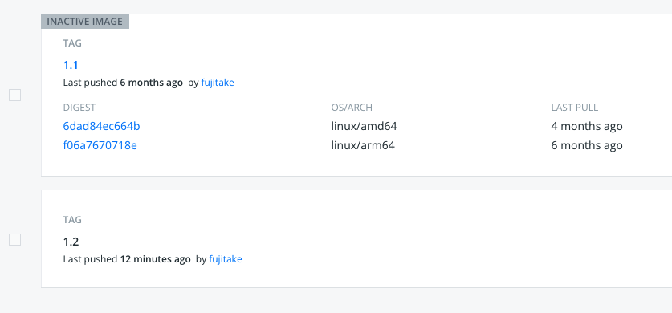

## この記事について

Docker for Desktopの有料化に伴うローカルマシンでのDocker代替え策を検討している方向けにちょうど良いかと。

## podman の紹介と docker との比較

podmanとは Pod Manager Toolと [公式website (英語)](https://podman.io) では表現されています。しかし、KubernetesのPodを管理するためのものではないようです。とりあえずdocker互換のruntimeとcliと理解しましょう。コマンドラインはほぼdockerと同じなので、dokerを入れ替えて`alias docker=podman`としても動作するよ、と書かれています。

もちろん違いがあります。dockerはデーモンが常時動作します。podmanはデーモンではありません。`podman machine`を起動して利用します。systemdに登録して自動起動も可能なようですが、私は試していません。サービスの土台として使うためには、要確認です。また、podmanは、cliオンリーなので、docker desktopとは違い、ある程度の知識を前提としてしまいます。

### ついでにdocker desktopとdocker engineの比較

docker desktopとdocker engineですが、実は全く違います。docker desktopは独自に作り込まれており、インストールが簡単で、WindowsとMacOSで動作します。コンテナ技術はlinuxを前提としており、docker engine自体は、もともとWindowsやMacOSには対応していません。docker desktopでは、アーキテクチャ面の違いを吸収して動作するように作り込んでいるようです。結果として、広い層に利用してもらえるソフトウェアとなっているようです。しかしながら、2021年8月31日付で無償ではなくなりました。

一方[docker engine](https://docs.docker.com/engine/)は、Apache License, Version 2.0で提供されています。docker engineは三つのコンポーネント、dockerデーモン、REST API、docker CLIから構成されるクライアントサーバ アプリケーションです。Windowsでは、`dockerd.exe`と`docker.exe`が提供されています。MacOSでは、クライアントのみが提供されており、デーモンは提供されていません。[バイナリからのdocker engineのインストール](https://docs.docker.com/engine/install/binaries/)より、Windows、MacOS、Linuxのインストール手順が記載されています。しかしながら、セキュリティパッチの提供と適用なども問題から、本番環境での利用は推奨しない旨の記載があります。さらにWindows、MacOSのいずれも、docker desktopを利用することが推奨されています。追伸、[docker desktop for Linux](https://www.docker.com/blog/accelerating-new-features-in-docker-desktop/)も計画されているようです。

また、Windowsでは、docker engine for WSL2 (Windows Subsystem for Linux 2)を使うことが以前はサポートされていましたが、最終的に完成しておらず、v20.10でdeprecated(廃止)となりました。[詳しくはこちらのページ](https://docs.docker.com/engine/deprecated/#linux-containers-on-windows-lcow-experimental)をご確認ください。古い記事や日本語ドキュメントでは、docker toolboxなどの記載がありますが、かなり古い情報です。

### dockerサブスクリプションの有償化

docker desktop、docker hubなど業務利用は、docker pro以上のサブスクリプション(月額一人あたり5ドル)が必要となります。[詳しくはこちら](https://www.docker.com/pricing)を参照下さい。docker personalは、0ドルですが、中小企業向け(250名以下、年間売上11億円以下)、個人利用、教育機関、商用ではないオープンソース プロジェクトのみとなります。オープンソース プロジェクトについては、個別にdocker社に対し、申請を行い許可をえる必要があります。

新しいライセンス体系は2021年8月31日より有効となっており、猶予期間は2022年1月31日となっております。それまでに、docker desktop for Windows/MacOSのアンインストールおよびdocker hubをアカウントを削除する必要があります。

## 前提条件

Linuxのコマンドラインを使えること、インターネットアクセスが最低限必要な条件となります。

## インストール

インストールは、下記記事を読んでそれぞれ対応してください、簡単です。

### MacOS

[macでpodman](https://blog.1q77.com/2021/09/podman-on-mac/)

久しぶりの`brew`でshallow clone関連エラー出た場合は[こちら](https://gotohayato.com/content/528/)をご確認下さい。

### Windows

Windowsは、[こちら](https://github.com/containers/podman/releases/latest/download/podman-remote-release-windows.zip)から最新をダウンロードしてインストールしてください。

### linux

Linuxは各ディストリビューションごとのインストール方法が[こちら](https://podman.io/getting-started/installation)に記載されています。

### インストール後の確認

私は `Intel Mac` にて `MacOS 11.6` で試してみました。問題なく動作しています。

```sh:
$ podman version
Client:
Version:      3.4.2
API Version:  3.4.2
Go Version:   go1.17.2
Built:        Sat Nov 13 01:08:25 2021
OS/Arch:      darwin/amd64

Server:
Version:      3.4.1
API Version:  3.4.1
Go Version:   go1.16.8
Built:        Wed Oct 20 23:31:56 2021
OS/Arch:      linux/amd64
```

## 本文

podmanをインストールして試したことをいくつか紹介します

### podman machineの起動

まず、podmanはdockerと違い仮想マシンを起動して処理を実行します。これは、OS/Archに依存しており、それぞれ適切なイメージを`podman machine init`にてダウンロードしセットアップします。これはpodman特有の処理であり、dockerにはない手間となります。

podmanインストール直後に実施すべき作業です。

`podman machine init`

initが終了したら、machineを開始します。podmanのイメージやコンテナを扱うコマンドについては、machineが起動している間のみ動作します。

`podman machine start`

作業が終わったら停止した方が電力効率は良いかと。

`podman machine stop`

### イメージのpull

以下、比較した方がわかりやすいコマンドについては、dockerとpodmanを併記します。

`docker pull docker.io/fujitake/alpine-f:latest`

`podman pull docker.io/fujitake/alpine-f:latest`

### イメージのbuild

dockerとpodmanは、デフォルトでのOCIイメージのフォーマットとスキーマが違います。docker hubにコンテナイメージを公開する場合、`--format docker`を含めることをオススメします。



Tag 1.1はOCIイメージのフォーマットがdocker、Tag 1.2はOCIv1です。Tagをクリックすることができませんし、DIGESTやOS/ARCHなども確認できません。イメージをpullすることはできますので、公開されていることは確認できています。

`docker build . -t fujitake/alpine-f:1.2`

`podman build . -t fujitake/alpine-f:1.2 --format docker`

### buildコマンドで使ったDockerfile

```sh:
FROM alpine:3.8.5
RUN apk add --no-cache curl
ENTRYPOINT ["/bin/ash"]
```

### コンテナ レジストリへのログイン

`podman login docker.io`

`docker login` はデフォルトで `docker.io` を(当然のように)指定するけど、`podman login` はレジストリを必ず指定する必要があります。

### イメージのpush

buildしたIMAGE IDは事前に `podman image list` などで確認し、下記のようにIDで指定するか、`--name fujitake/alpine-f:1.2`

`podman push 74f8a65978be docker.io/fujitake/alpine-f:1.2 --format v2s2`

### フォーマットの違いによるdocker hubでのUI表示

イメージのbuildでも説明しましたが`podman` にてbuildしてpushする先がdocker hubの場合、イメージのフォーマットがdocker (OCI version 2, schema 2)でないと詳細が表示されません。これは、podmanのデフォルト指定がOCIイメージspec v1.0となるためです。

二つの回避方法のうち、どちらかを選びましょう。どちらかで回避可能です。
- buildする際に、`--format docker`というオプションをつける
- pushする際に、`--format v2s2`というオプションをつける

## 参考

参考にしたWeb記事

[podman official webpage](https://podman.io)

[久しぶりにbrewしてshallow clone関連エラーが出た場合はこちら](https://gotohayato.com/content/528/)

インストール手順を記載 [macでpodman](https://blog.1q77.com/2021/09/podman-on-mac/)

違いを丁寧に説明 [DockerユーザーのためのPodmanとBuildahの紹介](https://rheb.hatenablog.com/entry/2020/07/16/podman_buidah_for_docker_users)
