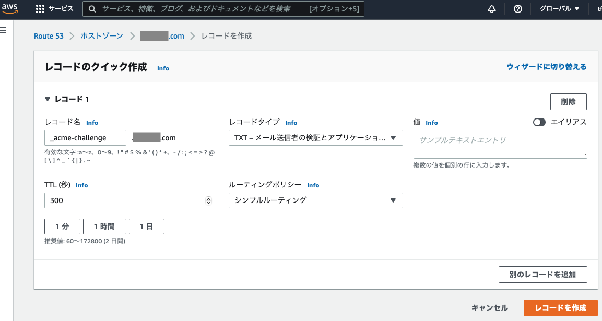

# テスト用SSL/TLS証明書作成方法

## 条件

本手順で作業を行うための条件は以下の通り。

- ドメイン名を所有していること
- 上記ドメインのDNSサーバの設定変更ができること
- 証明書を取得するFQDNを一時的に作業を行う端末に設定できること

## Let's Encryptをインストール

aws等でLinuxを起動

上記サーバが`証明書発行対象のFQDNとしてアクセスできること`かつ`tcp 80でアクセス可能なこと`を満たす

以下のコマンドにて`certbot`をインストール

```sh:
snap install --classic certbot
```

## Let's Encryptを使ったSSL/TLS証明書の作成方法

以下のコマンドを実行し、証明書を作成

```sh:
sudo certbot certonly -d "your.domain.name","your.domain.name" --server https://acme-v02.api.letsencrypt.org/directory --register-unsafely-without-email
```

次のようなメッセージが表示されるので`1`を入力し`enter`を押下

```sh:
Saving debug log to /var/log/letsencrypt/letsencrypt.log

How would you like to authenticate with the ACME CA?
- - - - - - - - - - - - - - - - - - - - - - - - - - - - - - - - - - - - - - - -
1: Spin up a temporary webserver (standalone)
2: Place files in webroot directory (webroot)
- - - - - - - - - - - - - - - - - - - - - - - - - - - - - - - - - - - - - - - -
Select the appropriate number [1-2] then [enter] (press 'c' to cancel): 1
```

Terms of Serviceを読んで同意する、`y`を入力して`enter`を押下

```sh:
- - - - - - - - - - - - - - - - - - - - - - - - - - - - - - - - - - - - - - - -
Please read the Terms of Service at
https://letsencrypt.org/documents/LE-SA-v1.2-November-15-2017.pdf. You must
agree in order to register with the ACME server. Do you agree?
- - - - - - - - - - - - - - - - - - - - - - - - - - - - - - - - - - - - - - - -
(Y)es/(N)o: y
```

適切に処理が行われれば、下記のように成功する。

```sh:
Account registered.
Requesting a certificate for your.domain.name

Successfully received certificate.
Certificate is saved at: /etc/letsencrypt/live/your.domain.name/fullchain.pem
Key is saved at:         /etc/letsencrypt/live/your.domain.name/privkey.pem
This certificate expires on 2022-02-11.
These files will be updated when the certificate renews.
Certbot has set up a scheduled task to automatically renew this certificate in the background.

- - - - - - - - - - - - - - - - - - - - - - - - - - - - - - - - - - - - - - - -
If you like Certbot, please consider supporting our work by:
 * Donating to ISRG / Let's Encrypt:   https://letsencrypt.org/donate
 * Donating to EFF:                    https://eff.org/donate-le
- - - - - - - - - - - - - - - - - - - - - - - - - - - - - - - - - - - - - - - -
```

下記に証明書が保存されているので、ローカルにコピーし、オーナーとグループを編集するなどし、利用できます。

```sh:
sudo cp /etc/letsencrypt/live/your.domain.name/fullchain.pem ~/.
sudo cp /etc/letsencrypt/live/your.domain.name/privkey.pem ~/.
sudo chown ubuntu fullchain.pem
sudo chown ubuntu privkey.pem
chgrp ubuntu *.pem
```

## Let's Encryptを使った`ワイルドカード`のSSL/TLS証明書の作成方法

下記のように`-d`で指定するドメイン名を`*.your.domain.name`のように指定する。

```sh:
sudo certbot certonly --manual --server https://acme-v02.api.letsencrypt.org/directory -d *.{your.domain.name} --register-unsafely-without-email
```

下記のようなメッセージが出力されるので、ドメインをホストゾーンを管理しているDNSサーバにアクセスし、`_acme-challenge.your.domain.name`とTXTを`Uxxxxxxxxxxxxx_xxxxxxxxxxxxxxxxxxxxxxx`として指定する。

このTXTは都度変更されるようなので、都度作業をする必要がある。

```sh:
Saving debug log to /var/log/letsencrypt/letsencrypt.log
Requesting a certificate for *.your.domain.name

- - - - - - - - - - - - - - - - - - - - - - - - - - - - - - - - - - - - - - - -
Please deploy a DNS TXT record under the name:

_acme-challenge.your.domain.name.

with the following value:

Uxxxxxxxxxxxxx_xxxxxxxxxxxxxxxxxxxxxxx

Before continuing, verify the TXT record has been deployed. Depending on the DNS
provider, this may take some time, from a few seconds to multiple minutes. You can
check if it has finished deploying with aid of online tools, such as the Google
Admin Toolbox: https://toolbox.googleapps.com/apps/dig/#TXT/_acme-challenge.vantiqjp.com.
Look for one or more bolded line(s) below the line ';ANSWER'. It should show the
value(s) you've just added.

- - - - - - - - - - - - - - - - - - - - - - - - - - - - - - - - - - - - - - - -
Press Enter to Continue
```

AWS Route53での追加例、`値`に上記で表示されている`with the following value:`の下に表示されている内容を指定する。



レコードが名前解決できることを確認する。

```sh:
nslookup -type=TXT _acme-challenge.your.domain.name
Server:		192.168.1.1
Address:	192.168.1.1#53

Non-authoritative answer:
_acme-challenge.your.domain.name	text = "Uxxxxxxxxxxxxx_xxxxxxxxxxxxxxxxxxxxxxx"

Authoritative answers can be found from:
vantiqjp.com	nameserver = ns-1781.awsdns-30.co.uk.
vantiqjp.com	nameserver = ns-1288.awsdns-33.org.
vantiqjp.com	nameserver = ns-802.awsdns-36.net.
vantiqjp.com	nameserver = ns-246.awsdns-30.com.
ns-1781.awsdns-30.co.uk	internet address = 205.251.198.245
ns-1781.awsdns-30.co.uk	has AAAA address 2600:9000:5306:f500::1
ns-246.awsdns-30.com	internet address = 205.251.192.246
ns-802.awsdns-36.net	internet address = 205.251.195.34
ns-802.awsdns-36.net	has AAAA address 2600:9000:5303:2200::1
```

名前解決ができることを確認した上で、コマンドに戻り、エンターキーを押下する。

```sh:
- - - - - - - - - - - - - - - - - - - - - - - - - - - - - - - - - - - - - - - -
Press Enter to Continue

Successfully received certificate.
Certificate is saved at: /etc/letsencrypt/live/your.domain.name/fullchain.pem
Key is saved at:         /etc/letsencrypt/live/your.domain.name/privkey.pem
This certificate expires on 2022-03-25.
These files will be updated when the certificate renews.

NEXT STEPS:
- This certificate will not be renewed automatically. Autorenewal of --manual certificates requires the use of an authentication hook script (--manual-auth-hook) but one was not provided. To renew this certificate, repeat this same certbot command before the certificate's expiry date.

- - - - - - - - - - - - - - - - - - - - - - - - - - - - - - - - - - - - - - - -
If you like Certbot, please consider supporting our work by:
 * Donating to ISRG / Let's Encrypt:   https://letsencrypt.org/donate
 * Donating to EFF:                    https://eff.org/donate-le
- - - - - - - - - - - - - - - - - - - - - - - - - - - - - - - - - - - - - - - -
```

下記に証明書が保存されているので、ローカルにコピーし、オーナーとグループを編集するなどし、利用できます。

```sh:
sudo cp /etc/letsencrypt/live/your.domain.name/fullchain.pem ~/.
sudo cp /etc/letsencrypt/live/your.domain.name/privkey.pem ~/.
sudo chown ubuntu fullchain.pem
sudo chown ubuntu privkey.pem
chgrp ubuntu *.pem
```

## 証明書の確認

`openssl x509 -in fullchain.pem -text`にて作成した証明書の内容が確認できます。

## 参考情報

Vantiq Private Cloudで利用する際は、`fullchain.pem`と`privkey.pem`を使用する
