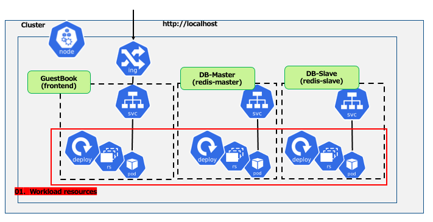
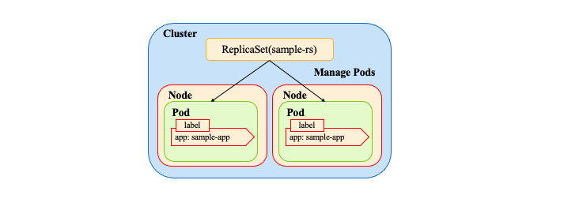
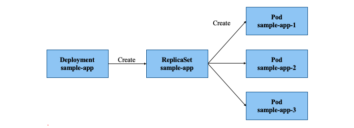
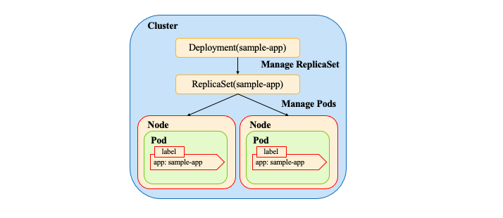

# Learn about Workload resources in Kubernetes

## Overview

* What are Workload resources?
  * Resources related to running containers such as Docker
  * Used to launch containers on a cluster   

* Learn about the following three among Workload resources
  #### 1. **[Pod](#Pod)**
  #### 2. **[ReplicaSet](#ReplicaSet)**
  #### 3. **[Deployment](#Deployment)**  

    **※1~3 are explained separately, but in the manifest file, 3 also encompasses the definitions of 1 and 2.**

## Review of the resources being learned



## What is Pod?<a id="Pod"></a>

* The smallest unit that can be deployed to Kubernetes, consisting of one or more containers.
* Each Pod is assigned a uniq IP address which is cluster internal.
  * Each container can communicate with external pods by binding its port to that of the pod it belongs to.
* Resources in a Pod are deployed to the same Node.
* Only one Pod can be created from the manifest file that defines the Pod.


## An example of a Pod manifest file

```yaml
apiVersion: v1
kind: Pod           # Specify the Resource type
metadata:
  name: sample-pod # Resource name
spec:               # Define the set of containers that compose the Pod
  containers:
  - name: nginx     # Container name
  image: nginx:latest  
ports:          # Specify the port for EXPOSE
  - containerPort: 80
・・・
```


## What is ReplicaSet?<a id="ReplicaSet"></a>

* A resource for creating and managing multiple pods of the same specification.
  * Specifies the number of pods with `replicas` in the manifest file.
  * When a Pod fails, it automatically recovers to the specified number.  

* `ReplicaSet` uses `labels` to track the pods it manages in a cluster.
  * Filters and identifies the set or list of pods to be managed by `labels`.   


## An example of a ReplicaSet manifest file

```yaml
apiVersion: apps/v1
kind: ReplicaSet
metadata:
  name: sample-rs
Spec:
  replicas: 2    # The number of Pods replicas
  selector:
    matchLabels:             # ReplicaSet management target label
      app: sample-app
  template:                 # Below template is the Pod resources definitions
    metadata:
      labels:                         # Define the label of the Pod
        app: sample-app
    spec:
      containers:
         ...
```




## What is Deployment?<a id="Deployment"></a>

* A Resource for managing and operating ReplicaSet.
* Enables the management of generations of ReplicaSet.
  * Allows rollout using revisions.
  * The definition of the manifest file is almost the same as that of ReplicaSet.
* Serves as the basic unit of the application deployment.
* When updated, creates a new ReplicaSet and replaces the old ReplicaSet.

## Relationship among Pod, ReplicaSet, and Deployment

__ReplicaSet__ :Manages and controls the number of Pod replicas with the same specification

__Deployment__ :Manages and operates ReplicaSet



## An example of a Deployment manifest file


```yaml
apiVersion: apps/v1
kind: Deployment
metadata:
  name: sample-app
Spec:
  replicas: 2    # The number of Pods replicas
  selector:
    matchLabels:             # ReplicaSet management target label
      app: sample-app
  template:                 # Below template is the Pod resources definitions
    metadata:
      labels:                         # Define the label of the Pod
        app: sample-app
    spec:
      containers:
         ・・・
```



## When the generation of a new ReplicaSet is triggered

*  Updating only the number of __Pod__ will NOT create a new __ReplicaSet__
  * The number of Pods changes, but the ReplicaSet is not replaced.

* Updating container definition causes replacement of __ReplicaSet__
  * New Pods are created and old ones are terminated gradually.
  * A new revision of the __Deployment__ is created.

* In production, it is important to understand how __ReplicaSet__ behaves in __Deployment__ when dealing with __Deployment__ manifest files.
