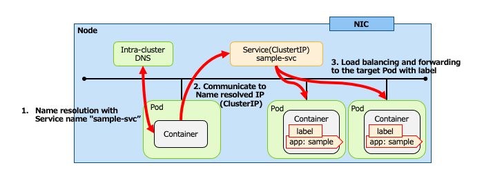
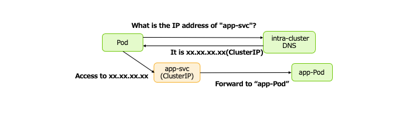
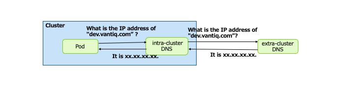
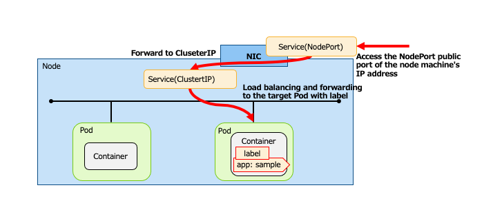
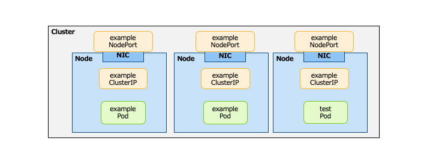
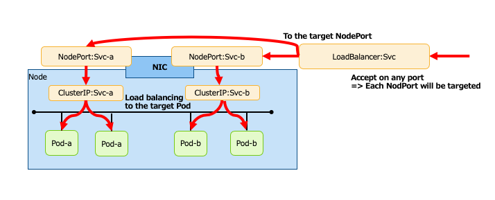
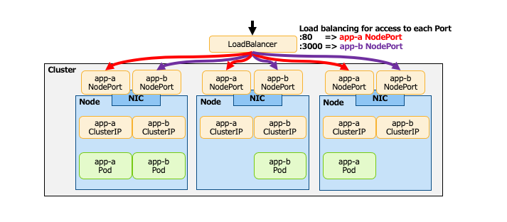

# Learn about Network, Loadbalancing resources in Kubaneres

## Overview

* Network, Loadbalancing resources
  * Provide an endpoint for inter-container communication and for exposing containers to the external world.

* Learn about the following two Network and Loadbalancing resources
  * Service
    * Provide routes and service discovery for Pods
  * Ingress
    * Expose the Service external the cluster

## Reviewing the resources being learned


## What is Service?

* Do name resolution for the pod in the intra-cluster DNS ( = “Service Discovery”)
  * The IP address assigned to a Pod is different for each Pod startup.
  * Perform L4 Loadbalancing of traffic destined for Pod.

* Service is mainly of the following three types
  * ClusterIPService
  * NodePortService
  * LoadBalancerService

## ClusterIP Service

* Publish the service to an internal IP address in the cluster
  * Inter-Pod communication is available via Service
  * Enables name resolution with Service name
* Access from the external is not possible



## Intra-cluster DNS

* Use intra-cluster DNS (Pod) for name resolution with Services internal the Kubernetes cluster.
  * kube\-dns
  * CoreDNS

* DNS entries in the cluster will change in relation to the Service resources.  

```yaml
spec:
  ports:
    - name: ”http”
      protocol: “tcp”
      port: 8080 
      targetPort: 80
```



## DNS configuration for Pod

* DNS configuration for Pods is possible in the manifest file.
  * `spec\.dnsPolicy` field
    * __ClusterFirst (defeult)__
      * When name resolution is not possible with intra-cluster DNS, query external DNS.
      * The external DNS inherits the configuration of the Node which Pod is running on.
    * __None__
      * Instead of using cluster DNS for name resolution, configure external DNS separately in `spec\.dnsConfig`.



## NodePort Service

* A service that can be accessed from external the cluster.

* Opens a port on each node to connect to the Service (ClusterIP).



## An example of a ClusterIP Service manifest file

```yaml
apiVersion: v1
kind: Service  # Set the resource type to Service
metadata:
  name: sample-svc   # Service name
spec:
  type: ClusterIP # Service type
  selector:    # Label of the Pod that the Service targets
    app: sample
  ports:
    - name: http
      port: 8080 # Port accepted by the service
      targetPort: 80 # Destination port
```


## An example of a NodePort Service manifest file

```yaml
apiVersion: v1
kind: Service    # Set the resource type to Service
metadata:
  name: sample-nodeport  # Service name
spec:
  type: NodePort # Service type
  selector:      # Label of the Pod that the Service targets
    app: sample
  ports:
    - name: http
      port: 80   # When omitting "targetPort", the same value in "port" will be set.
```


## Placement of ClusterIP and NodePort Service

* Exists on all Nodes in the Cluster
  * Doesn't matter if the Pod corresponding to the Service exists on the Node or not.



## Connection from external the cluster

* There is a limit to the resources available only in the cluster (ClusterIP and NodePort).
  * How to loadbalance NodePort when NodePort is used to provide external access, but there are multiple Nodes?
* Use **LoadBalancer** or **Ingress** that works with resources external the cluster.
  * LoadBalancer: Provides control at the L4 level
  * Ingress: Controls at the L7 level, such as switching the destination service on a path basis  
    ＊ In Kuberenetes, LoadBalancer is part of the Service resource, whereas Ingress is treated as an independent resource.  

* In a cluster environment in a public cloud, use the Loadbalancer on that platform.
  * Classic, ApplicationLoadBalancer (AWS), CloudLoadBalancing (GCP), etc.

## Loadbalancer Service

* Works with external system Loadbalancers to enable access to the Pod.
  * Enables L4 Loadbalancing
*  Automatically generates routes (NodePort and ClusterIP) to the target Pod.



## Loadbalancer Service image

* LoadBalancer => Loadbalancing to Node (NodePort)

* NodePort     => Forwarding to ClusterIP

* ClusterIP    => Loadbalancing to Pod



## An example of a LoadBalancer manifest file

```yaml
apiVersion: v1
kind: Service  # Set the resource type to Service
metadata:
  name: sample-lb
spec:
  selector:
    app: sample
  ports:
  - protocol: TCP
    port: 80
    targetPort: 8080
type: LoadBalancer
```


## What is an Ingress?

*  Works with external system Loadbalancers to enable access to the Pod.
  * In addition to L7 Loadbalancing, SSL termination is also possible.
*  Automatically generates routes (NodePort and ClusterIP) to the target.


## Ingress image (1)

* There are two main types of placement patterns in Ingress.
  * Place entities that do Ingress (L7 Loadbalancing) processing external or internal the cluster.
  * For external: The entity of Ingress is a function of an external system
  * For internal case: Ingress entity is a Pod
* The following is an example of a pattern for placement external a cluster.


## Ingress image (2)

* The following is a pattern of deploying Ingress internal a cluster.
* Pods that do Ingress processing include the following types.
  * Ingress Nginx
  * Ambassador
  * Contour


## An example of a Ingress manifest file

```yaml
apiVersion: extensions/v1beta1
kind: Ingress   # Set the resource type to Ingress
metadata:
  name: sample-ingress
spec:
  rules:        # Routing rules
  - host: sample.com
    http:
      paths:
      - path: /
        backend: # Routing destination
          serviceName: test-svc # Routing destination Service name
          servicePort: 80
```


