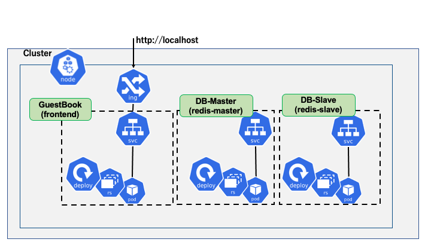
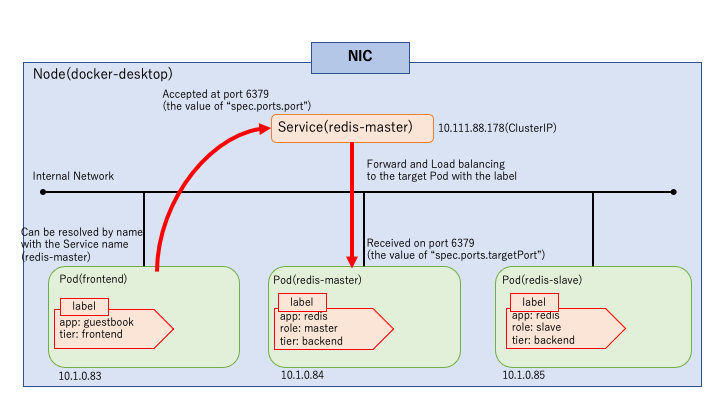

# **Lab 02-2 - Deploy the GuestBook application**

Deploy the official tutorial sample app **GuestBook**(<https://kubernetes.io/docs/tutorials/stateless-application/guestbook/>) so as to be able to access it via Ingress.

Deploy the **GuestBook**, and access it, it will work as the following.


When **GuestBook** is deployed, it should be the following configuration.



It will consist of a Service on the front end and a Database (NoSQL database called *redis*) on the back end. Through this Lab, build this configuration.  

**The working directory is *materials/lab02-2_guestbook* directory.**

## ***Step1 Deploy the Application***

1.  Review the manifest file for the sample application under the *guestbook* directory.  

2.  Deploy the manifest file under the directory with the `kubectl` command.   
    ＊ Be sure to be in the _guestbook_ directory.

```sh
$ kubectl apply -f ./
deployment.apps/frontend created
deployment.apps/redis-master created
service/redis-master created
deployment.apps/redis-slave created
service/redis-slave created
```

3.  Confirm the deployment status.

```sh
$ kubectl get deployment,rs,pods
NAME READY UP-TO-DATE AVAILABLE AGE
deployment.extensions/frontend 1/1 1 1 4m54s
deployment.extensions/redis-master 1/1 1 1 4m54s
deployment.extensions/redis-slave 1/1 1 1 4m54s

NAME DESIRED CURRENT READY AGE
replicaset.extensions/frontend-b88984c9 1 1 1 4m54s
replicaset.extensions/redis-master-545d695785 1 1 1 4m54s
replicaset.extensions/redis-slave-84548fdbc 1 1 1 4m54s

NAME READY STATUS RESTARTS AGE
pod/frontend-b88984c9-gvrnc 1/1 Running 0 4m54s
pod/redis-master-545d695785-62pxp 1/1 Running 0 4m54s
pod/redis-slave-84548fdbc-llzrw 1/1 Running 0 4m54s
$ kubectl get svc -l app=redis
NAME TYPE CLUSTER-IP EXTERNAL-IP PORT(S) AGE
redis-master ClusterIP 10.111.88.178 <none> 6379/TCP 5m39s
redis-slave ClusterIP 10.100.78.143 <none> 6379/TCP 5m39s
```

 Now review how the deployed resources have been deployed.   
 The following figure shows an image of resource placement (the following internal IPs and ports are those assigned by the operation when writing this document).


 **Guestbook**, which is the deployed application, is configured as a frontend web service and DB master and slave. Only the Service that can access redis-master and redis-slave between the internal Pods is created, and it cannot be accessed from outside the cluster.    



 ＊ Example of internal access (redis-slave is omitted)  
 In the next step, deploy Ingress in order to connect to the web service frontend from outside the cluster.   
 (Since this is a local environment, deploy the Pod for Ingress which performs L7 Load balancer processing in the cluster and the Service to access to the Pod.)

## ***Step2 Deploy the Ingress***  
 Control at the L7 layer level by using Ingress in a local environment.  
1.  Deploy **nginx_ingress_controller** with the `kubectl` command.  

```sh
$ kubectl apply -f https://raw.githubusercontent.com/kubernetes/ingress-nginx/master/deploy/static/provider/cloud/deploy.yaml
namespace/ingress-nginx created
serviceaccount/ingress-nginx created
configmap/ingress-nginx-controller created
clusterrole.rbac.authorization.k8s.io/ingress-nginx created
clusterrolebinding.rbac.authorization.k8s.io/ingress-nginx created
role.rbac.authorization.k8s.io/ingress-nginx created
rolebinding.rbac.authorization.k8s.io/ingress-nginx created
service/ingress-nginx-controller-admission created
service/ingress-nginx-controller created
deployment.apps/ingress-nginx-controller created
validatingwebhookconfiguration.admissionregistration.k8s.io/ingress-nginx-admission created
clusterrole.rbac.authorization.k8s.io/ingress-nginx-admission created
clusterrolebinding.rbac.authorization.k8s.io/ingress-nginx-admission created
job.batch/ingress-nginx-admission-create created
job.batch/ingress-nginx-admission-patch created
role.rbac.authorization.k8s.io/ingress-nginx-admission created
rolebinding.rbac.authorization.k8s.io/ingress-nginx-admission created
serviceaccount/ingress-nginx-admission created
```

If Pod _ingress-nginx-controller_ and Service _ingress-nginx_ are deployed on the Namespace _ingress-nginx_ as following, it is ready to use the Ingress resource.  

```sh
$ kubectl get pods,svc -n ingress-nginx
NAME READY STATUS RESTARTS AGE
pod/ingress-nginx-admission-create-zxtk2 0/1 Completed 0 3m2s
pod/ingress-nginx-admission-patch-gjnnc 0/1 Completed 1 3m2s
pod/ingress-nginx-controller-86cbd65cf7-h4ldc 1/1 Running 0 3m12s

NAME TYPE CLUSTER-IP EXTERNAL-IP PORT(S) AGE
service/ingress-nginx-controller LoadBalancer 10.102.62.2 localhost 80:31383/TCP,443:31394/TCP 3m12s
service/ingress-nginx-controller-admission ClusterIP 10.111.183.128 <none> 443/TCP 3m12s
```

 At this point, the Pod *ingress-nginx-controller* which handles the L7 load balancer is configured, and the Service  *ingress-nginx-controller* to access to the Pod is also configured for localhost.  
 So *404 Not Found* will be returned when accessing http://localhost from *nginx-ingress-controller*. Deploy the Ingress resource where the L7 load balancer process is defined.  

2.  Review the `guestboook-ingress.yaml` which is the manifest file for the Ingress under the *frontend_access* directory.  

```yaml
apiVersion: extensions/v1beta1
kind: Ingress                    # Manifest for Ingress
metadata:
  name: guestbook-ingress        # Ingress Resource Name
spec:
  rules:                         # Array of routing rules
  - http:
      paths:
      - path: /
        backend:                 # Access port 80 of the "frontend" service
          serviceName: frontend
          servicePort: 80 
```

3.  Deploy the Ingress with the `kubectl` command.

```sh
$ kubectl apply -f ./frontend_access/guestboook-ingress.yaml
ingress.extensions/guestbook-ingress created
```

 Deployment is complete when *localhost* is assigned to `ADDRESS` as following.    
 At this stage, the Ingress routing destination service has not been deployed, so *503* error will be returned when accessing http://localhost.  

```sh
$ kubectl get ingress
NAME HOSTS ADDRESS PORTS AGE
guestbook-ingress * localhost 80 2m44s
```

4.  To deploy the frontend service for the Ingress routing destination, review the `frontend-service.yaml` file under the *frontend_access* directory.  

```yaml
apiVersion: v1
kind: Service                 # Manifest for Service
metadata:
  name: frontend              # Service Resource Name
  labels:                     # Label for Service
    app: guestbook
    tier: frontend
spec:
  type: ClusterIP             # Service type
  ports:
  - port: 80                  # Port which accepts access
  selector:                   # Label for searching the target Pod
    app: guestbook
    tier: frontend
```

5.  Deploy the Service with the `kubectl` command.

```sh
$ kubectl apply -f ./frontend_access/frontend-service.yaml
service/frontend created
```

6.  Confirm the deployment status.

```sh
$ kubectl get svc -l app=guestbook
NAME TYPE CLUSTER-IP EXTERNAL-IP PORT(S) AGE
frontend ClusterIP 10.107.9.222 <none> 80/TCP 12m
```

By accessing <http://localhost>, it is possible to open the **GuestBook** page.  


The flow of the above access by the resources configured so far is the following.  


 Next, control the Access from Mobile by modifying the Ingress manifest file.

7.  Delete the deployed Ingress once.

```sh
$ kubectl delete -f ./frontend_access/guestboook-ingress.yaml
ingress.extensions "guestbook-ingress" deleted
```

8.  Review the contents of the `guestboook-ingress-agentFilter.yaml` file under the *frontend_access* directory.  

```yaml
apiVersion: extensions/v1beta1
kind: Ingress                    # Manifest for Ingress
metadata:
  name: guestbook-ingress        # Ingress Resource Name
  annotations:                   # Control settings in the case of nginx-ingress-controller. Controlled by User-Agent.
    nginx.ingress.kubernetes.io/server-snippet: |
      set $agentflag 0;

      if ($http_user_agent ~* "(Mobile)" ){
          set $agentflag 1;
        }

        if ( $agentflag = 1 ) {
            return 301 https://vantiq.co.jp/;
        }
      
spec:
  rules:                         # Array of routing rules
  - http:
      paths:
      - path: /
        backend:                 # Access port 80 of the "frontend" service
          serviceName: frontend
          servicePort: 80 
```

9.  Deploy the Ingress with the `kubectl` command.  

```sh
$ kubectl apply -f ./frontend_access/guestboook-ingress-agentFilter.yaml
ingress.extensions/guestbook-ingress created
```

10. Confirm the deployment status.

```sh
$ kubectl get ingress
NAME HOSTS ADDRESS PORTS AGE
guestbook-ingress * localhost 80 30m
```

11. Access it via a browser, the `curl` command, or Postman.    
    When accessing from a PC, change the User-Agent header and check the access.

```sh
$ curl http://localhost -H "User-Agent: Mozilla /5.0 (iPhone; CPU iPhone OS 9_1 like Mac OS X) AppleWebKit/601.1.46 (KHTML, like Gecko) Version/9.0 Mobile/13B5110e Safari/601.1"
<html>
<head><title>301 Moved Permanently</title></head>
<body>
<center><h1>301 Moved Permanently</h1></center>
<hr><center>nginx/1.17.8</center>
</body>
</html>
```

 When the User-Agent is mobile, it is possible to confirm that *301* is returned as a redirect, as described in Ingress.

## ***Step3 Do the Scale***

Scale the deployed **GuestBook** app. Increase the number of Pod frontend to 2.  
1.  Edit the Deployment manifest file for the frontend.    
    Edit the `frontend-deployment.yaml` file under the *guestbook* directory as following and save it.    
    **Line 10, change the value of replicas from 1 to 2.**  

2.  Apply changes to Deployment.

```sh
$ kubectl apply -f ./frontend-deployment.yaml
deployment.apps/frontend configured
```

3.  Confirm the deployment status.

```sh
$ kubectl get deployment,rs,pod
NAME READY UP-TO-DATE AVAILABLE AGE
deployment.extensions/frontend 2/2 2 2 106m
deployment.extensions/redis-master 1/1 1 1 106m
deployment.extensions/redis-slave 1/1 1 1 106m

NAME DESIRED CURRENT READY AGE
replicaset.extensions/frontend-b88984c9 2 2 2 106m
replicaset.extensions/redis-master-545d695785 1 1 1 106m
replicaset.extensions/redis-slave-84548fdbc 1 1 1 106m

NAME READY STATUS RESTARTS AGE
pod/frontend-b88984c9-qws8b 1/1 Running 0 4s
pod/frontend-b88984c9-sqdw7 1/1 Running 0 106m
pod/redis-master-545d695785-mmxb7 1/1 Running 0 106m
pod/redis-slave-84548fdbc-7gppf 1/1 Running 0 106m
```

 It is possible to confirm that both of the number of Pod frontend and the number of pods managed by ReplicaSet have increased to 2.  
 Also, it can be confirmed that changing the value of `replicas` does not cause ReplicaSet replacement, since the number of ReplicaSet themselves and their suffixes have not changed.

## ***Step4 Recover a Pod Automatically***

Confirm that the ReplicaSet will automatically recover the Pod.  
1.  Delete one Pod frontend with the `kubectl` command.    
     **＊ Use the Pod name same as that of the Pod in your environment.**

```sh
$ kubectl delete pod frontend-b88984c9-sqdw7
pod "frontend-b88984c9-sqdw7" deleted
```

2.  Confirm the deployment status of the Pod.

```sh
$ kubectl get pod
NAME READY STATUS RESTARTS AGE
frontend-b88984c9-g6t5b 1/1 Running 0 6s
frontend-b88984c9-qws8b 1/1 Running 0 8m46s
redis-master-545d695785-mmxb7 1/1 Running 0 115m
redis-slave-84548fdbc-7gppf 1/1 Running 0 115m
```

 Confirm that a new Pod has been created automatically.

## ***Step5 Switching ReplicaSet by Updating Deployment***

In Step 3, just changing the value of `replicas` did not cause the replacement of the ReplicaSet. ReplicaSet replacement is triggered by updating the container resource.   
In this step, confirm that updating the container resource of Deployment in the frontend will cause the ReplicaSet to switch. Also confirm that the Pods are switched in order.

1.  Edit the Deployment manifest file for the frontend.    
    Edit the `frontend-deployment.yaml` file under the *guestbook* directory as the following and save it.  
    **Line 23, change the value of memory from 100Mi to 120Mi.**

2.  Apply changes to Deployment, and confirm the deployment status.

```sh
$ kubectl apply -f frontend-deployment.yaml
deployment.apps/frontend configured

$ kubectl get deployment,rs,pod
NAME READY UP-TO-DATE AVAILABLE AGE
deployment.extensions/frontend 2/2 2 2 121m
deployment.extensions/redis-master 1/1 1 1 121m
deployment.extensions/redis-slave 1/1 1 1 121m

NAME DESIRED CURRENT READY AGE
replicaset.extensions/frontend-5d75d6b9b5 2 2 2 5s
replicaset.extensions/frontend-b88984c9 0 0 0 121m
replicaset.extensions/redis-master-545d695785 1 1 1 121m
replicaset.extensions/redis-slave-84548fdbc 1 1 1 121m

NAME READY STATUS RESTARTS AGE
pod/frontend-5d75d6b9b5-dkwjg 1/1 Running 0 5s
pod/frontend-5d75d6b9b5-wxs4p 1/1 Running 0 3s
pod/frontend-b88984c9-g6t5b 0/1 Terminating 0 5m55s
pod/frontend-b88984c9-qws8b 1/1 Terminating 0 14m
pod/redis-master-545d695785-mmxb7 1/1 Running 0 121m
pod/redis-slave-84548fdbc-7gppf 1/1 Running 0 121m
```

 The new ReplicaSet and Pod are created with the changes described above, and confirm that the switching has occurred. In the above case, it is possible to confirm that the current ReplicaSet and Pod, and previous ReplicaSet and Pod are as the following.  

 **・Current ReplicaSet and Pod**  
 ReplicaSet: frontend-5d75d6b9b5  
 Pod: frontend-5d75d6b9b5-dkwjg, frontend-5d75d6b9b5-wxs4p  
 **・Previous ReplicaSet and Pod**  
 ReplicaSet: frontend-b88984c9  
 Pod: frontend-b88984c9-g6t5b, frontend-b88984c9-qws8b  

 This is the end of this Lab. Lastly, reset a local cluster environment.

## ***Step6（Reset a local cluster environment）***

1.  Open docker's Settings > Kubernetes menu and reset it with "*Reset Kubernetes Cluster*".


