# Learn about Kubernetes Configuration, Storage resources

## Overview

* Configuration, Storage resources
  * Provide containers with configuration files, passwords, persistent volumes, etc.    

* Learn about the following Configuration, Storage resources and related resources
  * ConfigMap, Secret
    * Resources for storing data that can be retained by key\-value, such as configuration information and confidential information
  * Volume, StorageClass, PersistentVolume, PersistentVolumeClaim
    * Resources for handling persistent data in containers
  * StatefulSet
    * Resources which handle Pods (the special ReplicaSet associated with PV)

## Reviewing the resources being learned

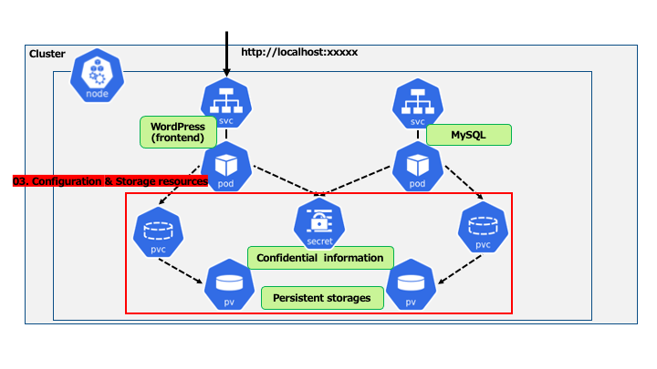

## An example of Wordpress Configuration - For Pod Only

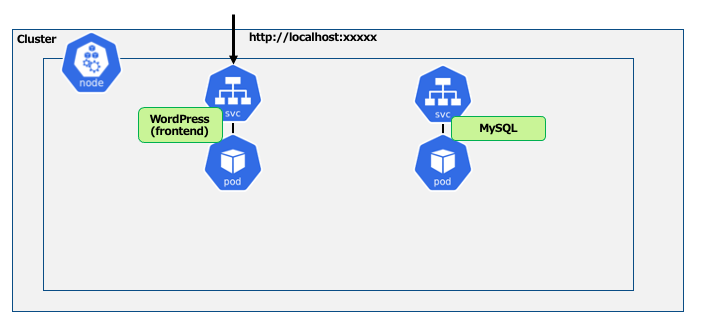

**Concerns**  
__* Providing the configuration information to each Pod__  
__=> Access information from WordPress to MySQL__  
__* Storage of persistent data for each Pod__  
__=> WordPress: additional plugins, theme data, etc__  
__=> MySQL: user data, posted page data, etc__  


## Set Environment variables to the container

* The ways to pass settings for individual containers are the followings.
  * Environment variables
  * Mount to the area where the configuration file is located  

* Specify Environment variables in pod templates with **env** or **envFrom**.
  * Define directly in key\-value format
  * Refer to the definition of the ConfigMap resource
  * Refer to the definition of the Secret resource  

* ConfigMap and Secret can place the data defined in the resource as a file in a directory in the container.

## Pod and Persistent data

* The data on the Pod\(container\) will be deleted as well when the container is deleted.  

* Pod data will be deleted in the following cases
  * Restarting the Pod
  * Updating the Pod  

=> Assign a Persistent volume to the Pod

## An example of Wordpress Configuration

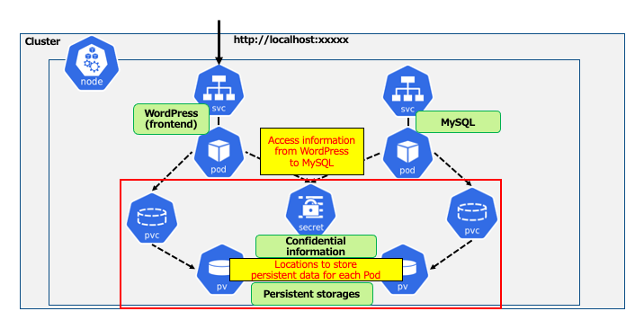

## What is Config Map?

* A resource which stores configuration information in key\-value format.  

* The ways to create a resource
  * Create it in a manifest file
  * Refer to a value from a file
  * Pass the value directly    

* The ways to use it from a container
  * Pass to the container as an Environment variable
  * Mount as a Volume
  * Both can pass specific keys or all keys in ConfigMap  

## What is Secret?

* A resource which stores confidential information in key\-value format.
  * Encode *Value* with base64  

* The ways to create and use it from the container are basically the same as ConfigMap.   

* There are several types, except for the Generic type, which have a defined schema.
  * ex: For the TLS type, the `tls\.crt` and `tls\.key` schemas are defined.

## Update ConfigMap and Secret

* For passing as an Environment variable
  * Environment variables are determined at startup, so dynamic update with the manifest file are not possible.
  * It is possible to update dynamically with the `kubectlset env` command.  

* For placing as a file
  * Since it is a symbolic link, it is possible to update dynamically at the kubelet monitoring interval.
  * Default is 60 seconds.

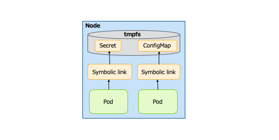

## Configuration information for containers - Direct definition of Environment variables

* Define each configuration information directly in the Pod as an Environment variable.

```yaml
apiVersion: v1
kind: Pod
metadata:
  name: sample-pod
  labels:
    app: sample
spec:
  containers:
  - name: sample-pod
    image: nginx:latest
    env: 
    - name: MAX_LOG_EVENT
      value: "10000"
      name: LOG_FILE_NAME
      value: /var/log/pod-myapp.log
```
**↓**

```sh
root@sample-pod:/# env | grep LOG
MAX_LOG_EVENT=10000
LOG_FILE_NAME=/var/log/pod-myapp.log
```

## Configuration information for containers – ConfigMap (1)

* Define configuration information in ConfigMap and provide it to Pod as an Environment variable.

```yaml
apiVersion: v1
kind: ConfigMap
metadata:
  name: sample-configmap
data:             # Define the value to be provided in the key-value format
  MAX_LOG_EVENT: "10000"
  LOG_FILE_NAME: /var/log/pod-myapp.log
---
apiVersion: v1
kind: Pod
metadata:
  name: sample-pod
  labels:
    app: sample
spec:
  containers:
  - name: sample-pod
    image: nginx:latest
    envFrom:
    - configMapRef:
        name: sample-configmap
```

**↓**

```sh
root@sample-pod:/# env | grep LOG
MAX_LOG_EVENT=10000
LOG_FILE_NAME=/var/log/pod-myapp.log
```

## Configuration information for containers – ConfigMap (2)

* Define configuration information in ConfigMap and store it in the container as a file.

```yaml
apiVersion: v1
kind: ConfigMap
metadata:
  name: sample-configmap
data:              # Define the value to be provided in the key-value format
  MAX_LOG_EVENT: "10000"
  LOG_FILE_NAME: /var/log/pod-myapp.log
---
apiVersion: v1
kind: Pod
metadata:
  name: sample-pod
  labels:
    app: sample
spec:
  containers:
  - name: sample-pod
    image: nginx:latest
    volumeMounts:              # Mount as a volume on /config
    - name: config-volume
      mountPath: /config 
  volumes:                     # Specify ConfigMap in the Volume
    - name: config-volume
      configMap:
        name: sample-configmap 
```

**↓**

```sh
root@sample-pod:/# ls /config
LOG_FILE_NAME  MAX_LOG_EVENT
root@sample-pod:/# cat /config/LOG_FILE_NAME
/var/log/pod-myapp.log
root@sample-pod:/# cat /config/MAX_LOG_EVENT
10000
```

## Configuration information for containers – Secret

* Define configuration information in Secret and provide it to the Pod as an Environment variable.

```yaml
apiVersion: v1
kind: Secret
metadata:
  name: sample-secret
type: Opaque                    # type which defines a Secret in a schema-less
data:                           # Define the value to be provided in the key-value Value format
  USERNAME: c2FtcGxl            # Encoded "sample" with base64
  PASSWORD: cGFzc3dvcmQ=        # Encoded "password" with base64
---
apiVersion: v1
kind: Pod
metadata:
  name: sample-pod
  labels:
    app: sample
spec:
  containers:
  - name: sample-pod
    image: nginx:latest
    envFrom:
    - secretRef:
        name: sample-secret
```

**↓**

```sh
root@sample-pod:/# env | grep -e USER -e PASS
USERNAME=sample
PASSWORD=password
```

## Handle Secret Manifests

* Data in Secret *should be encoded with base64*
  * To push the manifest file directly to the repository is dangerous.    
   => Use a tool like **kubesec** to encrypt it.   

   ＊ kubesec: Encrypts only Secret data with AWS or GCP KMS

```yaml
apiVersion: v1
data:
  DB_USER: uq9VqCu9WyoPsHTXzmsp2E80e3e3+ferUDrh3J+jyi/O9ZIhF/qldnMdA7INwLB8.yfFjHY1V7WDLJE7h.zOo2DWjd56/PhBETUBo73A==
  DB_PASSWORD: A4YV8j8QhAW7LxgO9sMqvrKXcSB76EfKuF/dYp73dQdWc6O+N/KdY9Rl0hDz6ojd.P/VVLzUx6swafWIp./nHidZkzk0mGrIToDHPXiQ==
kind: Secret
metadata:
  name: sample-secret
type: Opaque

```

## Flow of handling Secret manifest with KMS

* Must to create the key in Cloud's KMS in advance.
* Must be decrypted when registering the secret to Kubernetes.

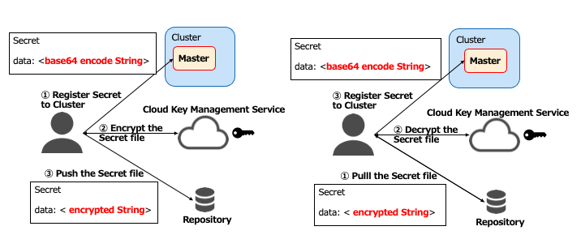


## Flow of allocating Persistent volumes to Pods

* Pods request the "Persistent volumes" which they need.
  * Must be a HDD volume
  * Must meet the capacity of 20GB
* Schedule the volumes which meet the requirements from among the "Persistent volumes" created in clusters.

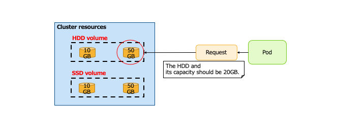


## Volume and PersistentVolume

* __Volume__
  * Use available volumes, etc. prepared in advance by specifying them directly in the manifest.
  * Host area, NFS, iSCSI, etc. are available.
  * Since it is specified directly in the manifest file for Pod, etc., there is _no need to define resources in the cluster_.     

* __PersistentVolume__  __\(PV\)__
  * Create as an intra-cluster resource in association with a system which provides external persistent volumes.
  * Must be defined in advance in the cluster.
  * Volume services such as AWS and GCP can also be handled in cooperation.
  * __Must create the reality of the volume externally__

* __StorageClass__
  * Define _the type of Volume_ which is allocated in the *PersistentVolume* resource.  
  * Use to specify what kind of volume is required when doing *Dynamic Provisioning*.  
  * `StorageClass` is already defined by default in a cloud cluster environment basically.
    * AWS: gp2 \(aws\-ebs\)  

* __PersistentVolumeClaim__  __\(PVC\)__
  * Resource which _requests a Volume \(PersistentVolume\)_.  
  * The scheduler allocates a suitable *PersistentVolume* for the request.
  * Manage PV by associating PV with PVC on a one-to-one basis.

## An example of PersistentVolume Allocation

* Request *PersistentVolume* by specifying the following
  * HDD Volume \(storageClassName:hdd\)
  * Capacity meet 20GB \(storage: 20GB\)

  ＊ controller\-manager: Master component which manages cluster resources

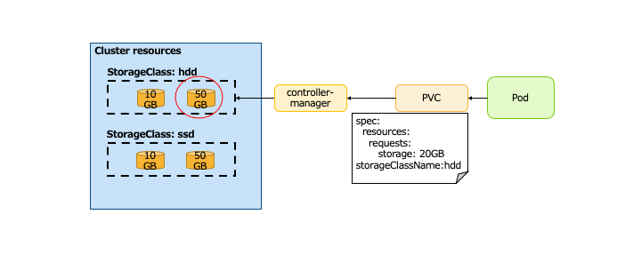

**Concerns**  
__* Must create the Volume entity in advance and define the PersistentVolume resource.__  
__=> Create a Cloud Volume Service resource, and define it in the manifest file as a PersistentVolume resource.__  
__* Be allocated PersistentVolume with capacity far away from the requirement, and resulting in waste.__  
__=> The required capacity is 20GB, but PersistentVolume only has capacities of 10GB and 50GB, so an extra 30GB is allocated.__  
__=> It is always scheduled to meet the PVC's requirements. In this case, PV which are less than 20GB will not be allocated.__


## Dynamic Provisioning

* Execute the following when a request is issued by PersistentVolumeClaim.
  * Create a volume reality, a *PersistentVolume* resource
  * Allocate the created *PersistentVolume* resource

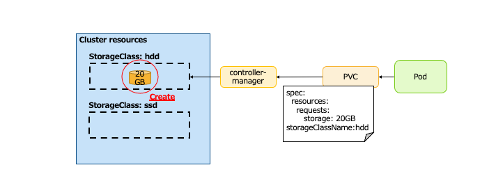


## StorageClass - Reclaim Policy

Control _the behavior of the volume realities_ when PersistentVolumeClaim is removed \(PersistentVolume is no longer used\).  

* __Delete__
  * Delete Volume realities
  * Often used for *Dynamic Provisioning* of external systems \(AWS, GCP, etc.\)   

* __Retain__
  * Retain Volume realities
  * Not be remounted by other PersistentVolumeClaims

* Both Delete and Retain retain the volume realities if the pod is just deleted.

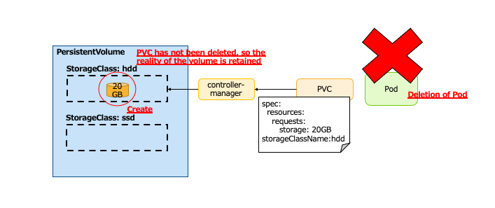


# Notes on PV

* Each Cloud provider may have its own restrictions depending on the type of PV used.
  * ex: AZ for Pod and PV \(AWSEBS case\)  
    * Both Pod and PV must be located in ***same AZ*** => Pod will not start if they are in different AZ    
  * When using PV, confirm the restrictions as a cloud resource in advance.

  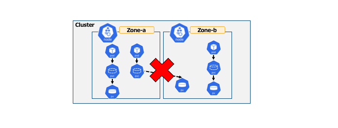

* Configuration of the timing at which PV is bound
  * Depends on volumeBindingMode of `StorageClass`
    * __Immediate__ : When the PVC is created, the PV reality is created and Bind is executed.
    * __WaitForFirstConsumer__ : Only after the Pod which uses the PVC is created, then the PV reality is created and Bind is executed.  

* PVC is created before Pod when using *Dynamic Provisioning*.
  * In the case of Immediate \(default\), the Pod cannot be scheduled in the Availability Zone where the PV is created, and then the Pod may happen to be in the *Pending state*.

## What is StatefulSet?

* The image is a ReplicaSet which uses a *PersistentVolume*.
* Features are the followings
  * Pod suffixes will be indexed in order.
    * sts\-pod\-1\,sts\-pod\-2\,sts\-pod\-3…
    * So, the pod name will not be changed.
    * When scaling out or scaling in, the pods are increased or decreased in the order of the larger index.
  * If the Pod is restarted, the same PV is assigned as before the restart.　　

* Used for stateful pods and/or master-slave configurations.
  * sts\-pod\-1: Master     sts\-pod\-2\,3: Slave

## An example of Statefulset

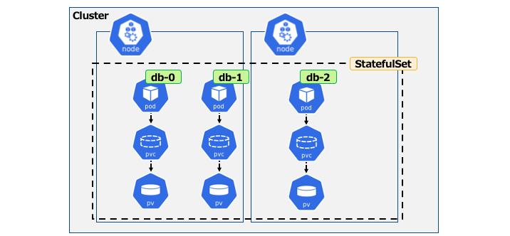
