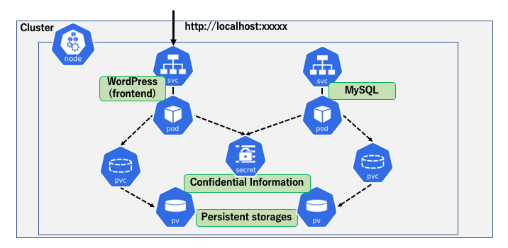
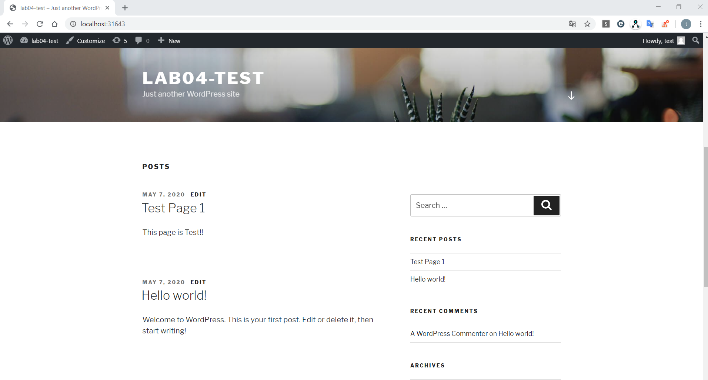
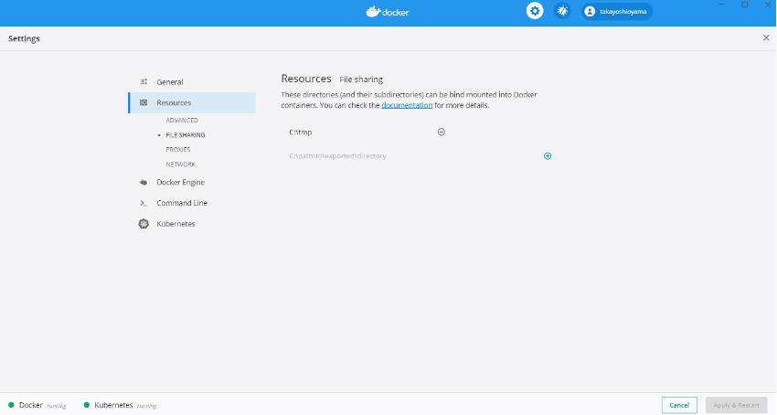
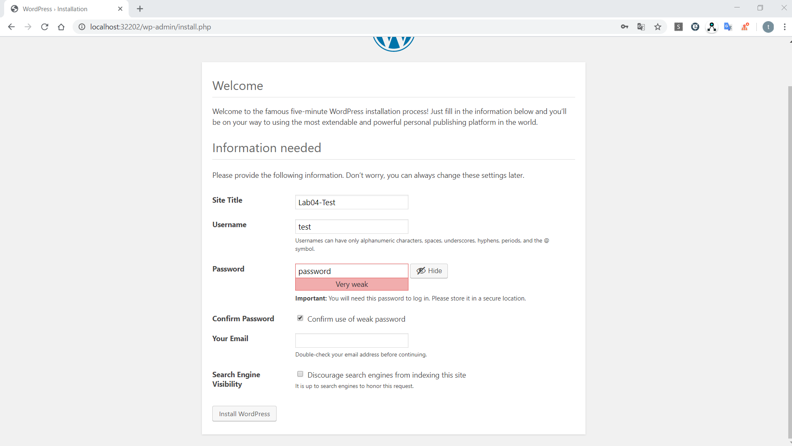
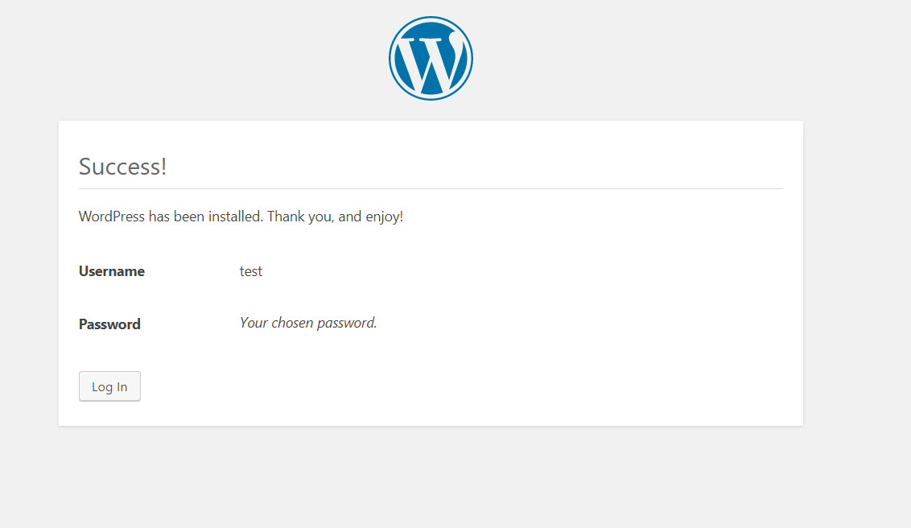
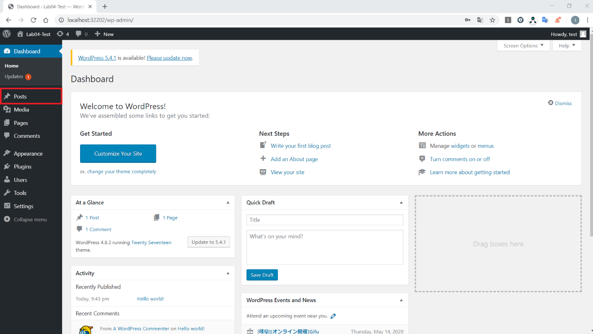
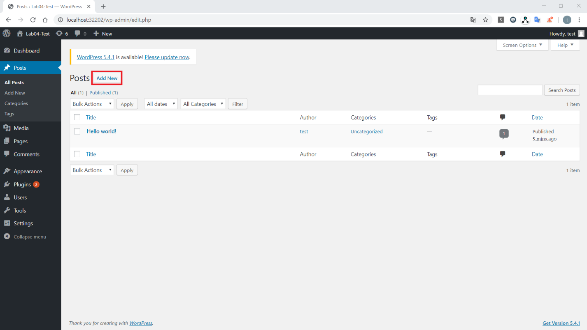
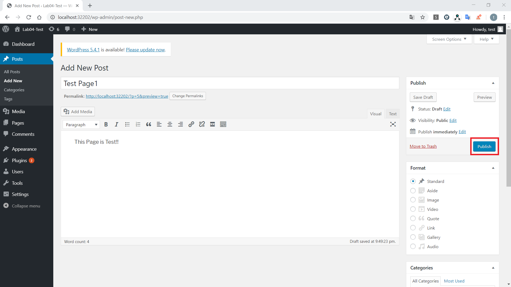
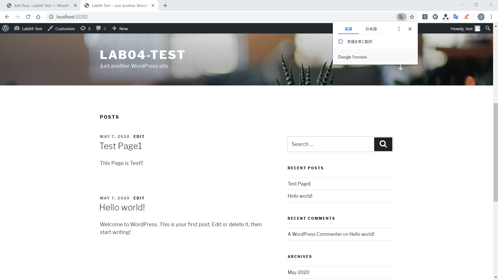
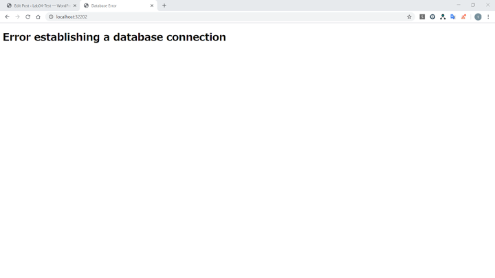

# **Lab 03-2 – Lab exercises on Kubernetes Storage resources**

In this Lab, deploy **WordPress** and **MySQLPod**, and confirm that configuration information and user information are stored in the *PersisitentVolume*.



In this Lab, deploy WordPress like the following, and allow users to post pages and view them via a browser.



To deploy to WordPress, it is necessary to store data such as plugins in the WordPress Pod, and WordPress user information and posted page data in MySQL.  
However, all the data in the Pod will be deleted when the Pod is restarted, so the user information and posts will be deleted whenever the Pod is restarted.  
Therefore, in this Lab, as a Persistent storage resource to store the above data, prepare a directory on the local machine as *PersistentVolume* in the kubernetes cluster, and deploy WordPress with the configuration to store data in *PersistentVolume*.

## ***Step 0 (Configure Docker Desktop and the work directory on the host side)***

Configure the followings so that it is possible to write to the host-side directory from the container side.  
**Note: Due to Docker Desktop specifications, it may fail to deploy if using a directory other than the following.**

1.  (For Windows) Create **C:¥tmp** directory. Go to Docker Desktop: Settings -> Resources -> FILE SHARING and configure the created directory for sharing. Place **lab03-2_storage** of materials to **C:¥tmp**.



_＊ If OS is Windows and using WSL, and the "FILE SHARING" item is not found in the "Resources" menu of Docker Desktop, change line 56 of `wordpress-mysql-deploy.yaml` from `mountPath: /var/lib/mysq Change` to **mountPath: /tmp/lib/mysq**._


2.  (For Mac) Place **lab03-2_storage** of materials to **/tmp** directory. Set permissions (777) on the directories and files under **lab03-2_storage**.  
ex： chmod -R 777 /tmp/lab03-2_storage

**The working directory for the following steps is */tmp/lab03-2_storage* directory.**

## ***Step 1 (Create a PersistentVolume)***

Use a directory on a local machine and create it as a *PersistentVolume*, which is a kubernetes resource.  

1.  Review and edit the manifest file `wordpress-pv-local.yaml` for the *PersistentVolume* to be deployed and its Claim.    
 Specify the directory on a local machine to be used as the *PersistentVolume* in the manifest file.  
 ・Places to edit  
 Lines 30 and 55 of `wordpress-pv-local.yaml` (value for _spec.local.path_)  
 ・Details to edit  
 Specify the directory of the host machine (_lab03-2_pv/hostpath_ in the Lab materials)   
 ・Examples of editing  
 **For Windows**: _"path: /host_mnt/c/tmp/lab03-2_storage/hostpath"_  
 => Mount the folder　_C:\\tmp\\lab03-2_storage\\hostpath_    
 **For Mac, Linux**: _"path: /tmp/lab03-2_storage/hostpath"_  
 => Mount the directory _/tmp/lab03-2_storage/hostpath_  
 _＊ If /tmp is a symbolic link, even if the PersistentVolume deployment succeeds, the subsequent Pod deployment may fail. Use the real directory. Also, the directory should be the directory or under it which configured as File sharing in Docker Desktop._  

```yaml
kind: StorageClass          # Define two types of StorageClass with different VolumeBindingMode
apiVersion: storage.k8s.io/v1
metadata:
  name: local-storage
provisioner: kubernetes.io/no-provisioner
volumeBindingMode: Immediate
---
kind: StorageClass
apiVersion: storage.k8s.io/v1
metadata:
  name: local-storage-wait
provisioner: kubernetes.io/no-provisioner
volumeBindingMode: WaitForFirstConsumer
---
apiVersion: v1
kind: PersistentVolume        # Create a directory on a local machine as PV
metadata:
  name: pv-frontend       # PV for WordPress Pod
  labels:
    app: wordpress
    tier: pv-frontend
spec:
  capacity:
    storage: 1Gi
  accessModes:
  - ReadWriteOnce
  persistentVolumeReclaimPolicy: Retain
  storageClassName: local-storage-wait
  local:
    path: <input your localmachine directory path>
  nodeAffinity:
    required:
      nodeSelectorTerms:
      - matchExpressions:
        - key: kubernetes.io/hostname
          operator: In
          values:
          - docker-desktop
---
apiVersion: v1
kind: PersistentVolume        # Create a directory on a local machine as PV
metadata:
  name: pv-mysql          # PV for MySQL Pod
  labels:
    app: wordpress
    tier: pv-mysql
spec:
  capacity:
    storage: 1Gi
  accessModes:
  - ReadWriteOnce
  persistentVolumeReclaimPolicy: Retain
  storageClassName: local-storage
  local:
    path: <input your localmachine directory path>
  nodeAffinity:
    required:
      nodeSelectorTerms:
      - matchExpressions:
        - key: kubernetes.io/hostname
          operator: In
          values:
          - docker-desktop
---
apiVersion: v1
kind: PersistentVolumeClaim
metadata:
  name: pv-claim-frontend  # PVClaim for WordPresss
spec:
  selector:
    matchLabels:
      app: wordpress
      tier: pv-frontend
  accessModes:
    - ReadWriteOnce
  storageClassName: local-storage-wait
  resources:
    requests:
      storage: 1Gi
---
apiVersion: v1
kind: PersistentVolumeClaim
metadata:
  name: pv-claim-mysql     # PVClaim for MySQL
spec:
  selector:
    matchLabels:
      app: wordpress
      tier: pv-mysql
  accessModes:
    - ReadWriteOnce
  storageClassName: local-storage
  resources:
    requests:
      storage: 1Gi
```

 Create *PersistentVolume* for WordPress Pod and for MySQL Pod, and assign it to each Pod with `PersistentVolumeClaim`. In this Lab, in order to confirm the difference in the VolumeBindingMode of `StorageClass`, the `StorageClass` of the PV used in WordPress is set to *Immediate*, and the `StorageClass` of the PV used in MySQL is set to *WaitForFirstConsumer*.

2.  Deploy the manifest file `wordpress-pv-local.yaml`, and confirm the status.  

```sh
$ kubectl apply -f wordpress-pv-local.yaml
storageclass.storage.k8s.io/local-storage created
storageclass.storage.k8s.io/local-storage-wait created
persistentvolume/pv-frontend created
persistentvolume/pv-mysql created
persistentvolumeclaim/pv-claim-frontend created
persistentvolumeclaim/pv-claim-mysql created

$ kubectl get pvc,pv
NAME STATUS VOLUME CAPACITY ACCESS MODES STORAGECLASS AGE
persistentvolumeclaim/pv-claim-frontend Pending local-storage-wait 34s
persistentvolumeclaim/pv-claim-mysql Bound pv-mysql 1Gi RWO local-storage 34s

NAME CAPACITY ACCESS MODES RECLAIM POLICY STATUS CLAIM STORAGECLASS REASON AGE
persistentvolume/pv-frontend 1Gi RWO Retain Available local-storage-wait 34s
persistentvolume/pv-mysql 1Gi RWO Retain Bound default/pv-claim-mysql local-storage 34s
```

 Confirm that the STATUS of the deployed *PersistentVolume*, pv-frontend and pv-mysql are created as *Available* and *Bound* respectively. Looking at the STATUS of the PVCs as well, it is confirmed that pv-claim-frontend is *Pending* and pv-claim-mysql is *Bound*, which means that the behavior corresponds to the VolumeBindingMode of the `StorageClass` requested by each.  
 Also, after deploying the application, pv-frontend will store WordPress plug-ins, etc., and pv-mysql will store WordPress user information, post contents, etc.    
 Now that the Persistent storage resources of the kubernetes cluster needed for WordPress are prepared.  

## ***Step 2 (Deploy MySQL and WordPress Pod)***

Mount the *PersistentVolume* created in Step 1 for the MySQL Pod and WordPress Pod on the directory where the persistent data is to be written.  
1.  Review the manifest file `wordpress-mysql-deploy.yaml` for deploying MySQL.    
     Defines three things: Secret (the MySQL password), Service for MySQL Pod access, and Deployment for MySQL.   (Modification is not required.)

```yaml
apiVersion: v1
kind: Secret
metadata:             # MySQL password information
  name: mysql-secret
type: Opaque          # type which defines a Secret in a schema-less
data:                 # Define the value to be provided in the key-value format
  MYSQL_ROOT_PASSWORD: cGFzc3dvcmRzZWM=  # Encoded "passwordsec" with base64
---
apiVersion: v1
kind: Service
metadata:
  name: wordpress-mysql
  labels:
    app: wordpress
spec:
  ports:
    - port: 3306
  selector:
    app: wordpress
    tier: mysql
  clusterIP: None
---
apiVersion: apps/v1
kind: Deployment
metadata:
  name: wordpress-mysql
  labels:
    app: wordpress
spec:
  selector:
    matchLabels:
      app: wordpress
      tier: mysql
  strategy:
    type: Recreate
  template:
    metadata:
      labels:
        app: wordpress
        tier: mysql
    spec:
      containers:
      - image: mysql:5.6
        name: mysql
        env:
        - name: MYSQL_ROOT_PASSWORD
          valueFrom:
            secretKeyRef:
              name: mysql-secret
              key: MYSQL_ROOT_PASSWORD
        ports:
        - containerPort: 3306
          name: mysql
        volumeMounts:       # Mount on /var/lib/mysql directory
        - name: mysql-persistent-storage
          mountPath: /var/lib/mysql
      volumes:              # Allocate PV for MySQL created via PVC
      - name: mysql-persistent-storage
        persistentVolumeClaim:
          claimName: pv-claim-mysql
```

2.  Deploy the manifest file `wordpress-mysql-deploy.yaml`, and confirm the status.  

```sh
$ kubectl apply -f wordpress-mysql-deploy.yaml
secret/mysql-secret created
service/wordpress-mysql created
deployment.apps/wordpress-mysql created

$ kubectl get pod -o wide
NAME READY STATUS RESTARTS AGE IP NODE NOMINATED NODE READINESS GATES
wordpress-mysql-849d8d5cbb-q4ppk 1/1 Running 0 6s 10.1.2.96 docker-desktop <none> <none>
```

3.  Review the manifest file `wordpress-deploy.yaml` for deploying WordPress.    
    Secret uses the Secret deployed during MySQL deployment. It defines two things: Service for WordPress Pod access, and Deployment for WordPress.   
   (Modification is not required.)

```yaml
apiVersion: v1
kind: Service      # Create NodePort for browser access
metadata:
  name: wordpress
  labels:
    app: wordpress
spec:
  ports:
    - port: 80
  selector:
    app: wordpress
    tier: frontend
  type: NodePort
---
apiVersion: apps/v1
kind: Deployment
metadata:
  name: wordpress
  labels:
    app: wordpress
spec:
  selector:
    matchLabels:
      app: wordpress
      tier: frontend
  strategy:
    type: Recreate
  template:
    metadata:
      labels:
        app: wordpress
        tier: frontend
    spec:
      containers:
      - image: wordpress:4.8-apache
        name: wordpress
        env:             # MySQL connection information (refer to the values from the Service name and Secret data)
        - name: WORDPRESS_DB_HOST
          value: wordpress-mysql
        - name: WORDPRESS_DB_PASSWORD
          valueFrom:
            secretKeyRef:
              name: mysql-secret
              key: MYSQL_ROOT_PASSWORD
        ports:
        - containerPort: 80
          name: wordpress
        volumeMounts:     # Mount on /var/www/html directory
        - name: wordpress-persistent-storage
          mountPath: /var/www/html
      volumes:            # Allocate PV for WordPress created via PVC
      - name: wordpress-persistent-storage
        persistentVolumeClaim:
          claimName: pv-claim-frontend
```

4.  Deploy the manifest file `wordpress-deploy.yaml` and review the resources deployed so far.  

```sh
$ kubectl apply -f wordpress-deploy.yaml
service/wordpress created
deployment.apps/wordpress created

$ kubectl get pod,svc,pvc,pv,secret
NAME READY STATUS RESTARTS AGE
pod/wordpress-6fb5c59555-wsjvz 1/1 Running 0 5s
pod/wordpress-mysql-849d8d5cbb-q4ppk 1/1 Running 0 3m31s

NAME TYPE CLUSTER-IP EXTERNAL-IP PORT(S) AGE
service/kubernetes ClusterIP 10.96.0.1 <none> 443/TCP 9h
service/wordpress NodePort 10.106.51.21 <none> 80:30828/TCP 5s
service/wordpress-mysql ClusterIP None <none> 3306/TCP 3m31s

NAME STATUS VOLUME CAPACITY ACCESS MODES STORAGECLASS AGE
persistentvolumeclaim/pv-claim-frontend Bound pv-frontend 1Gi RWO local-storage-wait 4m3s
persistentvolumeclaim/pv-claim-mysql Bound pv-mysql 1Gi RWO local-storage 4m3s

NAME CAPACITY ACCESS MODES RECLAIM POLICY STATUS CLAIM STORAGECLASS REASON AGE
persistentvolume/pv-frontend 1Gi RWO Retain Bound default/pv-claim-frontend local-storage-wait 4m3s
persistentvolume/pv-mysql 1Gi RWO Retain Bound default/pv-claim-mysql local-storage 4m3s

NAME TYPE DATA AGE
secret/default-token-skbgl kubernetes.io/service-account-token 3 9h
secret/mysql-secret Opaque 1 3m31s
```

 Due to the creation of a WordPress Pod which uses pv-frontend, it is confirmed that the corresponding PVC has been *Bound*.  
 At this point, the deployment of the necessary resources for WordPress has been completed. Then, access the deployed WordPress via a browser and test user registration and page submission.

## ***Step 3 (Use WordPress)***

Access WordPress via a browser and attempt to create the default user and post a page.  
1.  Access WordPress via a browser. Specify the following URL.   
    "http://localhost:{NodePort for WordPress Service}"  
    In this Lab, it is "http://localhost:30828".  



 As the initialization screen opens, enter any values to complete the initialization.    
 If the installation is successful, the following message will be displayed.  

 

 Enter the user name and password just set, and then click the _"Log In"_ button to log in.

2.  Post a page.    
    After logging in, the DashBoard will appear as the following, and select _"Posts"_ from the left menu.

 

 Click _"Add New"_ button.  

 

 

 Edit the title and contents of the page, and click the _"Publish"_ button to submit.  

3.  In another tab, go to "http://localhost:{NodePort for WordPress Service}" again and confirm the contents of the post.

  

 Accessing the site, it is possible to confirm the Site Title specified in the initialization and the page just posted as shown above.    
 Also, checking the mounted directory (*"mysql"* and *"WordPress"* directories under _/tmp/lab03-2_storage/hostpath_ directory) from a local machine, it is possible to confirm that the deployed WordPress configuration information and other data are stored there.

## ***Step 4 (Confirm data retention on PV by restarting the Pod)***

Here is how it works when the Pod fails and a reboot occurs.

1.  Attempt to fail the MySQL Pod.

```sh
$ kubectl scale --replicas=0 deploy/wordpress-mysql
deployment.extensions/wordpress-mysql scaled
```

 Set the number of `replicas` to 0 to cause a pseudo fault.  
 Access WordPress via a browser. Then the following page will be displayed. This means that MySQL is not accessible.  

 

 If the data is stored directly in a directory in the Pod, deletion of the Pod will also delete the user information and the information on the page submitted earlier.  
 Since this Lab stores the above data in a directory on a local machine where it mounts, it is not deleted and is retained.  

2.  Restore the MySQL Pod and confirm that the WordPress contents before the pseudo fault are retained.

```sh
$ kubectl scale --replicas=1 deploy/wordpress-mysql
deployment.extensions/wordpress-mysql scaled
```

 Refreshing the browser, it is possible to confirm that the pages and other information posted before the pseudo fault are still retained.   
 This way, the use of *PersistentVolume* allows Persistent data to be handled by the Pod as well.

## ***Step 5 (Delete resources)***

1.  Delete deployed resources.

```sh
$ kubectl delete -f wordpress-deploy.yaml
service "wordpress" deleted
deployment.apps "wordpress" deleted

$ kubectl delete -f wordpress-mysql-deploy.yaml
secret "mysql-secret" deleted
service "wordpress-mysql" deleted
deployment.apps "wordpress-mysql" deleted

$ kubectl delete -f wordpress-pv-local.yaml
storageclass.storage.k8s.io "local-storage" deleted
storageclass.storage.k8s.io "local-storage-wait" deleted
persistentvolume "pv-frontend" deleted
persistentvolume "pv-mysql" deleted
persistentvolumeclaim "pv-claim-frontend" deleted
persistentvolumeclaim "pv-claim-mysql" deleted
```

 Since the PV used by Pod had a directory mounted on a local machine, delete the data in the directory as well.  
 Delete all the data stored in this Lab's materials directory, and in the *"mysql"* and *"WordPress"* directories under _/tmp/lab03-2_storage/hostpath_.  

 Now, the deletion of the resource is complete.  
 This is the end of this Lab.


#### Reference
[Example: Deploying WordPress and MySQL with Persistent Volumes](https://kubernetes.io/docs/tutorials/stateful-application/mysql-wordpress-persistent-volume/)
