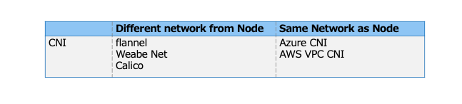
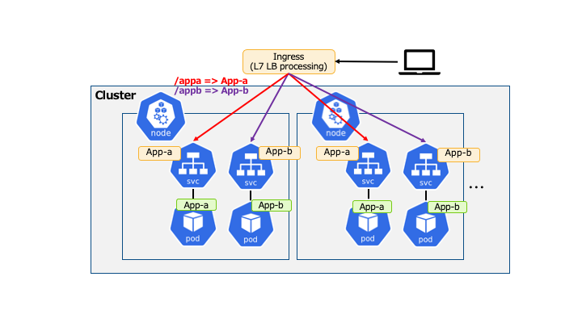
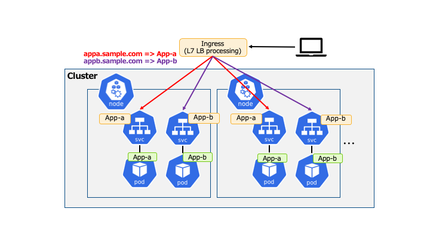
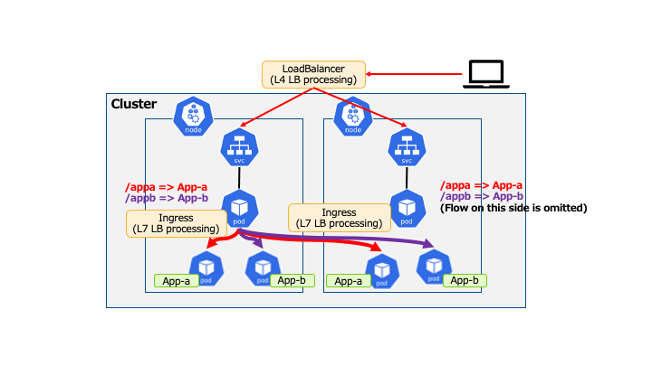
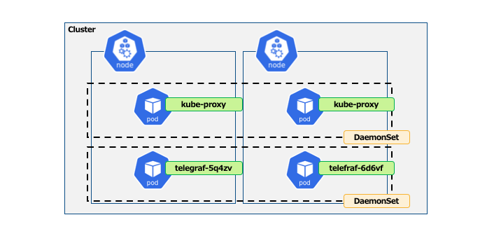

# Learn about the basics of Kubernetes Multi-Node configuration

## Overview

* Learn about Multi-Node configuration
  * Network
    * Inter-Node communication
    * Load balancing between Multi-Nodes
  * DaemonSet
    * Resources which handle Pods \(Image of special ReplicaSet\)

## Kubernetes Cluster - Inter-Node communication

* In order to enable communication between Pods on different Nodes, additional network plugins are needed to be implemented.

## Container Network Interface

* ContainerNetworkInterface \(CNI\) is
  * A plugin to enable Multi-Node communication between Pods.
  * Each cloud provider provides its own plugins by default.
    * It can also be selected at the time of building.    

* The following shows that Pods can be roughly categorized according to whether they belong to the same network as the Node.  

## Load balancing on Multi-Node

## Place LoadBalancer

* Place LoadBalancer outside a Cluster
  * Ingress resource \(L7 LoadBalancer\) or LoadBalancer resource \(L4 LoadBalancer\)  

* There are roughly two patterns of placement.
  * Do L7 Load balancing process outside the cluster.
    * ex: Do L7 Load balancing in AWS ELB and directly to each Node's Pod
  * Do L7 Load balancing process inside the cluster.
    * ex: Do L4 Load balancing in AWS ELB, and to L7 Load balancing Pod, and then to each Pod
  * In both cases, it is important to understand the functions and unique specifications of the Load balancer resources as they use the external system (Cloud Service).

## Example of Ingress Outside the Cluster (path-base routing)

## Example of Ingress Outside the Cluster (Routing via Host header)

## Example of Ingress Inside the Cluster (Pattern 3rd)

* The following Pods can be worked as Ingress and can be selected.
  * Ingress Nginx, Ambassador, Contour

## What is DaemonSet?

* One Pod is placed in every WorkerNode by default.
  * `replicas` is not specified as it is 1 Pod/Node.
  * It is possible to specify only a specific Node \(*nodeSelector*\) or to specify a condition by label \(*affinity*\).  

* Often used to place daemons and agents
  * Log collection daemon: fluentd
  * Log collection agent: telegraf
  * Storage daemon: ceph

## Example of DaemonSet

