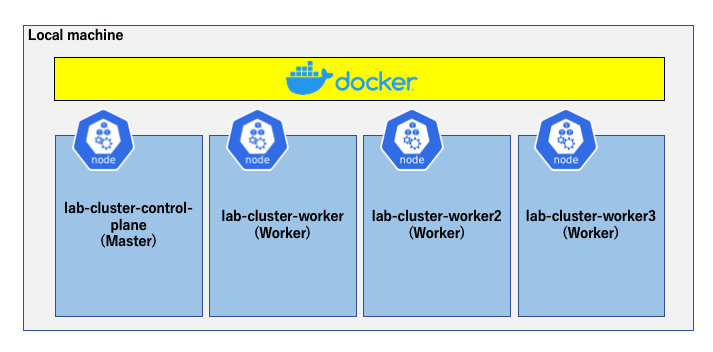

# **Lab 04-1 – Preparing Multi-Node Kubernetes environment (kind)**

**STEP 1 can be skipped, if the `kind` command is already set up on a local machine.**  
**This instruction manual is as of kind v0.8.1.**

In this Lab, a Multi-node cluster will be built on Docker on a local machine using **kind**, which is a Kubernetes building tool.  


The above figure is cited from <https://kind.sigs.k8s.io/docs/design/initial>.

`kind` is a tool that allows to build and test a Multi-node Kubernetes cluster environment on a local machine by creating a Master/Worker Node with the necessary components for Kuberentes configured in a container on Docker.  
In this Lab, install `kind` and create/delete a Multi-node cluster for use in Lab 04-2.  
The cluster to be created consists of one Master and three Workers, as the following figure shows.  



## ***Step 1 (Install kind)***

1.  Install `kind` on a local machine.  

 **<u>・For Mac</u>**

```sh
$ curl -Lo ./kind https://kind.sigs.k8s.io/dl/v0.8.1/kind-$(uname)-amd64
$ chmod +x ./kind
$ mv ./kind <Any directory with a PATH>kind
```

 **<u>・For Windows</u>**

```sh
// Download kind.exe to the current directory
$ curl -Lo kind.exe https://kind.sigs.k8s.io/dl/v0.8.1/kind-windows-amd64
```

 Move the downloaded kind.exe file to any folder with a PATH.  

2.  Confirm that `kind` is installed.    
    Confirm that the version of `kind` is displayed. The following is an example of the display on Windows.  

```sh
$ kind version
kind v0.8.1 go1.14.2 windows/amd64
```

## ***Step 2 (Create Multi-Node Cluster)***

Create a cluster on Docker with the `kind` installed in Step 1.  
**＊ The working directory is *materials/lab04-1_kind* directory.**  
**＊ The Node container image for the cluster is about 1.5GB.**

1.  Confirm the version of `kubectl` installed on a local machine.

```sh
// The display of the Server Version depends on whether or not there is a cluster connected to it.
$ kubectl version --short
Client Version: v1.15.5
Server Version: v1.15.11
```

 The version of `kubectl` supports up to one minor version before or after the Kubernetes version.  
 In the Lab, the version of `kubectl` is 1.15, so the corresponding Kubernetes version is 1.14\~1.16.  

 On the basis of the version of `kubectl`, review the configuration file `cluster-config.yaml` of the cluster to be created with `kind`.

```yaml
# this config file contains all config fields with comments
# NOTE: this is not a particularly useful config file
kind: Cluster
apiVersion: kind.x-k8s.io/v1alpha4
# 1 control plane node and 3 workers
nodes:
# the control plane node config
- role: control-plane
  image: kindest/node:v1.15.11@sha256:6cc31f3533deb138792db2c7d1ffc36f7456a06f1db5556ad3b6927641016f50
  kubeadmConfigPatches:
  - |
    kind: InitConfiguration
    nodeRegistration:
      kubeletExtraArgs:
        node-labels: "ingress-ready=true"
  # for Ingress access
  extraPortMappings:
  - containerPort: 80
    hostPort: 80
    protocol: TCP
  - containerPort: 443
    hostPort: 443
    protocol: TCP
# the three workers
- role: worker
  image: kindest/node:v1.15.11@sha256:6cc31f3533deb138792db2c7d1ffc36f7456a06f1db5556ad3b6927641016f50
  kubeadmConfigPatches:
  - |
    kind: JoinConfiguration
    nodeRegistration:
      kubeletExtraArgs:
        read-only-port: "10255"
- role: worker
  image: kindest/node:v1.15.11@sha256:6cc31f3533deb138792db2c7d1ffc36f7456a06f1db5556ad3b6927641016f50
  kubeadmConfigPatches:
  - |
    kind: JoinConfiguration
    nodeRegistration:
      kubeletExtraArgs:
        read-only-port: "10255"
- role: worker
  image: kindest/node:v1.15.11@sha256:6cc31f3533deb138792db2c7d1ffc36f7456a06f1db5556ad3b6927641016f50
  kubeadmConfigPatches:
  - |
    kind: JoinConfiguration
    nodeRegistration:
      kubeletExtraArgs:
        read-only-port: "10255"
```

 In the `image` field under the `nodes` field, the version of Kubernetes is specified based on the image of each Node. If the version specified in the configuration file does not correspond to the version of your `kubectl`, it is necessary to modify the description of the configuration file to the corresponding version of the image by referring to the following list of Node images.  
 The image field is changed in four places: one place for Master and three places for Worker.    
 As for the image list, refer to the Releases: kubernetes-sigs/kind (<https://github.com/kubernetes-sigs/kind/releases>).   
 **(＊ As of July 7th, 2020, Lab 04-2 is assumed to be Kuberentes 1.15.)**

2.  Build a cluster with the `kind` command.

```sh
$ kind create cluster --name lab-cluster --config cluster-config.yaml
Creating cluster "lab-cluster" ...
• Ensuring node image (kindest/node:v1.15.11) 🖼 ...
✓ Ensuring node image (kindest/node:v1.15.11) 🖼
• Preparing nodes 📦 📦 📦 📦 ...
✓ Preparing nodes 📦 📦 📦 📦
• Writing configuration 📜 ...
✓ Writing configuration 📜
• Starting control-plane 🕹️ ...
✓ Starting control-plane 🕹️
• Installing CNI 🔌 ...
✓ Installing CNI 🔌
• Installing StorageClass 💾 ...
✓ Installing StorageClass 💾
• Joining worker nodes 🚜 ...
✓ Joining worker nodes 🚜
Set kubectl context to "kind-lab-cluster"
You can now use your cluster with:

kubectl cluster-info --context kind-lab-cluster

Have a question, bug, or feature request? Let us know! https://kind.sigs.k8s.io/#community 🙂
```

 `--name` option: The name of the cluster to create    
 `--config` option: The configuration of the cluster to create

3.  Confirm that the information of Nodes is displayed.

```sh
// Confirm the status of the nodes
$ kubectl get node
NAME STATUS ROLES AGE VERSION
lab-cluster-control-plane Ready master 109s v1.15.11
lab-cluster-worker Ready <none> 57s v1.15.11
lab-cluster-worker2 Ready <none> 57s v1.15.11
lab-cluster-worker3 Ready <none> 57s v1.15.11

// Confirm that they are working as Docker containers
$ docker ps
CONTAINER ID IMAGE COMMAND CREATED STATUS PORTS NAMES
797a39678308 kindest/node:v1.15.11 "/usr/local/bin/entr…" 11 hours ago Up 3 minutes 0.0.0.0:80->80/tcp, 0.0.0.0:443->443/tcp, 127.0.0.1:59391->6443/tcp lab-cluster-control-plane
d80f5bececd1 kindest/node:v1.15.11 "/usr/local/bin/entr…" 11 hours ago Up 3 minutes lab-cluster-worker2
83dad29e5e77 kindest/node:v1.15.11 "/usr/local/bin/entr…" 11 hours ago Up 3 minutes lab-cluster-worker3
87a761a40855 kindest/node:v1.15.11 "/usr/local/bin/entr…" 11 hours ago Up 3 minutes lab-cluster-worker
```

 Now that the Multi-node cluster has been built on Docker on a local machine.  
 The next step, Step 3, should be carried out after Lab 04-2 is completed.

## ***Step 3 (Delete the Cluster)***

The following should be done after all Labs are finished.

1.  Delete the cluster with the `kind` command.

```sh
$ kind delete cluster --name lab-cluster
Deleting cluster "lab-cluster" ...

$ kind get clusters
No kind clusters found.

// Confirm that the Docker containers that were confirmed in Step 2, item 2 have been deleted.
$ docker ps

```

 Now, the deletion of the Cluster is complete.  
