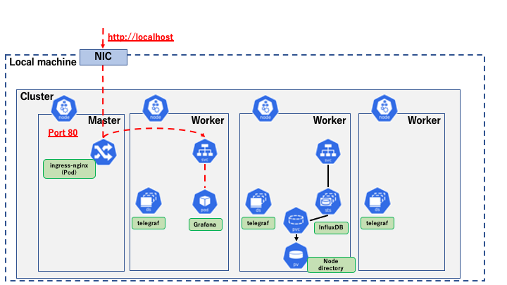
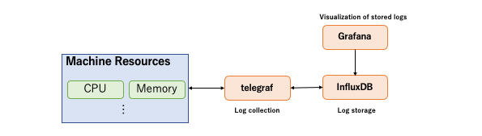
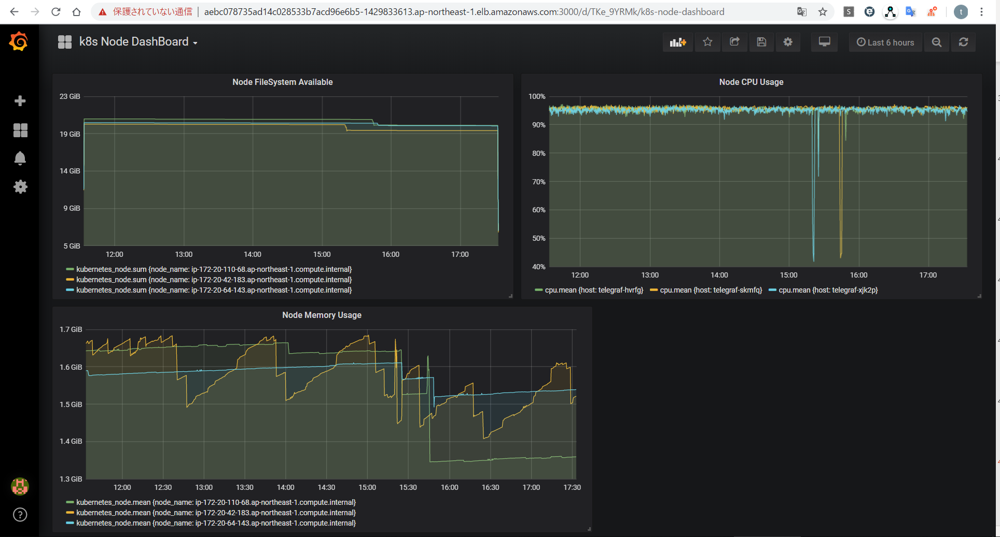
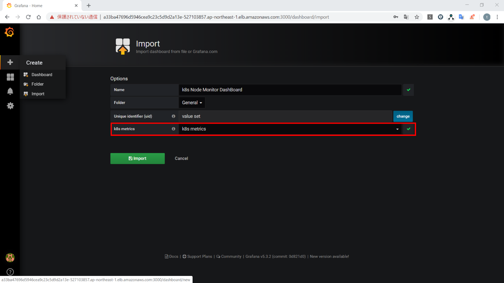
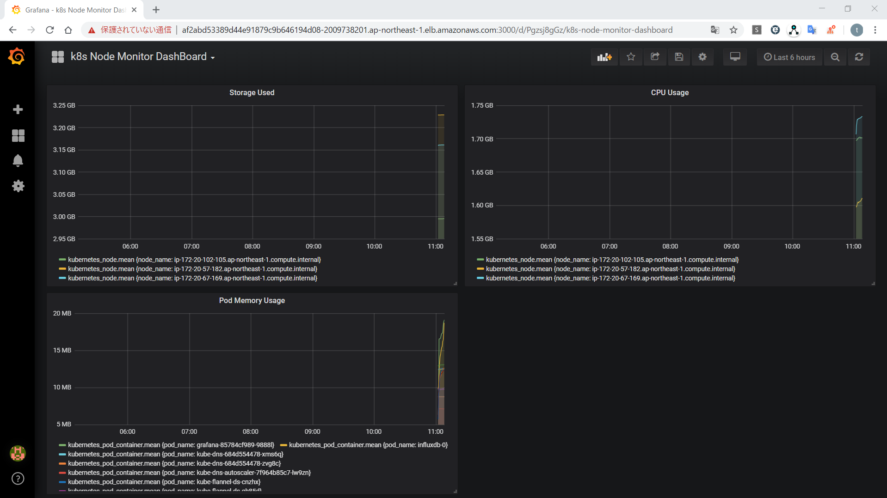
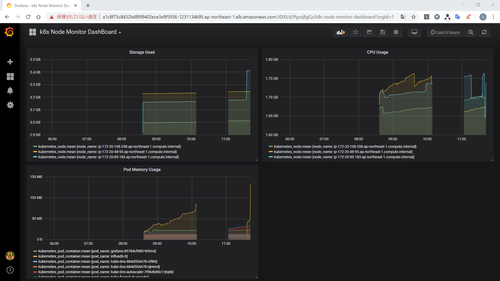

## **Lab 04-2 – Deploying a cluster monitoring application**

**＊ The working directory is *materials/lab04-2_sts-ds* directory.**  


In this Lab, deploy influxDB, telegraf, and grafana to the Multi-node kubernetes cluster which is configured on Docker on a local machine with `kind`, and create a Node monitoring dashboard.  
The following is the configuration image of deployment. Since it is the special environment which is configured with `kind`, the *ingress-nginx* Pod which operates Ingress exists only in the Master Node, and it will be port forwarded between Port 80 of the *ingress-nginx* Pod and Port 80 of the local machine.



In this Lab, deploy InfluxDB, telegraf, and Grafana. The roles of each are as the following figure.  



Also, the kubernetes resources to be deployed will be the followings.    

**・InfluxDB (Log storage)**  
StatefulSet + PersistentVolume + PersistentVolumeClaim  

**・telegraf (Log collection)**  
DaemonSet

**・Grafane (Log visualization)**  
Deployment + Ingress

After deploying, access Grafana via a browser, and create a monitoring dashboard for each Node something like this. (As it is an image, feel free to create any dashboard you like.)  



## ***Step 1 (Deploy an Ingress)***

1.  Deploy the **Ingress Nginx Controller** for the outside access.

```sh
$ kubectl apply -f https://raw.githubusercontent.com/kubernetes/ingress-nginx/master/deploy/static/provider/kind/deploy.yaml
namespace/ingress-nginx created
serviceaccount/ingress-nginx created
configmap/ingress-nginx-controller created
clusterrole.rbac.authorization.k8s.io/ingress-nginx created
clusterrolebinding.rbac.authorization.k8s.io/ingress-nginx created
role.rbac.authorization.k8s.io/ingress-nginx created
rolebinding.rbac.authorization.k8s.io/ingress-nginx created
service/ingress-nginx-controller-admission created
service/ingress-nginx-controller created
deployment.apps/ingress-nginx-controller created
validatingwebhookconfiguration.admissionregistration.k8s.io/ingress-nginx-admission created
clusterrole.rbac.authorization.k8s.io/ingress-nginx-admission created
clusterrolebinding.rbac.authorization.k8s.io/ingress-nginx-admission created
job.batch/ingress-nginx-admission-create created
job.batch/ingress-nginx-admission-patch created
role.rbac.authorization.k8s.io/ingress-nginx-admission created
rolebinding.rbac.authorization.k8s.io/ingress-nginx-admission created
serviceaccount/ingress-nginx-admission created

$ kubectl get pod -n ingress-nginx
NAME READY STATUS RESTARTS AGE
ingress-nginx-admission-create-fkr2b 0/1 Completed 0 3m17s
ingress-nginx-admission-patch-jlnjl 0/1 Completed 2 3m17s
ingress-nginx-controller-55784674bf-hhc57 1/1 Running 0 3m28s
```

 After the *ingress-nginx-controller* Pod startup is completed, when accessing http://localhost via a browser, *404 Not Found* page will be displayed.  
 In the cluster environment created in this Lab, it is possible to access Port 80 of the *nginx-ingress-controller* from Port 80 of localhost from the local machine.  

## ***Step 2 (Deploy an InfluxDB)***

Deploy InfluxDB for log storage. The kubernetes resources to be deployed are the followings.  

**・NameSpace**  
monitoring: Namespace for deploying monitoring-related resources  

**・Secret**  
influxdb-secret: Database name, User name, Password

**・StatefulSet**  
influxdb: StatefulSet in InfluxDB. In this Lab, the configuration is 1 *replicas* (Master only).    
It is possible to declare a PVC template, and the PVC will allow to mount and use the PV created with *Dynamic Provisioning*.  

**・PersistentVolumeClaim(PVC)**  
It is generated by the *VolumClaimTemplates* field, which can be defined in the StatefulSet.  

**・PersistentVolume(PV)**  
Used as data storage for InfluxDB. With the above PVC, the *Dynamic Provicioning* feature will automatically create the resource.  

**・Service**  
Service for StatefulSet. Enable name resolution with the hostname of the Pod, not via the virtual ClusterIP. In this Lab, the name resolution should be enabled in *influxdb-0.influxdb*.  

1.  Review the manifest file `influxdb-deploy.yaml` for deploying.   

```yaml
apiVersion: v1
kind: Namespace       # Create a Namespace for Log Monitoring
metadata:
  name: monitoring
---
apiVersion: v1
kind: Secret          # InfluxDB connection information
metadata:
  name: influxdb-secret
  namespace: monitoring
type: Opaque          # type which defines a Secret in a schema-less
data:                 # Define the value to be provided in the key-value format
  INFLUXDB_DATABASE: bG9jYWxfbW9uaXRvcmluZw==  # Encoded "local_monitoring" with base64
  INFLUXDB_USERNAME: c2FtcGxl                  # Encoded "sample" with base64
  INFLUXDB_PASSWORD: cGFzc3dvcmQ=              # Encoded "passwordsec" with base64
---
apiVersion: apps/v1
kind: StatefulSet     # StatefulSet for InfluxDB Pod (Pod with PV)
metadata:
  namespace: monitoring
  labels:
    app: influxdb
  name: influxdb
spec:
  replicas: 1         # 1 Master configuration
  selector:
    matchLabels:
      app: influxdb
  serviceName: influxdb
  template:
    metadata:
      labels:
        app: influxdb
    spec:
      containers:
      - envFrom:
        - secretRef:
            name: influxdb-secret
        image: docker.io/influxdb:1.6.4
        name: influxdb
        volumeMounts:                   # Mount PV
        - mountPath: /var/lib/influxdb
          name: var-lib-influxdb
  volumeClaimTemplates:                 # PVC
  - metadata:
      name: var-lib-influxdb
    spec:
      accessModes: ["ReadWriteOnce"]
      resources:
        requests:
          storage: 1Gi
---
apiVersion: v1
kind: Service
metadata:
  name: influxdb
  namespace: monitoring
spec:
  clusterIP: None
  selector:
    app: influxdb
```

2.  Deploy **influxdb**.

```sh
$ kubectl apply -f influxdb-deploy.yaml
namespace/monitoring created
secret/influxdb-secret created
statefulset.apps/influxdb created
service/influxdb created

$ kubectl get pod,sts,pv -o wide -n monitoring
NAME READY STATUS RESTARTS AGE IP NODE NOMINATED NODE READINESS GATES
pod/influxdb-0 1/1 Running 0 55s 10.244.3.4 lab-cluster-worker <none> <none>

NAME READY AGE CONTAINERS IMAGES
statefulset.apps/influxdb 1/1 55s influxdb docker.io/influxdb:1.6.4

NAME CAPACITY ACCESS MODES RECLAIM POLICY STATUS CLAIM STORAGECLASS REASON AGE VOLUMEMODE
persistentvolume/pvc-3348244c-bfb8-4bb5-bf26-8a6dcd97a04b 1Gi RWO Delete Bound monitoring/var-lib-influxdb-influxdb-0 standard 53s Filesystem
```

 *PersistentVolume* is not defined in the manifest file, but the resources have been created. This is because of the "*Dynamic Provicioning*" feature, which automatically creates PV when PVC is created.   
 Reviewing the `StorageClass` in the following, it can be noticed that the `StorageClass` named "standard" is set as default.   
 The *PersistentVolume* used in this Lab environment is a resource called "HostPath" which uses the directory of the Worker Node where the Pod is running.  

```sh
$ kubectl get sc
NAME PROVISIONER AGE
standard (default) rancher.io/local-path 18m

$ kubectl describe sc standard
Name: standard
IsDefaultClass: Yes
Annotations: kubectl.kubernetes.io/last-applied-configuration={"apiVersion":"storage.k8s.io/v1","kind":"StorageClass","metadata":{"annotations":{"storageclass.kubernetes.io/is-default-class":"true"},"name":"standard"},"provisioner":"rancher.io/local-path","reclaimPolicy":"Delete","volumeBindingMode":"WaitForFirstConsumer"}
,storageclass.kubernetes.io/is-default-class=true
Provisioner: rancher.io/local-path
Parameters: <none>
AllowVolumeExpansion: <unset>
MountOptions: <none>
ReclaimPolicy: Delete
VolumeBindingMode: WaitForFirstConsumer
Events: <none>
```

 Confirm the details of the created PV.  

```sh
$ kubectl describe pv -n monitoring
Name: pvc-3348244c-bfb8-4bb5-bf26-8a6dcd97a04b
Labels: <none>
Annotations: pv.kubernetes.io/provisioned-by: rancher.io/local-path
Finalizers: [kubernetes.io/pv-protection]
StorageClass: standard
Status: Bound
Claim: monitoring/var-lib-influxdb-influxdb-0
Reclaim Policy: Delete
Access Modes: RWO
VolumeMode: Filesystem
Capacity: 1Gi
Node Affinity:
Required Terms:
Term 0: kubernetes.io/hostname in [lab-cluster-worker]
Message:
Source:
Type: HostPath (bare host directory volume)
Path: /var/local-path-provisioner/pvc-3348244c-bfb8-4bb5-bf26-8a6dcd97a04b
HostPathType: DirectoryOrCreate
Events: <none>
```

 Find the directory path of the Worker Node currently in use in the `Source` field .  
 Also, `Node Affinity` field indicates on which Worker Node the resource is located. In this Lab, the resources exist on a Worker Node named *"lab-cluster-worker"*.  

## ***Step 3 (Deploy a telegraf)***

Then, deploy **telegraf** to do the log collection. DaemonSet is used to deploy a pod to each Node machine that collects logs from each Node. The reason for using DaemonSet is described later.  

The kubernetes resources to be deployed are the followings.  
**・Secret**  
telegraf-secret: InfluxDB connection information  

**・ConfigMap**  
telegraf-config: Telegraf configuration information  

**・DaemonSet**  
telegraf: DaemonSet to collect logs of each Node

1.  Review the manifest file `telegraf-deploy.yaml` for deploying.   

```yaml
apiVersion: v1
kind: Secret                                    # InfluxDB connection information
metadata:
  name: telegraf-secret
  namespace: monitoring
type: Opaque
data: 
  INFLUXDB_DB: bG9jYWxfbW9uaXRvcmluZw==         # Encoded "local_monitoring" with base64
  INFLUXDB_USER: c2FtcGxl                       # Encoded "sample" with base64
  INFLUXDB_USER_PASSWORD: cGFzc3dvcmQ=          # Encoded "passwordsec" with base64
  INFLUXDB_URL: aHR0cDovL2luZmx1eGRiLTAuaW5mbHV4ZGI6ODA4Ng==   # Encoded "http://influxdb-0.influxdb:8086" with base64
---
apiVersion: v1
kind: ConfigMap                                 # Telegraf configuration information
metadata:
  name: telegraf-config
  namespace: monitoring
data:                                           # Configuration values for log destination (influxdb) and log collection destination (k8s)
  telegraf.conf: |+
    [[outputs.influxdb]]
      urls = ["$INFLUXDB_URL"]
      database = "$INFLUXDB_DB"
      username = "$INFLUXDB_USER"
      password = "$INFLUXDB_USER_PASSWORD"
    [[inputs.statsd]]
    [[inputs.cpu]]
    [[inputs.disk]]
    [[inputs.diskio]]
    [[inputs.kernel]]
    [[inputs.mem]]
    [[inputs.processes]]
    [[inputs.swap]]
    [[inputs.system]]
    [[inputs.docker]]
    [[inputs.kubernetes]]
      url = "http://$TELEGRAF_KUBERNETES_ENDPOINT:10255"
---
apiVersion: apps/v1
kind: DaemonSet                                 # Specify a DaemonSet to locate the telegraf Pod
metadata:
  namespace: monitoring
  name: telegraf
spec:
  selector:
    matchLabels:
      app: telegraf
  minReadySeconds: 5
  template:
    metadata:
      labels:
        app: telegraf
    spec:
      containers:
        - image: telegraf:1.10.0
          name: telegraf
          env:                                  # The hostname of the Node where the Pod is located
          - name: TELEGRAF_KUBERNETES_ENDPOINT
            valueFrom:
              fieldRef:
                fieldPath: spec.nodeName
          envFrom:                              # InfluxDB connection information
            - secretRef:
                name: telegraf-secret
          volumeMounts:                         # Mount telegraf configuration information as a file
            - name: telegraf-config-volume
              mountPath: /etc/telegraf/telegraf.conf
              subPath: telegraf.conf
              readOnly: true
      volumes:                                  # Specify ConfigMap     
        - name: telegraf-config-volume
          configMap:
            name: telegraf-config
```

2.  Deploy telegraf.

```sh
$ kubectl apply -f telegraf-deploy.yaml
secret/telegraf-secret created
configmap/telegraf-config created
daemonset.apps/telegraf created

$ kubectl get pod,ds,sts,svc -n monitoring -o wide
NAME READY STATUS RESTARTS AGE IP NODE NOMINATED NODE READINESS GATES
pod/influxdb-0 1/1 Running 0 17m 10.244.3.4 lab-cluster-worker <none> <none>
pod/telegraf-6lbcc 1/1 Running 0 3m11s 10.244.3.6 lab-cluster-worker <none> <none>
pod/telegraf-9r4v4 1/1 Running 0 3m12s 10.244.2.3 lab-cluster-worker2 <none> <none>
pod/telegraf-gdfnf 1/1 Running 0 3m11s 10.244.1.5 lab-cluster-worker3 <none> <none>

NAME DESIRED CURRENT READY UP-TO-DATE AVAILABLE NODE SELECTOR AGE CONTAINERS IMAGES SELECTOR
daemonset.extensions/telegraf 3 3 3 3 3 <none> 3m12s telegraf telegraf:1.10.0 app=telegraf

NAME READY AGE CONTAINERS IMAGES
statefulset.apps/influxdb 1/1 17m influxdb docker.io/influxdb:1.6.4

NAME TYPE CLUSTER-IP EXTERNAL-IP PORT(S) AGE SELECTOR
service/influxdb ClusterIP None <none> <none> 17m app=influxdb
```

 Since telegraf is a DaemonSet, one telegraf Pod will be deployed to each Node. In this way, DaemonSet is useful for deploying one Pod on each Node. There is no `replicas` setting that represents the number of Pods in a ReplicaSet or StatefulSet.   
 Some system components such as the CNI "kindnet" which is a CNI in the kind environment are also DaemonSets, and it can be confirmed with "`kubectl get ds -A`".

## ***Step 4 (Create a Grafana)***

Deploy **Grafana** for visualizing the logs collected to InfluxDB.  
The resources to be deployed are the followings.  

**・Secret**  
grafana-secret: Credentials to access the Grafana dashboard

**・Deployment**  
grafana: Deployment for Grafana

**・Service**  
grafana: Service to access the Grafana dashboard

**・Ingress**  
grafana: Routing rules to be applied to nginx-ingress-controller

1.  Review the manifest file `grafana-deploy.yaml` for deploying.  

```yaml
apiVersion: v1
kind: Secret        # Login information for Grafana dashboaard
metadata:
  name: grafana-secret
  namespace: monitoring
type: Opaque
data: 
  GF_SECURITY_ADMIN_USER: YWRtaW4=                   # Encoded "admin" with base64
  GF_SECURITY_ADMIN_PASSWORD: bGFiLWdyYWZhbmExMjM=   # Encoded "lab-grafana123" with base64
---
apiVersion: apps/v1
kind: Deployment     # Deployment for Grafana Pod
metadata:
  namespace: monitoring
  labels:
    app: grafana
  name: grafana
spec:
  replicas: 1
  selector:
    matchLabels:
      app: grafana
  template:
    metadata:
      labels:
        app: grafana
    spec:
      containers:
      - envFrom:
        - secretRef:
            name: grafana-secret
        image: docker.io/grafana/grafana:5.3.2
        name: grafana
---
kind: Service
apiVersion: v1
metadata: 
  name: grafana-svc
  namespace: monitoring
spec:
  selector:
    app: grafana
  ports: 
  - port: 3000
---
apiVersion: extensions/v1beta1
kind: Ingress          # Ingress to access Grafana Pod
metadata:
  name: grafana
  namespace: monitoring
spec:
  rules:
  - http:
      paths:
      - path: /
        backend:
          serviceName: grafana-svc
          servicePort: 3000
```

2.  Deploy Grafana.

```sh
$ kubectl apply -f grafana-deploy.yaml
secret/grafana-secret created
deployment.apps/grafana created
service/grafana-svc created
ingress.extensions/grafana created

$ kubectl get pod,ds,sts,svc -n monitoring -o wide
NAME READY STATUS RESTARTS AGE IP NODE NOMINATED NODE READINESS GATES
pod/grafana-85784cf989-z7x42 1/1 Running 0 72s 10.244.2.4 lab-cluster-worker2 <none> <none>
pod/influxdb-0 1/1 Running 0 26m 10.244.3.4 lab-cluster-worker <none> <none>
pod/telegraf-6lbcc 1/1 Running 0 12m 10.244.3.6 lab-cluster-worker <none> <none>
pod/telegraf-9r4v4 1/1 Running 0 12m 10.244.2.3 lab-cluster-worker2 <none> <none>
pod/telegraf-gdfnf 1/1 Running 0 12m 10.244.1.5 lab-cluster-worker3 <none> <none>

NAME DESIRED CURRENT READY UP-TO-DATE AVAILABLE NODE SELECTOR AGE CONTAINERS IMAGES SELECTOR
daemonset.extensions/telegraf 3 3 3 3 3 <none> 12m telegraf telegraf:1.10.0 app=telegraf

NAME READY AGE CONTAINERS IMAGES
statefulset.apps/influxdb 1/1 26m influxdb docker.io/influxdb:1.6.4

NAME TYPE CLUSTER-IP EXTERNAL-IP PORT(S) AGE SELECTOR
service/grafana-svc ClusterIP 10.108.97.65 <none> 3000/TCP 72s app=grafana
service/influxdb ClusterIP None <none> <none> 26m app=influxdb
```

 Now, the necessary resources to access the Grafana dashboard had been deployed.


3.  Access the Grafana dashboard via a browser and do the initial settings.

 Accessing the Grafana dashboard by http via a browser will bring up the login screen as shown below.  
 **URL: http://localhost**


 The login credentials are stored in the `grafana-secret` deployed in `grafana-deploy.yaml`.    
 username: admin  
 password: lab-grafana123

 After logging in, the Home Dashboard as shown below will be displayed, and click *"Add data source"* to set up the connection to InfluxDB.  


 In the Setting screen, configure the settings as the followings.  

 **Name**: k8s metrics  
 **Type**: InfluxDB  
 **HTTP**  
 **- URL**: http://influxdb-0.influxdb:8086  
   => For StatefulSet, Name resolution is possible with \<Pod host name>.\<Service name>. (＊)  
 **InfluxDB Details**  
 **- Database**: local_monitoring  
 **- User**: sample  
 **- Password**: password  
   => The above information is stored in the *influxdb-secret* field.

 After filling in the settings, click *"Save & Test"*. Once the settings had been successfully configured, the message *"Data source is working"* will be displayed.  

  ＊ Name resolution for StatefulSet Pod  
  Normally, Pod-to-Pod communication is accessed through Service, and name resolution by Pod hostname is not possible. When configuring Primary/Secondary using StatefulSet, Primary access should be the main access. Accessing via the Service will cause load balancing, and access to the Primary will not be possible at all times.    
  By using a StatefulSet and ClusterIP:None which is the specially configured service (Headless Service) like in this Lab, it is possible to access by specifying the Pod name.  

 Then, import the Grafana DashBoard configuration file.  


 Select *"Import"* from the left menu, click *"Upload .json File"*, and select the `grafana-config.json` file under the */materials/lab04-2_sts-ds/grafana-config* directory.    
 Select *"k8s metrics"* as the data source that has created earlier, and click *"Import"*.  



 Once the import had been successful, the following dashboard will be displayed.  



 This dashboard displays three graphs. The storage and memory usage of each Worker Node is graphed in the top row, and the memory usage of the Pod is graphed in the bottom row.    
 The telegraf Pod of each Node located by DaemonSet stores metrics retrieved via the kubelet API into InfluxDB, and Grafana uses the data to create graphs.    
 As in this Lab, kubernetes manages logs by locating a log collection agent on each Node, or by encapsulating a log collection container in a Pod (sidecar pattern).  

4.  Customize Grafana (optional)

 Customize Grafana by adding graphs, etc.  
 To edit an existing graph, click on the graph title and select Edit.    
 To add a new graph, click the *Add panel* on the dashboard screen.  
 ・List of metrics captured by telegraf    
 Refer to the *Metrics* section in github(<https://github.com/influxdata/telegraf/tree/master/plugins/inputs/kubernetes>).

## ***Step 5(Move StatefulSet Node)***

When moving the Pod to which PV is assigned, be aware of the resource limitations of the PV (in the case of cloud services such as EKS and AKS, the storage service used by the PV, etc).    
In this Lab, the directory of Worker Node is assigned as PV in influxdb-0 Pod.   
The directory of PV used in each Worker Node cannot be accessed from another Worker Node.　　  
For example, sample-pv is created on Node worker-1 and a Pod is scheduled on Node worker-2, when the Pod attempts to assign the sample-pv, the Pod would not start up.  
Note the PV limitation and actually move the influxdb-0 Pod to another Node as the following figure shows.  


When moving Node, the Pod is recreated and the PV is assigned new PV, so the data in the Pod is deleted and the PV data will be the new PV data. Therefore, the data in the database needs to be restored if the graph of Grafana before the move is to be displayed.    
In this Lab, access inside the influxdb-0 Pod and with the `influxd` command to get a backup before moving the Node. After moving the Node, restore it from the backup that had been got.  

1.  Prepare to move the influxdb-0 Pod.    
    Confirm the Node name where the influxdb-0 Pod is located.  

```sh
// Confirm the Node where influxdb-0 Pod is located and its AZ.
$ kubectl get pod influxdb-0 -n monitoring -o=jsonpath='{.spec.nodeName}'
lab-cluster-worker
```

 Set the unscheduled flag on the Node to prevent it from being scheduled to the same Node.  
 In this Lab, the Node to set the flag is "**lab-cluster-worker**".  
 _**Take a note in a text file or something as the original Node where the influxdb-0 Pod was located.**_

```
// Review Node STATUS
$ kubectl get node lab-cluster-worker
NAME STATUS ROLES AGE VERSION
lab-cluster-worker Ready <none> 129m v1.15.11
// Set unscheduled flag to Node
$ kubectl cordon lab-cluster-worker
node/lab-cluster-worker cordoned

// Review Node STATUS
$ kubectl get node lab-cluster-worker
NAME STATUS ROLES AGE VERSION
lab-cluster-worker Ready,SchedulingDisabled <none> 130m v1.15.11
```

 The target Node was no longer scheduled with the `kubectl cordon` command.  
 STATUS of the Node is now showing *SchedulingDisabled*. The *SchedulingDisabled* Node will no longer be a target for subsequent deployments of the Pod.    
 With cordon, the existing Pods on the unscheduled Node will continue to run.    
 In the Grafana dashboard, confirm that the graph is displayed normally.　　

2.  Get a backup of InfluxDB.  

```sh
$ kubectl exec -n monitoring -it influxdb-0 bash

// Inside influxdb-0 Pod
<strong>root@influxdb-0:/# influxd backup -portable -database local_monitoring /tmp/influxdb-bak
2020/07/07 22:29:48 backing up metastore to /tmp/influxdb-bak/meta.00
2020/07/07 22:29:48 backing up db=local_monitoring
2020/07/07 22:29:48 backing up db=local_monitoring rp=autogen shard=2 to /tmp/influxdb-bak/local_monitoring.autogen.00002.00 since 0001-01-01T00:00:00Z
2020/07/07 22:29:49 backup complete:
2020/07/07 22:29:49 /tmp/influxdb-bak/20200707T222948Z.meta
2020/07/07 22:29:49 /tmp/influxdb-bak/20200707T222948Z.s2.tar.gz
2020/07/07 22:29:49 /tmp/influxdb-bak/20200707T222948Z.manifest
root@influxdb-0:/# ls /tmp/influxdb-bak/
20200707T222948Z.manifest 20200707T222948Z.meta 20200707T222948Z.s2.tar.gz

// Exit from influxdb-0 Pod
root@influxdb-0:/# exit
```

 Copy the backup data from inside the Pod to the local machine.

```
// Local machine
$ kubectl cp influxdb-0:/tmp/influxdb-bak ./bak-dir -n monitoring
tar: Removing leading `/' from member names

$ ls ./bak-dir/
20200707T222948Z.manifest 20200707T222948Z.meta 20200707T222948Z.s2.tar.gz

```

 ＊　`kubectl cp \<copy source>\<copy destination>`  
    For specifying a directory in Pod, \<Pod name>:\<directory path in Pod>.

3. Move the influxdb-0 Pod.    
   Move the Node with `kubectl delete` command to recreate the influxdb-0 Pod. However, StatefulSet would attempt to use the same PVC to allocate the PV when recreating the Pod.    
   When moving a Node, as in this Lab, the PV and the Node to which the Pod is scheduled will be different, and then the Pod will not start. In order to start the Pod, it should be necessary to delete the PVC and assign the PV with the new PVC.    
   The *Reclaim Policy* of the PV assigned to influxdb-0 is *Delete*, so when deleting the PVC, the directory on the Node will also be deleted. The backup of influxdb-0 had already been taken, but changing the *Reclaim Policy* to *Retain* and hold the directory on Node.

```sh
// Confirm the PV assigned to influxdb-0 (reviewing the PVC)
$ kubectl get pod influxdb-0 -n monitoring -o jsonpath='{.spec.volumes[*].persistentVolumeClaim.claimName}'
var-lib-influxdb-influxdb-0

// Confirm the PV assigned to the PVC checked (CLAIM is the name of the PVC you checked above).
// In this Lab environment, there is only one PV, but when there are multiple PVs, confirm them in this way and others.
$ kubectl get pv
NAME CAPACITY ACCESS MODES RECLAIM POLICY STATUS CLAIM STORAGECLASS REASON AGE
pvc-3348244c-bfb8-4bb5-bf26-8a6dcd97a04b 1Gi RWO Delete Bound monitoring/var-lib-influxdb-influxdb-0 standard 157m
```

  Edit the *Reclaim Policy* for the confirmed PV.    
 ＊ Type the PV name that is confirmed above in <INPUT YOUR PV NAME>.  
    In this Lab, the PV name is "**pvc-3348244c-bfb8-4bb5-bf26-8a6dcd97a04b**".  

 **・For Mac**

```sh
// Change Reclaim Policy
$ kubectl patch persistentvolume/<INPUT YOUR PV NAME> -n monitoring -p '{"spec":{"persistentVolumeReclaimPolicy":"Retain"}}'
persistentvolume/<INPUT YOUR PV NAME> patched

// Confirm that the Reclaim Policy has been changed.
$ kubectl get pv
NAME CAPACITY ACCESS MODES RECLAIM POLICY STATUS CLAIM STORAGECLASS REASON AGE
pvc-3348244c-bfb8-4bb5-bf26-8a6dcd97a04b 1Gi RWO Retain Bound monitoring/var-lib-influxdb-influxdb-0 standard 161m
```

 **・For Windows**

```sh
$ kubectl edit persistentvolume/<INPUT YOUR PV NAME>
// A text editor will launch as the following and it allows to edit the PV\'s yaml directly
// After completing the following edits, save the file with overwrite and close the text editor.  
// Close the text editor, and when editing is complete, the message will appear as the following.
// If it does not appear, please press the Enter key.
persistentvolume/<INPUT YOUR PV NAME> edited

// Confirm that the Reclaim Policy has been changed.
$ kubectl get pv
NAME CAPACITY ACCESS MODES RECLAIM POLICY STATUS CLAIM STORAGECLASS REASON AGE
pvc-3348244c-bfb8-4bb5-bf26-8a6dcd97a04b 1Gi RWO Retain Bound monitoring/var-lib-influxdb-influxdb-0 standard 161m
```

 **・Place to edit**  
 Change the value of **spec.persistentVolumeReclaimPolicy** field to "**Retain**".

 

 Now that the *Reclaim Policy* had been changed to *Retain*, delete the PVC and recreate the Pod.  

```sh
// Remove Pod with setting scale to 0 in StatefulSet
$ kubectl scale --replicas=0 sts/influxdb -n monitoring
statefulset.apps/influxdb scaled

// Delete PVC
$ kubectl delete persistentvolumeclaim/var-lib-influxdb-influxdb-0 -n monitoring
persistentvolumeclaim "var-lib-influxdb-influxdb-0" deleted

// Confirm that the PVC has been deleted and the PV is now Released.
$ kubectl get pv,pvc -A
NAME CAPACITY ACCESS MODES RECLAIM POLICY STATUS CLAIM STORAGECLASS REASON AGE
persistentvolume/pvc-3348244c-bfb8-4bb5-bf26-8a6dcd97a04b 1Gi RWO Retain Released monitoring/var-lib-influxdb-influxdb-0 standard 172m
```

 Confirm that the Node directory used for PV is also left undeleted.  
  lab-cluster-worker is the Node where the influxdb-0 Pod was originally deployed.  

```SH
// Confirm the directory path of the Node being used with the PV information.
$ kubectl get persistentvolume/pvc-3348244c-bfb8-4bb5-bf26-8a6dcd97a04b -o jsonpath='{.spec.hostPath.path}'
/var/local-path-provisioner/pvc-3348244c-bfb8-4bb5-bf26-8a6dcd97a04b

// Use the docker exec command and execute the ls command in the Node container to confirm.
$ docker exec lab-cluster-worker ls /var/local-path-provisioner/pvc-3348244c-bfb8-4bb5-bf26-8a6dcd97a04b
data
meta
wal
```

 Now, with setting the scale of influxdb back from 0 to 1, it allows to restart the Pod.  
 One thing to note about PV is the behavior of the volumeBindingMode of `StorageClass`.  
 There are two modes of volumeBindingMode: _Immediate_ and _waitForFirstConsumer_. *Based on Dyanmic Provisioning*, each of them behaves as the followings.

 **・Immediate (default)**  
 PVC is created, then the PV is bound and reality are created.     
 **・waitForFirstConsumer**  
 Wait to bind the PV and create the reality until Pod that uses the PVC is created.  

 In the default _Immediate_ mode, the PV reality is created before the Pod is scheduled.  Therefore, not knowing the scheduling conditions of the Pod, it may happen that the PV is created in an AZ where the Pod cannot be scheduled, and the Pod will not start up.    
 The workaround is to use a StorageClass with the volumeBindingMode set to _waitForFirstConsumer_. Note that in this Lab environment, volumeBindingMode of `StorageClass` is set to _waitForFirstConsumer_ by default, so there is not a problem.

```SH
$ kubectl describe sc
Name: standard
IsDefaultClass: Yes
Annotations: kubectl.kubernetes.io/last-applied-configuration={"apiVersion":"storage.k8s.io/v1","kind":"StorageClass","metadata":{"annotations":{"storageclass.kubernetes.io/is-default-class":"true"},"name":"standard"},"provisioner":"rancher.io/local-path","reclaimPolicy":"Delete","volumeBindingMode":"WaitForFirstConsumer"}
,storageclass.kubernetes.io/is-default-class=true
Provisioner: rancher.io/local-path
Parameters: <none>
AllowVolumeExpansion: <unset>
MountOptions: <none>
ReclaimPolicy: Delete
VolumeBindingMode: WaitForFirstConsumer
Events: <none>
```

 Set the value of scale of influxdb StatefulSet back to 1.  

```sh
$ kubectl scale --replicas=1 sts/influxdb -n monitoring
statefulset.apps/influxdb scaled

// After the completion of Pod startup
$ kubectl get pod,pv,pvc -n monitoring
NAME READY STATUS RESTARTS AGE
pod/grafana-85784cf989-z7x42 1/1 Running 0 167m
pod/influxdb-0 1/1 Running 0 52s
pod/telegraf-6lbcc 1/1 Running 0 179m
pod/telegraf-9r4v4 1/1 Running 0 179m
pod/telegraf-gdfnf 1/1 Running 0 179m

NAME CAPACITY ACCESS MODES RECLAIM POLICY STATUS CLAIM STORAGECLASS REASON AGE
persistentvolume/pvc-3348244c-bfb8-4bb5-bf26-8a6dcd97a04b 1Gi RWO Retain Released monitoring/var-lib-influxdb-influxdb-0 standard 3h13m
persistentvolume/pvc-a19e4f63-cfec-45d7-ab89-e6d8726b10ef 1Gi RWO Delete Bound monitoring/var-lib-influxdb-influxdb-0 standard 51s

NAME STATUS VOLUME CAPACITY ACCESS MODES STORAGECLASS AGE
persistentvolumeclaim/var-lib-influxdb-influxdb-0 Bound pvc-a19e4f63-cfec-45d7-ab89-e6d8726b10ef 1Gi RWO standard 52s

```

 Checking the dashboard in Grafana, the data before the move is not displayed because new PV has been created and assigned to the Pod. Next, confirm that the Pod has been created in another Node.  

```sh
// Confirm that it is different from the previous Node
# kubectl get pod -o wide -n monitoring
NAME READY STATUS RESTARTS AGE IP NODE NOMINATED NODE READINESS GATES
grafana-85784cf989-z7x42 1/1 Running 0 168m 10.244.2.4 lab-cluster-worker2 <none> <none>
influxdb-0 1/1 Running 0 2m17s 10.244.2.6 lab-cluster-worker2 <none> <none>
telegraf-6lbcc 1/1 Running 0 3h 10.244.3.6 lab-cluster-worker <none> <none>
telegraf-9r4v4 1/1 Running 0 3h 10.244.2.3 lab-cluster-worker2 <none> <none>
telegraf-gdfnf 1/1 Running 0 3h 10.244.1.5 lab-cluster-worker3 <none> <none>

// Confirm the Node of PV
# kubectl describe pv <INPUT YOUR NEW PV>
・・・
Node Affinity:
Required Terms:
Term 0: kubernetes.io/hostname in [lab-cluster-worker2]
Message:
・・・
```

 This way, Pod had been created on a different Node from the previously assigned Node, and PV had been created on that Node.

4.  Execute restore of influxdb.

```sh
// Copy the backup data to the influxdb-0 Pod and access the Pod
$ kubectl cp ./bak-dir/ influxdb-0:/tmp/influxdb-bak -n monitoring
$ kubectl exec -n monitoring -it influxdb-0 bash

//The following is the operation inside the influxdb-0 Pod
root@influxdb-0:/# ls /tmp/influxdb-bak/
20200707T222948Z.manifest 20200707T222948Z.meta 20200707T222948Z.s2.tar.gz

root@influxdb-0:/# influxd restore -portable -db local_monitoring -newdb local_monitoring_bak /tmp/influxdb-bak/
2020/07/07 23:49:53 Restoring shard 2 live from backup 20200707T222948Z.s2.tar.gz

root@influxdb-0:/# influx
Connected to http://localhost:8086 version 1.6.4
InfluxDB shell version: 1.6.4
> use local_monitoring_bak
Using database local_monitoring_bak
> SELECT * INTO local_monitoring..:MEASUREMENT FROM /.*/ GROUP BY *
name: result
time written
---- -------
0 89602
> drop database "local_monitoring_bak"
> exit
// Exit from Pod
root@influxdb-0:/# exit
```

 After the restore, review the Grafana dashboard and find the data before the Pod move.    
 Since there is no data during the Pod move process, it should look like the following.  



5.  Since unscheduled flag for Node had been set (`kubectl cordon`), remove the flag.    
    lab-cluster-worker is the Node where influxdb-0 Pod was originally located.  

```sh
$ kubectl get node lab-cluster-worker
NAME STATUS ROLES AGE VERSION
lab-cluster-worker Ready,SchedulingDisabled <none> 3h39m v1.15.11

// Remove unscheduled flag
# kubectl uncordon lab-cluster-worker
node/lab-cluster-worker uncordoned

$ kubectl get node lab-cluster-worker
NAME STATUS ROLES AGE VERSION
lab-cluster-worker Ready <none> 3h40m v1.15.11
```

 Now, move the influxdb-0 Pod to Node is completed. When moving a Pod with PV, such as StatefulSet, pay attention to the `StorageClass` setting of the PV which the Pod uses, and the PVC setting, because the difference in scheduling between the Pod and the PV may cause the failure of the Pod creation.

## ***Step 6(Delete InfluxDB, telegraf, Grafana)***

Delete the deployed resources.

```sh
$ kubectl delete -f grafana-deploy.yaml
secret "grafana-secret" deleted
deployment.apps "grafana" deleted
service "grafana-svc" deleted
ingress.extensions "grafana" deleted

$ kubectl delete -f telegraf-deploy.yaml
secret "telegraf-secret" deleted
configmap "telegraf-config" deleted
daemonset.apps "telegraf" deleted

$ kubectl delete -f influxdb-deploy.yaml
namespace "monitoring" deleted
secret "influxdb-secret" deleted
statefulset.apps "influxdb" deleted
service "influxdb" deleted

$ kubectl delete -f https://raw.githubusercontent.com/kubernetes/ingress-nginx/master/deploy/static/provider/kind/deploy.yaml
namespace "ingress-nginx" deleted
serviceaccount "ingress-nginx" deleted
configmap "ingress-nginx-controller" deleted
clusterrole.rbac.authorization.k8s.io "ingress-nginx" deleted
clusterrolebinding.rbac.authorization.k8s.io "ingress-nginx" deleted
role.rbac.authorization.k8s.io "ingress-nginx" deleted
rolebinding.rbac.authorization.k8s.io "ingress-nginx" deleted
service "ingress-nginx-controller-admission" deleted
service "ingress-nginx-controller" deleted
deployment.apps "ingress-nginx-controller" deleted
validatingwebhookconfiguration.admissionregistration.k8s.io "ingress-nginx-admission" deleted
clusterrole.rbac.authorization.k8s.io "ingress-nginx-admission" deleted
clusterrolebinding.rbac.authorization.k8s.io "ingress-nginx-admission" deleted
job.batch "ingress-nginx-admission-create" deleted
job.batch "ingress-nginx-admission-patch" deleted
role.rbac.authorization.k8s.io "ingress-nginx-admission" deleted
rolebinding.rbac.authorization.k8s.io "ingress-nginx-admission" deleted
serviceaccount "ingress-nginx-admission" deleted
```

 This is the end of this Lab. Go back to Step 3 in Lab 04-1 and delete the cluster created with `kind`.
