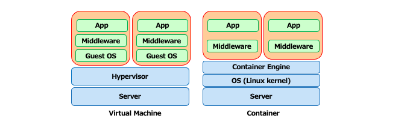
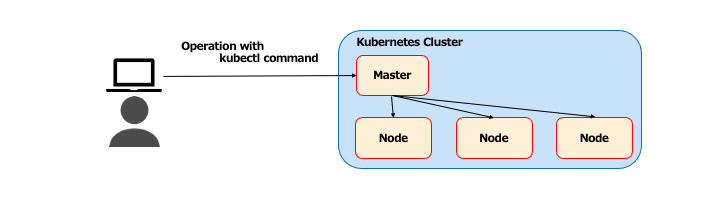
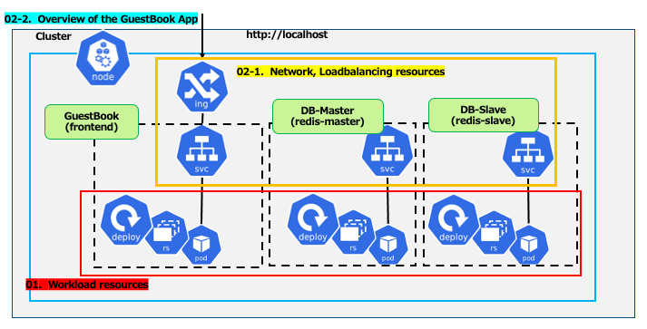
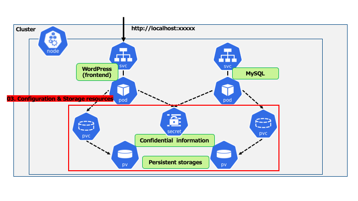
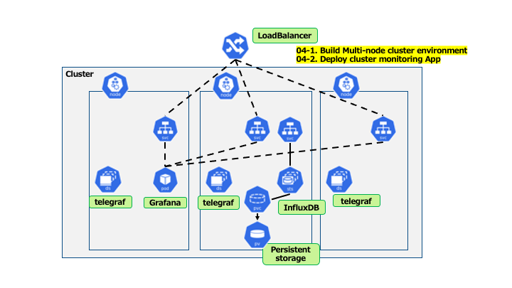

# Kubernetes Learning Overview

## Course Purpose

To acquire the knowledge and skills required to manage and operate Kubernetes environment.

## What is Kubernetes?

* The de facto standard for container orchestration system.
  * Open source projects hosted by Cloud Native Computing Foundation\(CNCF\).

* It can be used to configure a cluster environment and supports the following features.
  * Rolling upgrade
  * Self-healing
  * Scheduling (automated deployment) of Node (host) for container deployment
  * Service discovery and load balancing
  * Scaling/Autoscaling
  * Management of resources via declarative code (yaml or json) (Infrastructure as Code)

## Appendix - What is a container?

* A lightweight virtual environment that does not require a guest OS.
  * Shared use of the host OS kernel
* Focus on applications.
  * Packaging of required middleware and dependent libraries
* __Docker__ ： The de facto standard for container engines.

## Kubernetes operation and management image

* __cluster__
  * It consists of a Server called Master and Worker.
* __kubectl__
  * Commands to operate the Kuberenetes cluster
  *  A request by the command is sent to the Master Server.

## Course Contents

* Fundamental
  * Learn about the basic elements of Kubernetes.

## About the Fundamental course - first half

  * Purpose
    * To understand the basic elements of Kubernetes.
  * In the first half, learn about the basics of Kubernetes' unique resources, such as followings.  
    Use a single configuration Kubernetes environment on a local machine.   
    * __Workload__  __resource__  __\-1__
      * Resources for executing containers
    * __Network, Loadbalancing__  __resource__
      * Resources that provide endpoints for inter-container communication and for exposing containers to the outside world.
  * At the end of the first half, deploy the official Kubernetes sample GuestBook app with the learned resources.

## About the Fundamental course - second half

  * In the second half, learn about the basics of Kubernetes' unique resources and Multi-Node configuration, such as followings.
    * __Configuration, Storage__  __resource__
      * Resources related to configuration/confidential information/ persistent volumes, etc.
    * __Workload__  __resource__  __\- 2__
      * Resources related to Storage resources
    * __Multi-node Kubernetes clusters__
      * Network
  * At the end of the second half, deploy Kubernetes cluster monitoring app with the learned resources.

## Course Agenda - first half

  * Lecture
    * 00 – Fundamental Course Overview
    * 01 – Learn about Workload resources in Kubernetes
    * 02 – Learn about Network, Loadbalancing resources in Kubaneres

  * Lab
    * 01 – Lab exercises on Workload resources in Kubernetes
    * 02\-1 – Lab exercises on Network, Loadbalancing resources in Kubernetes
    * 02\-2 – Deploy the GuestBook application

## Course Flow - first half (up to configuration of the GuestBook application)

  

## Course Agenda - second half

  * Lecture
    * 03 – Learn about Kubernetes Configuration, Storage resources
    * 04 – Learn about the basics of Kubernetes Multi-Node configuration

  * Lab
    * 03\-1 - Lab exercises on Kubernetes Configuration related resources
    * 03\-2 - Lab exercises on Kubernetes Storage resources
    * 04\-1 – Preparing Multi-Node Kubernetes environment (kind)
    * 04\-2 – Deploying a cluster monitoring application

## Course Flow - second half

  

  

## kubernetes environment used in Lab

  * First half - Lab will be operated in a single node cluster environment with _Docker for Desktop_.
  * Second half - Lab will be operated in a multi-node cluster environmet with _Docker\+kind_.

  * Other __Types of Kubernetes environments__
    * __Local__  __Kubernetes__
      * Minikube
      * Docker for Desktop
      * Docker \+ kind
    * __Kubernetes environment built with tools__
      * kubeadm
      * Rancher
      * kops
    * __Managed__  __Kubernetes__  __Services__
      * Google Kubernetes Engine\(GKE\)
      * Elastic Container Service for Kubernetes\(EKS\)
      * Azure Kubernetes Service\(AKS\)

# Course Agenda

|Session #|Session                                  | Type  |Contents Description       |Duration (h)|Material                               |
|:-----:|-----------------------------------------|:------:|---------------------------|---|--------------------------------------------|
|1|Learn about Workload resources in Kubernetes|Lecture|Pod, Replicaset, Deployment|1|[k8s-01_Lec-workloads_resource](../JP/k8s-01_Lec-workloads_resource.md)|
|1|Lab exercises on Workload resources in Kubernetes|Lab|Pod, Replicaset, Deployment|1|[k8s-01_lab-Pod-RS-Deployment](../JP/k8s-01_lab-Pod-RS-Deployment.md)|
|2|Learn about Network, Loadbalancing resources in Kubernetes|Lecture|Service, Ingress, CoreDNS|1|[k8s-02_0_Lec-discovery_lb_resource](../JP/k8s-02_0_Lec-discovery_lb_resource.md)|
|2|Lab exercises on Netrork, Loadbalancing resources in Kubernetes|Lab|Service, Ingress|1|[k8s-02_1_lab-Service-Ingress_internal](../JP/k8s-02_1_lab-Service-Ingress_internal.md)|
|2|Deploy the GuestBook application|Lab|Pod, Replicaset, Deployment, Deploying a sample application|1|[k8s-02_2_lab-GuestBook-Deploy](../JP/k8s-02_2_lab-GuestBook-Deploy.md)|
|3|Learn about Kubernetes Configuration, Storage resources|Lecture|PV, PVC, ConfigMap, Secret, StatefulSet, StorageClass|1| [k8s-03_0_Lec-config_storage_resource](../JP/k8s-03_0_Lec-config_storage_resource.md)|
|3|Lab exercises on Kubernetes Configuration related resources|Lab|ConfigMap, Secret|1|[k8s-03_1_lab-ConfigMap-Secret](../JP/k8s-03_1_lab-ConfigMap-Secret.md)   |
|3|Lab exercises on Kubernetes Storage resources|Lab|StorageClass, PV, PVC|1|[k8s-03_2_lab-Storage](../JP/k8s-03_2_lab-Storage.md)  |
|4|Learn about the basics of Kubernetes Multi-Node configuration|Lecture|Mult-Node cluster, CNI plug in, DamesonSet, Ingress + Loadbalancer|1|[k8s-04_0_Lec-multinode](../JP/k8s-04_0_Lec-multinode.md)   |
|4|Preparing Multi-Node Kubernetes environment  |Lab| Kind, DaemonSet, Ingress|1|[k8s-04_1_lab-kind_multiplenode_cluster](../JP/k8s-04_1_lab-kind_multiplenode_cluster.md)  |
|4|Deploying a cluster monitoring application|Lab|Kind, DaemonSet, Ingress|1|[k8s-04_2_lab-statefulset-daemonset_env_kind](../JP/k8s-04_2_lab-statefulset-daemonset_env_kind.md)  |

**＊ As for the materials used in Labs, please refer to [here](../../conf) .**  
**The operations described in these documents have been verified within VANTIQ Corporation. When using these documents, please do so at your own risk.**
