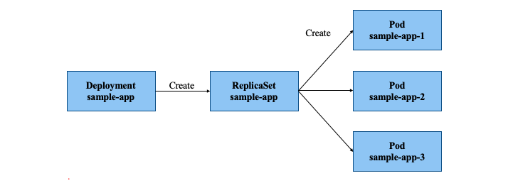

# Kubernetes の Workload リソースについての学習

## 概要

* Workload リソースとは
  * Dockerなどのコンテナの実行に関するリソースのことである
  * クラスタ上にコンテナを起動させるために利用される  

* Workload リソースのうち下記3つのリソースについて学ぶ
  #### 1. **[Pod](#Pod)**
  #### 2. **[ReplicaSet](#ReplicaSet)**
  #### 3. **[Deployment](#Deployment)**  

    **※1~3 を個別に説明するが、マニフェストファイルでは 3 は 1 と 2 の定義も包括する**

## 学習対象リソースの確認


## Pod とは<a id="Pod"></a>

* Kubernetesにデプロイできる最小単位で、1つ以上のコンテナから構成される
* Pod単位でクラスタ内部IPアドレスが払い出される
  * コンテナは属するPodのIPに対してポートのbindを行うことで、外部Podなどと通信が可能である
* Pod内のリソースは同一のNodeにデプロイされる
* Podを定義したマニフェストファイルから作成できるPodは 1つだけである


## Pod マニフェスト例

```yaml
apiVersion: v1
kind: Pod           # リソースの種類を指定
metadata:
  name: sample-pod # リソースの名称
spec:               # Podを構成するコンテナ群を定義
  containers:
  - name: nginx     # コンテナの名前
  image: nginx:latest  
ports:          # EXPOSEするポートの指定
  - containerPort: 80
・・・
```


## ReplicaSet とは<a id="ReplicaSet"></a>

* 同一仕様のPodを複数生成・管理するためのリソースである
  * マニフェストファイル内の `replicas` でPodの数を指定する
  * Pod障害時、指定した数になるよう自動回復する  

* `ReplicaSet` がクラスタ内で管理するPodの追跡に `labels` を利用する
  * 管理すべきPodの集合・一覧を `labels` によってフィルタリング、識別をする  


## ReplicaSet マニフェスト例

```yaml
apiVersion: apps/v1
kind: ReplicaSet
metadata:
  name: sample-rs
Spec:
  replicas: 2    # Podの複製数
  selector:
    matchLabels:             # ReplicaSet管理対象label
      app: sample-app
  template:                 # template以下はPodリソース定義
    metadata:
      labels:                         # Podのlabelを定義
        app: sample-app
    spec:
      containers:
         ・・・
```


## Deploymentとは<a id="Deployment"></a>

* ReplicaSetを管理・操作するためのリソースである
* ReplicaSetの世代管理を可能にする
  * リビジョンを使ってロールアウトが可能である
  * マニフェストファイルの定義は、ReplicaSetと差はあまりない
* アプリケーションデプロイの基本単位となる
* Deploymentの更新によってReplicaSetが新しく作成され、ReplicaSetの入れ替えが発生する

## Pod、ReplicaSet、Deployment の関係

__ReplicaSet__ :同一仕様のPodレプリカの数を管理・制御する

__Deployment__ :ReplicaSetを管理・操作する



## Deployment マニフェスト例


```yaml
apiVersion: apps/v1
kind: Deployment
metadata:
  name: sample-app
Spec:
  replicas: 2    # Podの複製数
  selector:
    matchLabels:             # ReplicaSet管理対象label
      app: sample-app
  template:                  # template以下はPodリソース定義
    metadata:
      labels:                         # Podのlabelを定義
        app: sample-app
    spec:
      containers:
         ・・・
```


## 新規 ReplicaSet 生成のトリガー

* __Pod__ 数のみを更新しても新規 __ReplicaSet__ は生成されない
  * Pod数は変化するが、ReplicaSetの入れ替えは発生しない

* コンテナ定義を更新すると  __ReplicaSet__  の入れ替えが発生する
  * 新しいPodが作成され、古いPodが段階的に停止する
  * __Deployment__ の新たなリビジョンが作成される

* 実運用では  __Deployment__  のマニフェストファイルを扱うが  __Deployment__  の中で  __ReplicaSet__  がどのような挙動をするかを把握することが重要である
