# Kubernetes の Network、Loadbalancing リソースについての学習

## 概要

* Network、Loadbalancing リソース
  * コンテナ間通信や、コンテナを外部公開するようなエンドポイントを提供する

* 下記2つの Network、Loadbalancing リソースについて学ぶ
  * Service
    * Podに対する経路やサービスディスカバリを提供する
  * Ingress
    * Service をクラスタ外に公開する

## 学習対象リソースの確認

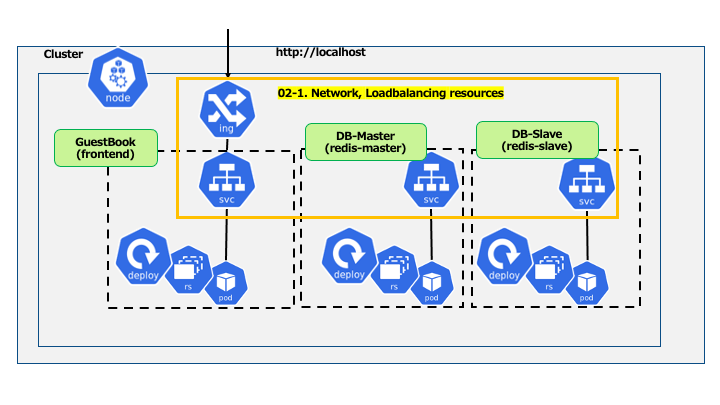

## Service とは

* クラスタ内DNSでPodの名前解決をする\( = “Service Discovery”\)
  * Podに割り当てられるIPアドレスは、Podの起動ごとに異なる
  * Pod宛トラフィックのL4ロードバランシングをする

* 主にServiceは以下の3種類
  * ClusterIPService
  * NodePortService
  * LoadBalancerService

## ClusterIP Service

* クラスタ内の内部IPアドレスにServiceを公開する
  * Pod間通信をServiceを介して行うことができる
  * Service名での名前解決が可能になる
* 外部からのアクセスは不可能である

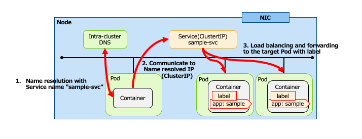

## クラスタ内DNS

* Kubernetesクラスタ内部のServiceを利用した名前解決にクラスタ内DNS\(Pod\)を利用する
  * kube\-dns
  * CoreDNS

* Serviceリソースと紐づいてクラスタ内DNSのエントリが変更になる

```yaml
spec:
  ports:
    - name: ”http”
      protocol: “tcp”
      port: 8080 
      targetPort: 80
```

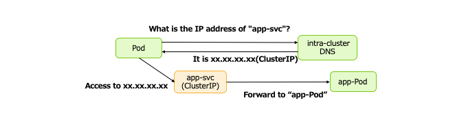

## PodのDNS設定

* マニフェストファイルでPodのDNS設定が可能である
  * `spec\.dnsPolicy` フィールド
    * __ClusterFirst__  __\(__  __デフォルト__  __\)__
      * クラスタ内DNSで名前解決不可能な場合、外部DNSへ問い合わせする
      * 外部DNSはPodが稼働しているNodeの設定を引き継ぐ
    * __None__
      * クラスタDNSで名前解決をせずに、別途 `spec\.dnsConfig` で外部DNSの設定をする

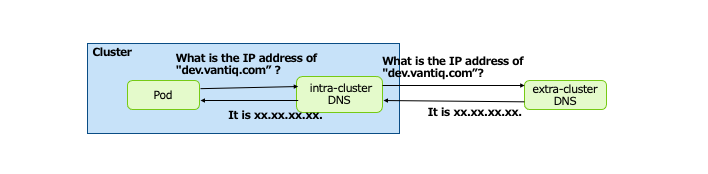

## NodePort Service

* クラスタ外からアクセスできるServiceのことである

* Service\(ClusterIP\) へ接続するためのポートを各ノード上から開ける

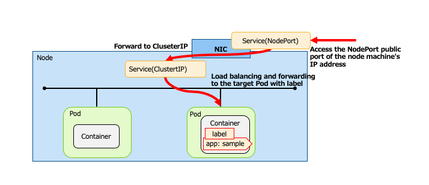

## ClusterIP Service マニフェスト例

```yaml
apiVersion: v1
kind: Service  # リソースの種類をServiceに
metadata:
  name: sample-svc   # Service名
spec:
  type: ClusterIP #Serviceの種類
  selector:    # ServiceのターゲットとするPodのラベル
    app: sample
  ports:
    - name: http
      port: 8080 # Serviceが受け付けるport
      targetPort: 80 # 転送先port
```

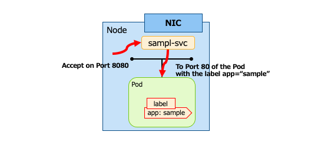

## Nodeport Service マニフェスト例

```yaml
apiVersion: v1
kind: Service    # リソースの種類をServiceに
metadata:
  name: sample-nodeport  #Service名
spec:
  type: NodePort # Serviceの種類
  selector:      # ServiceのターゲットとするPodのラベル
    app: sample
  ports:
    - name: http
      port: 80   # targetPort省略時、portと同じ値が設定される
```

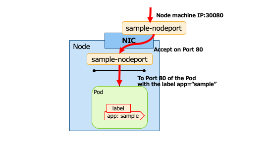

## ClusterIP、Nodeport Service の配置

* Cluster内すべてのNodeに存在する
  * Serviceに対応するPodがNode上に存在するかどうかは影響しない

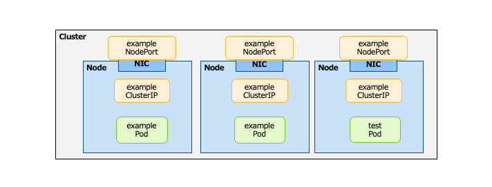

## クラスタ外部からの接続

* クラスタ内だけのリソース\(ClusterIPとNodePort\) では限界がある
  * NodePort により外部からのアクセスを確保したが、複数Node存在する場合、NodePort へのロードバランシングをどうするか
* クラスタ外部のリソースと連携する **LoadBalancer** もしくは **Ingress** を利用する
  * LoadBalancer: L4レベルでの制御をする
  * Ingress:パスベースで転送先のServiceを切り替えるといったL7レベルでの制御をする  
    ＊ KuberenetesではLoadBalancerはServiceリソースの一部だが、Ingressは独立したリソースとして扱われている

* パブリッククラウドにおけるクラスタ環境では、そのプラットフォーム上のロードバランサーを利用する
  * Classic\,ApplicationLoadBalancer\(AWS\)、CloudLoadBalancing\(GCP\) などがある

## Loadbalancer Service

* 外部システムのロードバランサと連携し、Podへのアクセスを可能にする
  * L4ロードバランシングが可能である
* ターゲットPodまでの経路\(NodePortとClusterIP\)を自動的に生成する

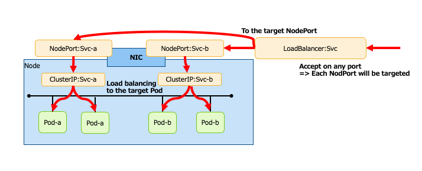

## Loadbalancer Service イメージ

* LoadBalancer => Node\(NodePort\) へのロードバランシング

* NodePort     => ClusterIP への転送

* ClusterIP    => Pod へのロードバランシング

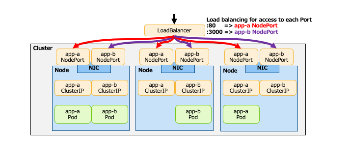

## LoadBalancer マニフェスト例

```yaml
apiVersion: v1
kind: Service  # リソースの種類はService
metadata:
  name: sample-lb
spec:
  selector:
    app: sample
  ports:
  - protocol: TCP
    port: 80
    targetPort: 8080
type: LoadBalancer
```

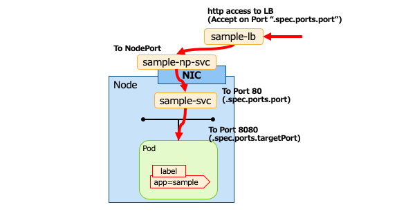

## Ingress とは

* 外部システムのロードバランサと連携し、Podへのアクセスを可能にする
  * L7ロードバランシングのほか、SSLターミネーションなども可能である
* ターゲットまでの経路\(NodePortとClusterIP\) を自動的に生成する

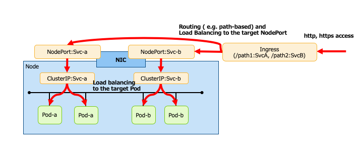

## Ingress イメージ(1)

* Ingress には大きく分けて2種類の配置パターンが存在する
  * Ingress\(L7ロードバランシング\)処理を行う実体をクラスターの外部 or 内部に配置する
  * 外部の場合: Ingressの実体は外部システムの機能である
  * 内部の場合: Ingressの実体はPodである
* 以下はクラスター外部に配置するパターンの例

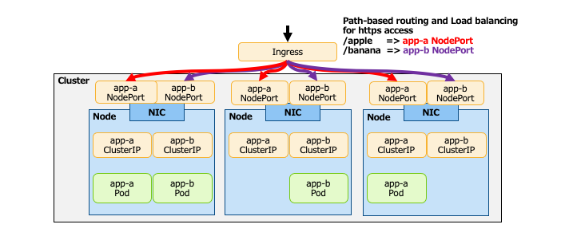

## Ingressイメージ(2)

* 以下はクラスター内部に Ingress を配置するパターン
* Ingress 処理をするPodには以下のような種類が存在する
  * Ingress Nginx
  * Ambassador
  * Contour

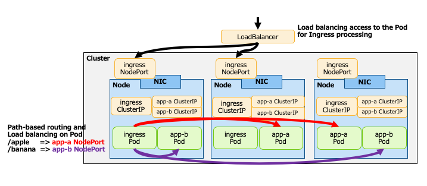

## Ingress マニフェスト例

```yaml
apiVersion: extensions/v1beta1
kind: Ingress   # リソースの種類をIngressに
metadata:
  name: sample-ingress
spec:
  rules:        # ルーティングルール
  - host: sample.com
    http:
      paths:
      - path: /
        backend: # ルーティング先
          serviceName: test-svc # ルーティング先Service名
          servicePort: 80
```

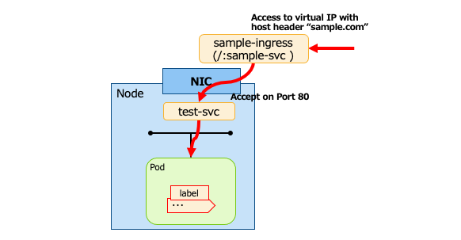
