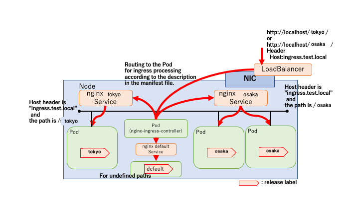

# **Lab 02-1 – Kubernetes の Network、Loadbalancing リソースについての実習**

## ***Step 0 (Kubernetes 実行環境と必要なファイルの用意)***

1.  インストラクターより、Labに必要なファイルを受け取り、作業用ディレクトリに展開します。  
**作業ディレクトリは *materials/lab02-1_svc-ingress* ディレクトリです。**

## ***Step 1 (ReplicateSet のデプロイ)***

1.  デプロイする ReplicateSet のマニフェストファイル `simple-replicaset-with-label.yaml` の内容を、ファイルを開いて確認します。

```yaml
apiVersion: apps/v1
kind: ReplicaSet
metadata:
  name: rs-tokyo
  labels:
    app: nginx
    release: tokyo
spec:
  replicas: 1
  selector:
    matchLabels: # rs-tokyo ReplicaSetが管理するPodのlabelを設定
      app: nginx 
      release: tokyo
  template:
    metadata:
      labels: # Podのlabelを設定
        app: nginx
        release: tokyo
    spec:
      containers:
      - name: nginx
        image: nginx:1.13 
        env: 
        - name: BACKEND_HOST
          value: localhost:8080
        ports:
        - containerPort: 80 
---
apiVersion: apps/v1
kind: ReplicaSet
metadata:
  name: rs-osaka
  labels:
    app: nginx
    release: osaka 
spec:
  replicas: 2
  selector:
    matchLabels: # rs-osaka ReplicaSetが管理するPodのlabelを設定
      app: nginx
      release: osaka 
  template:
    metadata:
      labels: # Podのlabelを設定
        app: nginx
        release: osaka 
    spec:
      containers:
      - name: nginx
        image: nginx:1.14 
        env: 
        - name: BACKEND_HOST
          value: localhost:8080
        ports:
        - containerPort: 80 
```

2.  ターミナルで作業ディレクトリに移動し、`kubectl`コマンドでPodをデプロイします。

```sh
$ kubectl apply -f simple-replicaset-with-label.yaml
replicaset.apps/rs-tokyo created
replicaset.apps/rs-osaka created
```

 rs-tokyo、rs-osaka という ReplicaSet のPodの中に nginx コンテナを作成しています。

3.  デプロイ状況を確認します。

```sh
$ kubectl get rs,pod -l app=nginx,release=tokyo
NAME DESIRED CURRENT READY AGE
replicaset.extensions/rs-tokyo 1 1 1 7s

NAME READY STATUS RESTARTS AGE
pod/rs-tokyo-skw9h 1/1 Running 0 7s
$ kubectl get rs,pod -l app=nginx,release=osaka
NAME DESIRED CURRENT READY AGE
replicaset.extensions/rs-osaka 2 2 2 19s

NAME READY STATUS RESTARTS AGE
pod/rs-osaka-pn2s5 1/1 Running 0 19s
pod/rs-osaka-tbh7j 1/1 Running 0 19s
```

 `release`ラベルに tokyo、osaka を持つPodがそれぞれデプロイされていることを確認できます。  
 ＊ `-l` オプションは `–selector`　オプションと同じで、ラベル名に一致したリソースを表示できます。

4.  レスポンス用のファイルをPodにコピーします。  
 **＊ Pod名は自身の環境に作成されたPod名に置き換えてください。**

```
$ kubectl cp tokyo-pod-1/index.html rs-tokyo-skw9h:/usr/share/nginx/html/

$ kubectl cp osaka-pod-1/index.html rs-osaka-pn2s5:/usr/share/nginx/html/

$ kubectl cp osaka-pod-2/index.html rs-osaka-tbh7j:/usr/share/nginx/html/
```

 ＊ `kubectl cp \<コピー元> \<コピー先>`  
 Podを指定する場合、\<Pod名>:\<Pod内パス> とします。

## ***Step 2 (ClusterIP Service のデプロイ)***
 `release`ラベルに osaka を持つPodにアクセスできるように Service を作成します。  
1.  デプロイする Service のマニフェストファイル `simple-service.yaml` の内容を確認します。

```yaml
apiVersion: v1
kind: Service  # リソースの種類をServiceに
metadata:
  name: nginx   # Service名、名前解決に利用
spec:
  selector:    # ServiceのターゲットとするPodのラベル
    app: nginx
    release: osaka
  ports:
    - name: http
      port: 80 # 転送先port
```

2.  `kubectl` コマンドで Service をデプロイします。

```sh
$ kubectl apply -f simple-service.yaml
service/nginx created
```

3.  デプロイ状況を確認します。

```sh
$ kubectl get svc nginx
NAME TYPE CLUSTER-IP EXTERNAL-IP PORT(S) AGE
nginx ClusterIP 10.101.159.85 <none> 80/TCP 28s

```

 ClusterIP Service が作成されたため、クラスタ内のPodから nginx Service を介して`app` ラベルに *nginx* かつ `release` ラベルに *osaka* を持つPodにアクセスが可能になりました。

4.  各Podの *echo* コンテナのログを確認してみます。  
 **＊ Pod名は自身の環境に作成されたPod名に置き換えてください。**

```sh
$ kubectl logs rs-tokyo-skw9h

$ kubectl logs rs-osaka-pn2s5

$ kubectl logs rs-osaka-tbh7j
```

 ここでクラスタ内にトラフィック確認用にデバッグコンテナを一時的にデプロイし、`curl`コマンドでhttpリクエストを数回送ってからログを再度確認します。

5.  デバッグコンテナのデプロイをし、コンテナ内からリクエストを数回送ります。  
 ＊ リクエストは必ず Pod1,2 の順番に返ってくるわけではありません。

```sh
$ kubectl run curl --image=radial/busyboxplus:curl -i --tty
kubectl run --generator=deployment/apps.v1 is DEPRECATED and will be removed in a future version. Use kubectl run --generator=run-pod/v1 or kubectl create instead.
If you do not see a command prompt, try pressing enter.
[ root@curl-6bf6db5c4f-qlbsl:/ ]$ curl http://nginx
Hello! Nginx1.14 Osaka Pod 1!
[ root@curl-6bf6db5c4f-qlbsl:/ ]$ curl http://nginx
Hello! Nginx1.14 Osaka Pod 2!
```

 リクエストに対して「Hello Nginx1.14 Osaka Pod \<Num>!!」というメッセージが返ってきます。Serviceを作成したことでクラスタ内DNSにより名前解決ができるようになりました。クラスタ内DNSでは  
 **Service名.Namespace名.svc.cluster.local**  
 で名前解決が可能になっています。また、`svc.cluster.local` は省略可能です。別 Namespace の Service の名前解決には  
 Service名.Namespace名  
 同一Namespaceであれば、Service名だけで解決が可能です。よってデバッグコンテナ内から下記でも`curl`コマンドによるリクエストで名前解決が可能です。  
 ＊ defaultではない Namespace でデプロイした場合、Namespace名は置き換えてください。

```sh
[ root@curl-6bf6db5c4f-qlbsl:/ ]$ curl http://nginx.default.svc.cluster.local/
Hello! Nginx1.14 Osaka Pod 1!
[ root@curl-6bf6db5c4f-qlbsl:/ ]$ curl http://nginx.default/
Hello! Nginx1.14 Osaka Pod 1!
```

 `exit`コマンドもしくは`ctrl+d`でコンテナからログアウトします。以下のコマンドで再度コンテナ内にログインできます。  
 `kubectl exec -it \<pod名> bash`

6.  再度Podのログを確認します。  
 **＊ Pod名は自身の環境に作成されたPod名に置き換えてください。**

```sh
$ kubectl logs rs-tokyo-skw9h

$ kubectl logs rs-osaka-pn2s5
10.1.2.59 - - [06/Jul/2020:05:37:07 +0000] "GET /index.html HTTP/1.1" 200 31 "-" "curl/7.35.0" "-"
10.1.2.59 - - [06/Jul/2020:05:37:10 +0000] "GET /index.html HTTP/1.1" 200 31 "-" "curl/7.35.0" "-"
10.1.2.59 - - [06/Jul/2020:05:37:13 +0000] "GET /index.html HTTP/1.1" 200 31 "-" "curl/7.35.0" "-"

$ kubectl logs rs-osaka-tbh7j
10.1.2.59 - - [06/Jul/2020:05:37:18 +0000] "GET /index.html HTTP/1.1" 200 31 "-" "curl/7.35.0" "-"
10.1.2.59 - - [06/Jul/2020:05:37:23 +0000] "GET /index.html HTTP/1.1" 200 31 "-" "curl/7.35.0" "-"
```

 ログから osaka のラベルをもつPodのみに Service を介してアクセスできていることが確認できます。Serviceとラベル付で区別されたPodとの関係は以下の図のようになります。


## ***Step 3（NodePort Service のデプロイ）***
 クラスタ外から osaka をラベルに持つPodへアクセスできるようにします。  
1.  デプロイする NodePort のマニフェストファイル `simple-service-nodeport.yaml` の内容を確認します。

```yaml
apiVersion: v1
kind: Service    # リソースの種類をServiceに
metadata:
 name: nginx
spec:
  type: NodePort # Serviceの種類、デフォルト(指定なし)の場合ClusterIPとなる
  selector:      # ServiceのターゲットとするPodのラベル
    app: nginx
    release: osaka
  ports:
    - name: http
      port: 80   # 転送先port
```

2.  `kubectl`コマンドで NodePort をデプロイします。  
    (マニフェストファイルベースの削除もしくはPodを指定した場合の削除どちらかを行います。)

```sh
$ kubectl apply -f simple-service-nodeport.yaml
service/nginx configured
```

3.  デプロイ状況を確認します。

```sh
$ kubectl get svc nginx
NAME TYPE CLUSTER-IP EXTERNAL-IP PORT(S) AGE
nginx NodePort 10.101.159.85 <none> 80:30713/TCP 175m
```

 **PORT(S)の表記**:  
 {Serviceの接続先Podのポート}:{NodeのServiceへの接続ポート}/プロトコル

 よって上記の場合、http://localhost:30713 でPodへアクセスができます。

4.  クラスタ外からPodへアクセスします。  
 ローカルマシンからブラウザや`curl`コマンドを使用して下記へアクセスし、レスポンスが返ってくることを確認します。  
 http://localhost:{NodeのServiceへの接続先ポート}

5.  `kubectl delete`コマンドから NodePort を削除します。  
**＊ Step4に影響するため必ず削除して下さい。**

```sh
$ kubectl delete -f simple-service-nodeport.yaml
service "nginx" deleted
```

## ***Step 4（Ingress のデプロイ）***  
 ローカル環境で Ingress を利用して、L7層レベルでの制御を行います。  
1.  **nginx_ingress_controller** をデプロイします。

```sh
$ kubectl apply -f https://raw.githubusercontent.com/kubernetes/ingress-nginx/master/deploy/static/provider/cloud/deploy.yaml
Warning: kubectl apply should be used on resource created by either kubectl create --save-config or kubectl apply
namespace/ingress-nginx configured
serviceaccount/ingress-nginx created
configmap/ingress-nginx-controller created
clusterrole.rbac.authorization.k8s.io/ingress-nginx created
clusterrolebinding.rbac.authorization.k8s.io/ingress-nginx created
role.rbac.authorization.k8s.io/ingress-nginx created
rolebinding.rbac.authorization.k8s.io/ingress-nginx created
service/ingress-nginx-controller-admission created
service/ingress-nginx-controller created
deployment.apps/ingress-nginx-controller created
validatingwebhookconfiguration.admissionregistration.k8s.io/ingress-nginx-admission createdclusterrole.rbac.authorization.k8s.io/ingress-nginx-admission created
clusterrolebinding.rbac.authorization.k8s.io/ingress-nginx-admission created
job.batch/ingress-nginx-admission-create created
job.batch/ingress-nginx-admission-patch created
role.rbac.authorization.k8s.io/ingress-nginx-admission created
rolebinding.rbac.authorization.k8s.io/ingress-nginx-admission created
serviceaccount/ingress-nginx-admission created
```

下記のように ingress-nginx という Namespace 上に ingress-nginx-controller Pod と ingress-nginx Service がデプロイされていれば Ingress リソースを利用する準備が完了します。

```sh
$ kubectl get pods,svc -n ingress-nginx
NAME READY STATUS RESTARTS AGE
pod/ingress-nginx-admission-create-52vzf 0/1 Completed 0 5m59s
pod/ingress-nginx-admission-patch-bcrxn 0/1 Completed 0 5m59s
pod/ingress-nginx-controller-86cbd65cf7-gtpvs 1/1 Running 0 6m9s

NAME TYPE CLUSTER-IP EXTERNAL-IP PORT(S) AGE
service/ingress-nginx-controller LoadBalancer 10.96.193.5 localhost 80:30668/TCP,443:30025/TCP 6m9s
service/ingress-nginx-controller-admission ClusterIP 10.110.112.252 <none> 443/TCP 6m9s
NAME TYPE CLUSTER-IP EXTERNAL-IP PORT(S) AGE
service/default-http-backend ClusterIP 10.110.141.207 <none> 80/TCP 15m
service/ingress-nginx LoadBalancer 10.111.53.58 localhost 80:32640/TCP,443:31347/TCP 15m
```

 この段階で localhost に仮想IPアドレスが localhost で払いだされたため、ローカルマシンから http://localhost へアクセスすると *404*が返ってくることを確認できます。

2.  Ingress を定義したマニフェストファイル`simple-ingress.yaml`と、Ingress 内でルーティング先として利用する Service を定義したマニフェストファイル`simple-service-forIngress.yaml`の内容を確認します。

`simple-ingress.yaml`

```yaml
apiVersion: extensions/v1beta1
kind: Ingress   # リソースの種類をIngressに
metadata:
  name: nginx-ing
spec:
  rules:        # ルーティングルール
  - host: ingress.test.local
    http:
      paths:
      - path: /
        backend: # 転送先 
          serviceName: nginx-svc
          servicePort: 80
```

`simple-service-forIngress.yaml`

```yaml
apiVersion: v1
kind: Service  # リソースの種類をServiceに
metadata:
  name: nginx-svc   # Service名、名前解決に利用
spec:
  type: ClusterIP
  selector:    # ServiceのターゲットとするPodのラベル
    app: nginx
  ports:
    - name: http
      port: 80 # 転送先port
```

3.  `kubectl`コマンドから Service と Ingress をデプロイします。

```sh
$ kubectl apply -f simple-service-forIngress.yaml
service/nginx-svc created
$ kubectl apply -f simple-ingress.yaml
ingress.extensions/nginx-ing created
```

4.  デプロイ状況を確認します。

```sh
$ kubectl get ingress
NAME HOSTS ADDRESS PORTS AGE
ingress.extensions/nginx-ing ingress.test.local localhost 80 8s

```

5.  リクエストをローカルマシンから送り、レスポンスが返ってくることを確認します。

```sh
$ curl -sS http://localhost/ -H "Host: ingress.test.local"
Hello! Nginx1.14 Osaka Pod 2!

$ curl -sS http://localhost/
<html>
<head><title>404 Not Found</title></head>
<body>
<center><h1>404 Not Found</h1></center>
<hr><center>nginx/1.19.0</center>
</body>
</html>
```

Ingress によって Hostヘッダーに基づくL7ルーティングが行われていることが確認できました。  
トラフィックのイメージは以下のようになります。


続いて、Ingress を用いてパスベースルーティングを行ってみます。

6.  3でデプロイした Service と Ingress を削除します。

```sh
$ kubectl delete -f simple-ingress.yaml
ingress.extensions "nginx-ing" deleted

$ kubectl delete -f simple-service-forIngress.yaml
service "nginx-svc" deleted
```

7.  新たにデプロイする、パスベースルーティングを行うための Service と Ingress のマニフェストファイルを確認します。

`simple-service-forIngress-path-routing.yaml`

```yaml
apiVersion: v1
kind: Service  # リソースの種類をServiceに
metadata:
  name: nginx-svc-tokyo   # Service名、名前解決に利用
spec:
  type: ClusterIP
  selector:    # ServiceのターゲットとするPodのラベル
    app: nginx
    release: tokyo
  ports:
    - name: http
      port: 80 # 転送先port
---
apiVersion: v1
kind: Service  # リソースの種類をServiceに
metadata:
  name: nginx-svc-osaka   # Service名、名前解決に利用
spec:
  type: ClusterIP
  selector:    # ServiceのターゲットとするPodのラベル
    app: nginx
    release: osaka
  ports:
    - name: http
      port: 80 # 転送先port
```

`simple-ingress-path-routing.yaml`

```yaml
apiVersion: extensions/v1beta1
kind: Ingress   # リソースの種類をIngressに
metadata:
  name: nginx-ing
spec:
  backend:      # デフォルトバックエンドの設定
    serviceName: nginx-svc-default
    servicePort: 80
  rules:        # ルーティングルール
  - host: ingress.test.local
    http:
      paths:
      - path: /tokyo
        backend: # 転送先 
          serviceName: nginx-svc-tokyo
          servicePort: 80
      - path: /osaka
        backend: # 転送先 
          serviceName: nginx-svc-osaka
          servicePort: 80
```

`backend-pod.yaml`

```yaml
apiVersion: apps/v1
kind: ReplicaSet
metadata:
  name: rs-default
  labels:
    app: nginx
    release: default
spec:
  replicas: 1
  selector:
    matchLabels: # rs-default ReplicaSetが管理するPodのlabelを設定
      app: nginx 
      release: default
  template:
    metadata:
      labels: # Podのlabelを設定
        app: nginx
        release: default
    spec:
      containers:
      - name: nginx
        image: nginx:1.15 
        env: 
        - name: BACKEND_HOST
          value: localhost:8080
        ports:
        - containerPort: 80 
---
apiVersion: v1
kind: Service  # リソースの種類をServiceに
metadata:
  name: nginx-svc-default   # Service名、名前解決に利用
spec:
  type: ClusterIP
  selector:    # ServiceのターゲットとするPodのラベル
    app: nginx
    release: default
  ports:
    - name: http
      port: 80 # 転送先port
```

先ほどと同じく、Hostヘッダーに基づくL7ルーティングに加え、URLのパスベースのルーティングを行うよう、マニフェストファイルを定義しました。デフォルトバックエンドを設定できるため、`backend-pod.yaml`にて nginx 1.15 のPodに *404* を返してもらうようにします。  
今回の場合、以下のようなルーティングとなります。

**・http://localhost/tokyo/**

nginx-svc-tokyo の80番ポートへ

**・http://localhost/osaka/**

nginx-svc-osaka の80番ポートへ

**・上記以外**

nginx-svc-default の80番ポートへ  

ルーティング先の各Serviceは`app=nginx`ラベルと各`release`ラベルで *tokyo* もしくは *osaka* を持つPodへ転送されます。

8.  `kubectl`コマンドから Service と Ingress、Backend のPodをデプロイします

```sh
$ kubectl apply -f simple-service-forIngress-path-routing.yaml
service/nginx-svc-tokyo created
service/nginx-svc-osaka created

$ kubectl apply -f simple-ingress-path-routing.yaml
ingress.extensions/nginx-ing created

$ kubectl get ingress
NAME HOSTS ADDRESS PORTS AGE
nginx-ing ingress.test.local localhost 80 18m

$ kubectl apply -f backend-pod.yaml
replicaset.apps/rs-default created
service/nginx-svc-default created
```

9.  レスポンスを返す *nginx* Pod を編集します。  
**＊ Pod名は自身の環境に作成されたPod名に置き換えてください。**

```sh
// 各Podでindex.htmlファイルを対応するディレクトリを作成しそのディレクトリへコピー
$ kubectl -it exec rs-tokyo-skw9h -- mkdir /usr/share/nginx/html/tokyo
$ kubectl -it exec rs-tokyo-skw9h -- cp /usr/share/nginx/html/index.html /usr/share/nginx/html/tokyo

$ kubectl -it exec rs-osaka-pn2s5 -- mkdir /usr/share/nginx/html/osaka
$ kubectl -it exec rs-osaka-pn2s5 -- cp /usr/share/nginx/html/index.html /usr/share/nginx/html/osaka/

$ kubectl -it exec rs-osaka-tbh7j -- mkdir /usr/share/nginx/html/osaka
$ kubectl -it exec rs-osaka-tbh7j -- cp /usr/share/nginx/html/index.html /usr/share/nginx/html/osaka/
```

10. リクエストをローカルマシンから送り、レスポンスが返ってくることを確認します。

```sh
$ curl http://localhost/tokyo/ -H "Host: ingress.test.local" -sS
Hello! Nginx1.13 Tokyo Pod 1!

$ curl http://localhost/osaka/ -H "Host: ingress.test.local" -sS
Hello! Nginx1.14 Osaka Pod 1!

$ curl http://localhost/osaka/ -H "Host: ingress.test.local" -sS
Hello! Nginx1.14 Osaka Pod 2!

$ curl http://localhost/winter -H "Host: ingress.test.local" -sS
<html>
<head><title>404 Not Found</title></head>
<body>
<center><h1>404 Not Found</h1></center>
<hr><center>nginx/1.15.12</center>
</body>
</html>
```

Ingress によってHostヘッダーかつパスに基づくL7ルーティングが行われていることが確認できました。トラフィックのイメージは以下となります。



以上で、Ingress の確認が完了しました。

## ***Step 5（ローカルクラスタ環境のリセット）***

1.  docker の Settings > Kubernetes メニューを開き「*Reset Kubernetes Cluster*」からリセットを行います。


