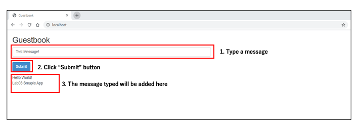
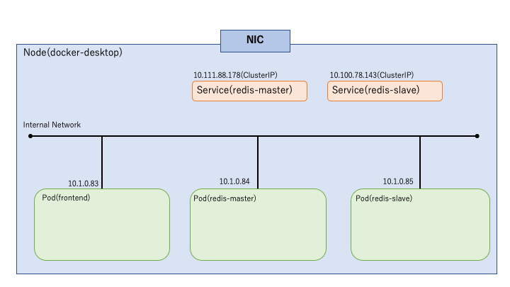
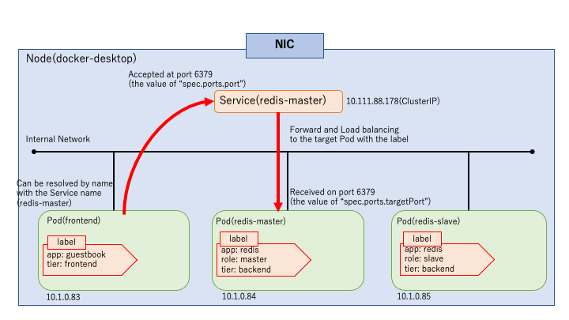
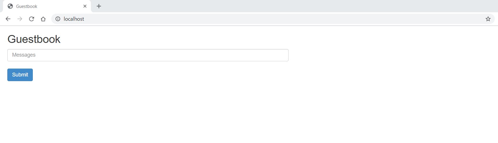
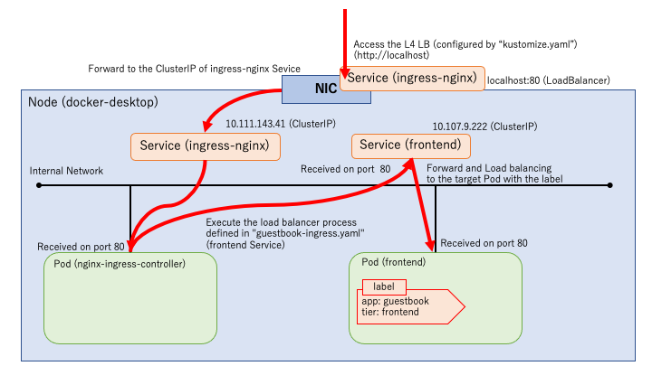
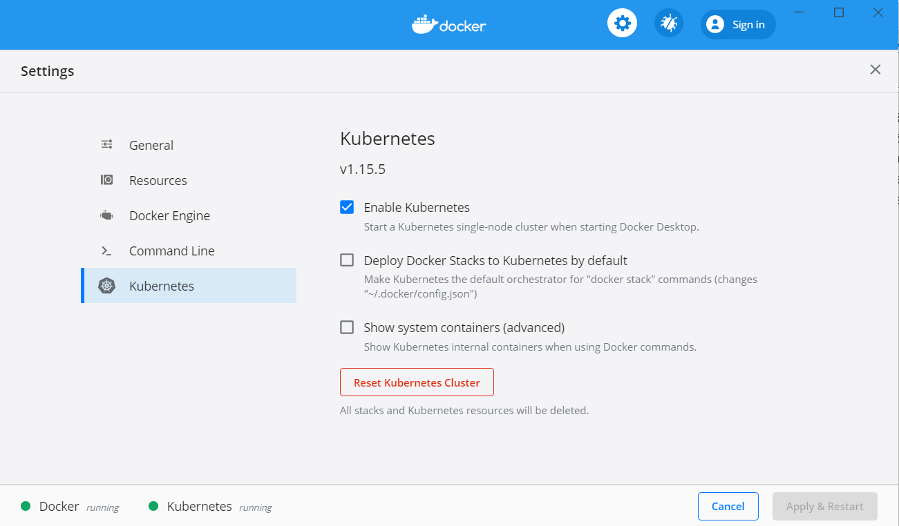

# **Lab 02-2 - GuestBook アプリのデプロイ**

公式チュートリアルのサンプルアプリ **GuestBook**(<https://kubernetes.io/docs/tutorials/stateless-application/guestbook/>)を Ingress 経由でアクセスできるようにデプロイしてみましょう。

アプリをデプロイし、アクセスすると次のような動作をします。



GuestBook をデプロイすると以下のような構成になります。


フロントエンドのサービスとバックエンドのデータベース (*redis* という NoSQLデータベース) という構成になります。このLabを通してこの構成を構築していきます。

**作業ディレクトリは *materials/lab02-2_guestbook* ディレクトリです。**

## ***Step1 アプリケーションのデプロイ***

1.  *guestbook* ディレクトリ配下のサンプルアプリケーションのマニフェストファイルを確認します。

2.  `kubectl`コマンドを使用してディレクトリ配下のマニフェストファイルをデプロイします。  
    ＊ *guestbook* ディレクトリにいることを確認してください。

```sh
$ kubectl apply -f ./
deployment.apps/frontend created
deployment.apps/redis-master created
service/redis-master created
deployment.apps/redis-slave created
service/redis-slave created
```

3.  デプロイ状況を確認します。

```sh
$ kubectl get deployment,rs,pods
NAME READY UP-TO-DATE AVAILABLE AGE
deployment.extensions/frontend 1/1 1 1 4m54s
deployment.extensions/redis-master 1/1 1 1 4m54s
deployment.extensions/redis-slave 1/1 1 1 4m54s

NAME DESIRED CURRENT READY AGE
replicaset.extensions/frontend-b88984c9 1 1 1 4m54s
replicaset.extensions/redis-master-545d695785 1 1 1 4m54s
replicaset.extensions/redis-slave-84548fdbc 1 1 1 4m54s

NAME READY STATUS RESTARTS AGE
pod/frontend-b88984c9-gvrnc 1/1 Running 0 4m54s
pod/redis-master-545d695785-62pxp 1/1 Running 0 4m54s
pod/redis-slave-84548fdbc-llzrw 1/1 Running 0 4m54s
$ kubectl get svc -l app=redis
NAME TYPE CLUSTER-IP EXTERNAL-IP PORT(S) AGE
redis-master ClusterIP 10.111.88.178 <none> 6379/TCP 5m39s
redis-slave ClusterIP 10.100.78.143 <none> 6379/TCP 5m39s
```

 ここで、デプロイされたリソースがどのように配置されたかを見ていきます。  
 次の図がリソースの配置イメージです(以降の内部IPやポートは手順書作成時の操作によって割り当てられたものです)。  



 デプロイされたアプリケーションである **Guestbook** の構成は、web サービスである frontend と DB のマスターとスレーブとなっています。内部Pod間で redis-master と redis-slave へアクセス可能な Service のみ作成されており、クラスタ外からは現状アクセスできません。  



 ＊内部アクセス例(redis-slaveは省略)  
 次のStepでクラスタ外から Web サービス frontend へ接続するために、Ingress をデプロイします。  
 (ローカル環境のため、クラスタ内にL7ロードバランサ処理を行う Ingress 用のPodと、そのPodへアクセスするための Service をデプロイします。)

## ***Step2 Ingress のデプロイ***  
 ローカル環境で Ingress を利用して、L7層レベルでの制御を行います。  
1.  `kubectl`コマンドで **nginx_ingress_controller** をデプロイします。

```sh
$ kubectl apply -f https://raw.githubusercontent.com/kubernetes/ingress-nginx/master/deploy/static/provider/cloud/deploy.yaml
namespace/ingress-nginx created
serviceaccount/ingress-nginx created
configmap/ingress-nginx-controller created
clusterrole.rbac.authorization.k8s.io/ingress-nginx created
clusterrolebinding.rbac.authorization.k8s.io/ingress-nginx created
role.rbac.authorization.k8s.io/ingress-nginx created
rolebinding.rbac.authorization.k8s.io/ingress-nginx created
service/ingress-nginx-controller-admission created
service/ingress-nginx-controller created
deployment.apps/ingress-nginx-controller created
validatingwebhookconfiguration.admissionregistration.k8s.io/ingress-nginx-admission created
clusterrole.rbac.authorization.k8s.io/ingress-nginx-admission created
clusterrolebinding.rbac.authorization.k8s.io/ingress-nginx-admission created
job.batch/ingress-nginx-admission-create created
job.batch/ingress-nginx-admission-patch created
role.rbac.authorization.k8s.io/ingress-nginx-admission created
rolebinding.rbac.authorization.k8s.io/ingress-nginx-admission created
serviceaccount/ingress-nginx-admission created
```

下記のように *ingress-nginx* という Namespace 上に *ingress-nginx-controller* Pod と *ingress-nginx* Service がデプロイされていれば Ingress リソースを利用する準備が完了します。

```sh
$ kubectl get pods,svc -n ingress-nginx
NAME READY STATUS RESTARTS AGE
pod/ingress-nginx-admission-create-zxtk2 0/1 Completed 0 3m2s
pod/ingress-nginx-admission-patch-gjnnc 0/1 Completed 1 3m2s
pod/ingress-nginx-controller-86cbd65cf7-h4ldc 1/1 Running 0 3m12s

NAME TYPE CLUSTER-IP EXTERNAL-IP PORT(S) AGE
service/ingress-nginx-controller LoadBalancer 10.102.62.2 localhost 80:31383/TCP,443:31394/TCP 3m12s
service/ingress-nginx-controller-admission ClusterIP 10.111.183.128 <none> 443/TCP 3m12s
```

 この時点でL7ロードバランサ処理を行う *ingress-nginx-controller* というPodが構成され、そのPodへアクセスするための *ingress-nginx-controller* という Service も localhost に対して構成されました。  
 そのため「http:localhost」にアクセスすると、*nginx-ingress-controller* から *404 Not Found* が返ってくるようになります。ここで、L7ロードバランサ処理を定義した Ingress リソースをデプロイしていきます。

2.  *frontend_access* ディレクトリ配下の Ingress リソースマニフェストファイル  
    `guestboook-ingress.yaml` を確認します。

```yaml
apiVersion: extensions/v1beta1
kind: Ingress                    # Ingressのマニフェスト
metadata:
  name: guestbook-ingress        # Ingressリソースの名前
spec:
  rules:                         # ルーティングのルールの配列
  - http:
      paths:
      - path: /
        backend:                 # "frontend"Serviceの80番ポートにアクセス
          serviceName: frontend
          servicePort: 80 
```

3.  `kubectl`コマンドで Ingress をデプロイします。

```sh
$ kubectl apply -f ./frontend_access/guestboook-ingress.yaml
ingress.extensions/guestbook-ingress created
```

 次のように `ADDRESS` に *localhost* が割り当てられていればデプロイが完了となります。  
 なお、この段階では Ingress のルーティング先 Service をデプロイしいていないため、http://localhost へアクセスすると *503* エラー が返ってきます。

```sh
$ kubectl get ingress
NAME HOSTS ADDRESS PORTS AGE
guestbook-ingress * localhost 80 2m44s
```

4.  Ingress のルーティング先の frontend Service をデプロイするため、*frontend_access* ディレクトリ配下の `frontend-service.yaml` ファイルを確認します。

```yaml
apiVersion: v1
kind: Service                 # Serviceのマニフェスト
metadata:
  name: frontend              # Serviceリソースの名前
  labels:                     # ServiceにつけるLabel
    app: guestbook
    tier: frontend
spec:
  type: ClusterIP             # Serviceの種別
  ports:
  - port: 80                  # アクセスを受け付けるポート
  selector:                   # 対象のPodを検索するときのLabel
    app: guestbook
    tier: frontend
```

5.  `kubectl`コマンドで Service をデプロイします。

```sh
$ kubectl apply -f ./frontend_access/frontend-service.yaml
service/frontend created
```

6.  デプロイ状況を確認します。

```sh
$ kubectl get svc -l app=guestbook
NAME TYPE CLUSTER-IP EXTERNAL-IP PORT(S) AGE
frontend ClusterIP 10.107.9.222 <none> 80/TCP 12m
```

「<http://localhost>」にアクセスすると **GuestBook** のページが開けるようになります。



ここまでに構成したリソースによる上記アクセスは次のような流れとなります。



 続いて、Ingress のマニフェストファイルを変更して、モバイルからのアクセスを制御してみます。

7.  デプロイした Ingress を一度削除します。

```sh
$ kubectl delete -f ./frontend_access/guestboook-ingress.yaml
ingress.extensions "guestbook-ingress" deleted
```

8.  *frontend_access* ディレクトリ配下の `guestboook-ingress-agentFilter.yaml` ファイルの内容を確認します。

```yaml
apiVersion: extensions/v1beta1
kind: Ingress                    # Ingressのマニフェスト
metadata:
  name: guestbook-ingress        # Ingressリソースの名前
  annotations:                   # nginx-ingress-controllerの場合の制御設定。User-Agentによる制御を行う
    nginx.ingress.kubernetes.io/server-snippet: |
      set $agentflag 0;

      if ($http_user_agent ~* "(Mobile)" ){
          set $agentflag 1;
        }

        if ( $agentflag = 1 ) {
            return 301 https://vantiq.co.jp/;
        }
      
spec:
  rules:                         # ルーティングのルールの配列
  - http:
      paths:
      - path: /
        backend:                 # "frontend"Serviceの80番ポートにアクセス
          serviceName: frontend
          servicePort: 80 
```

9.  `kubectl`コマンドで Ingress をデプロイします。

```sh
$ kubectl apply -f ./frontend_access/guestboook-ingress-agentFilter.yaml
ingress.extensions/guestbook-ingress created
```

10. デプロイ状況を確認します。

```sh
$ kubectl get ingress
NAME HOSTS ADDRESS PORTS AGE
guestbook-ingress * localhost 80 30m
```

11. ブラウザ、`curl`コマンドや Postman からアクセスしてみます。  
 PCからアクセスする場合、User-Agent ヘッダーを変更してアクセスを確認します。

```sh
$ curl http://localhost -H "User-Agent: Mozilla /5.0 (iPhone; CPU iPhone OS 9_1 like Mac OS X) AppleWebKit/601.1.46 (KHTML, like Gecko) Version/9.0 Mobile/13B5110e Safari/601.1"
<html>
<head><title>301 Moved Permanently</title></head>
<body>
<center><h1>301 Moved Permanently</h1></center>
<hr><center>nginx/1.17.8</center>
</body>
</html>
```

 User-Agent がモバイルの場合、Ingress に記述したように、リダイレクトとして *301* が返ってきていることを確認できます。

## ***Step3 スケールを行う***

デプロイした **GuestBook** アプリをスケールさせてみます。frontend のPodを2つに増やしてみましょう。  
1.  frontend の Deployment マニフェストファイルを編集します。  
 *guestbook* ディレクトリ配下の `frontend-deployment.yaml` ファイルを以下のように編集し、保存します。  
 **10行目 replicasの値を 1 => 2**  

2.  Deployment の変更を反映させます。

```sh
$ kubectl apply -f ./frontend-deployment.yaml
deployment.apps/frontend configured
```

3.  デプロイ状況を確認します。

```sh
$ kubectl get deployment,rs,pod
NAME READY UP-TO-DATE AVAILABLE AGE
deployment.extensions/frontend 2/2 2 2 106m
deployment.extensions/redis-master 1/1 1 1 106m
deployment.extensions/redis-slave 1/1 1 1 106m

NAME DESIRED CURRENT READY AGE
replicaset.extensions/frontend-b88984c9 2 2 2 106m
replicaset.extensions/redis-master-545d695785 1 1 1 106m
replicaset.extensions/redis-slave-84548fdbc 1 1 1 106m

NAME READY STATUS RESTARTS AGE
pod/frontend-b88984c9-qws8b 1/1 Running 0 4s
pod/frontend-b88984c9-sqdw7 1/1 Running 0 106m
pod/redis-master-545d695785-mmxb7 1/1 Running 0 106m
pod/redis-slave-84548fdbc-7gppf 1/1 Running 0 106m
```

 frontend のPodの数や ReplicaSet が管理するPod数が 2に増えていることが確認できます。  
 また、ReplicaSet 自体の数やそのサフィックスが変わっていないことからも、`replicas` の値を変更しただけでは ReplicaSet の入れ替わりが発生していないことをも確認できます。

## ***Step4 Pod の自動復旧***

ReplicaSet によりPodが自動復旧されることを確認します。  
1.  `kubectl`コマンドから frontend のPodを 1つ削除してみます。  
     **＊ Pod名は自身の環境のものを指定してください。**

```sh
$ kubectl delete pod frontend-b88984c9-sqdw7
pod "frontend-b88984c9-sqdw7" deleted
```

2.  Podのデプロイ状況を確認します。

```sh
$ kubectl get pod
NAME READY STATUS RESTARTS AGE
frontend-b88984c9-g6t5b 1/1 Running 0 6s
frontend-b88984c9-qws8b 1/1 Running 0 8m46s
redis-master-545d695785-mmxb7 1/1 Running 0 115m
redis-slave-84548fdbc-7gppf 1/1 Running 0 115m
```

 自動でPodが新たに作成されていることが確認できます。

## ***Step5 Deployment の更新による ReplicaSet の切り替え***

Step3 で `replicas`の値を変えただけでは、ReplicaSet の入れ替わりが発生しませんでした。ReplicaSet の入れ替わりはコンテナリソースを更新することで発生します。  
このStepでは frontend の Deployment のコンテナリソースを更新することで ReplicaSet の切り替えが発生することを確認します。また、その際にPodが順々に切り替わることも確認していきます。

1.  frontend の Deploymentマニフェストファイルを編集します。  
 *guestbook* ディレクトリ配下の `frontend-deployment.yaml` ファイルを以下のように編集し保存します。  
 **23行目 memoryの値を 100Mi => 120Mi**

2.  Deployment の変更を反映させ、デプロイ状況を確認します。

```sh
$ kubectl apply -f frontend-deployment.yaml
deployment.apps/frontend configured

$ kubectl get deployment,rs,pod
NAME READY UP-TO-DATE AVAILABLE AGE
deployment.extensions/frontend 2/2 2 2 121m
deployment.extensions/redis-master 1/1 1 1 121m
deployment.extensions/redis-slave 1/1 1 1 121m

NAME DESIRED CURRENT READY AGE
replicaset.extensions/frontend-5d75d6b9b5 2 2 2 5s
replicaset.extensions/frontend-b88984c9 0 0 0 121m
replicaset.extensions/redis-master-545d695785 1 1 1 121m
replicaset.extensions/redis-slave-84548fdbc 1 1 1 121m

NAME READY STATUS RESTARTS AGE
pod/frontend-5d75d6b9b5-dkwjg 1/1 Running 0 5s
pod/frontend-5d75d6b9b5-wxs4p 1/1 Running 0 3s
pod/frontend-b88984c9-g6t5b 0/1 Terminating 0 5m55s
pod/frontend-b88984c9-qws8b 1/1 Terminating 0 14m
pod/redis-master-545d695785-mmxb7 1/1 Running 0 121m
pod/redis-slave-84548fdbc-7gppf 1/1 Running 0 121m
```

 以上のように変更を加えた新たな ReplicaSet とPodが作成され、切り替えが発生していることを確認できます。上記の場合、以下のような新旧の ReplicaSet とPodが確認できます。  

 **・新ReplicaSetとPod**  
 ReplicaSet: frontend-5d75d6b9b5  
 Pod: frontend-5d75d6b9b5-dkwjg, frontend-5d75d6b9b5-wxs4p  
 **・旧ReplicaSetとPod**  
 ReplicaSet: frontend-b88984c9  
 Pod: frontend-b88984c9-g6t5b, frontend-b88984c9-qws8b  

 以上で本Labが終了となります。最後にローカルクラスタ環境をリセットします。

## ***Step 6（ローカルクラスタ環境のリセット）***

1.  docker の Settings > Kubernetes メニューを開き「*Reset Kubernetes Cluster*」からリセットを行います。


