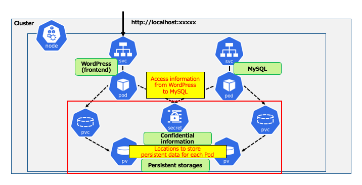
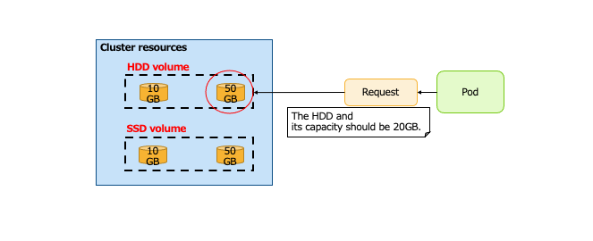
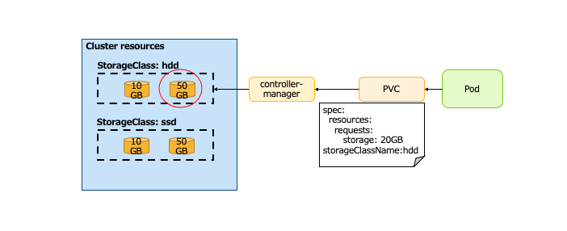
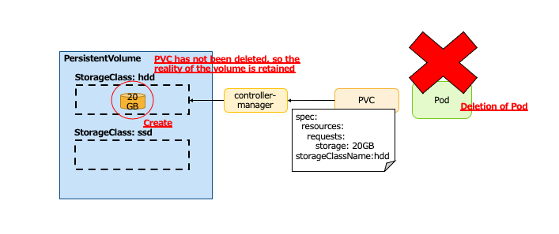
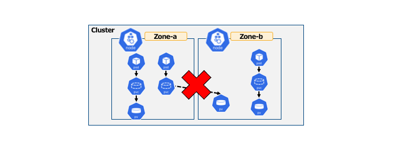

# Kubernetes の Configuration、Storage リソースについての学習

## 概要

* Configuration、Storage リソース
  * コンテナに対して、設定ファイル・パスワード・永続化ボリュームなどを提供する  

* 下記の Configuration、Storage リソースおよび関連リソースについて学ぶ
  * ConfigMap、Secret
    * 設定情報・機密情報などのkey\-valueで保持できるデータを保存しておくリソース
  * Volume、StorageClass、PersistentVolume、PersistentVolumeClaim
    * コンテナで永続化データを扱うためのリソース
  * StatefulSet
    * Podを扱うリソース\(PVに関連した特殊なReplicaSetというイメージ\)

## 学習対象のリソースの確認


## Wordpress 構成例 – Pod のみの場合


**問題点**  
__* 各 Pod への設定情報の流し込み__  
__=> WordPress から MySQL へのアクセス情報__  
__* 各 Pod の永続化データの保存__  
__=> WordPress: 追加プラグイン、テーマデータなど__  
__=> MySQL: ユーザーデータ、投稿ページデータなど__  

## コンテナへ環境変数の設定

* 個別のコンテナに対する設定の渡し方には以下がある
  * 環境変数
  * 設定ファイルが置かれた領域のマウント  

* 環境変数をPodテンプレートに **env** または **envFrom** を指定する
  * Key\-Value 形式で直接定義する
  * ConfigMap リソースの定義を参照する
  * Secret リソースの定義を参照する  

* ConfigMap と Secret はリソースで定義したデータを、コンテナ内のディレクトリにファイルとして配置可能である

## Pod と永続化データ

* Pod\(コンテナ\)上のデータはコンテナが削除されると同様に削除される  

* 以下のようなときにPodのデータは削除されてしまう
  * Podの再起動
  * Podのアップデート  

=> Podに永続ボリュームを割り当てる

## Wordpress構成例



## Config Map とは

* 設定情報などを Key\-Value 形式で保存するリソースのこと  

* リソースの作成方法
  * マニフェストファイルで作成する
  * ファイルから値を参照する
  * 直接値を渡す  

* コンテナからの利用方法
  * 環境変数としてコンテナに渡す
  * ボリュームとしてマウントする
  * どちらも ConfigMap の 特定のKey か すべてのKey を渡すか選択可能である

## Secret とは

* 機密情報などを Key\-Value 形式で保存するリソースのこと
  * _Value_ はbase64でエンコードする  

* 作成方法、コンテナからの利用方法は基本的に ConfigMap と同様である   

* タイプがいくつかあり、Generic タイプ以外はスキーマが定義されている
  * ex: TLSタイプでは、`tls\.crt` と `tls\.key` スキーマが定義されている

## ConfigMap と Secret の更新

* 環境変数として渡した場合
  * 起動時に環境変数が決まるため、マニフェストファイルからの動的な更新はできない
  * `kubectlset env`コマンドにより動的に更新可能である  

* ファイルとして配置した場合
  * シンボリックリンクのため、kubelet の監視間隔で動的な更新が可能である
  * デフォルトは 60秒である


## コンテナへの設定情報 – 環境変数の直接定義

* 設定情報をPodに環境変数として 1つずつ直接定義する

```yaml
apiVersion: v1
kind: Pod
metadata:
  name: sample-pod
  labels:
    app: sample
spec:
  containers:
  - name: sample-pod
    image: nginx:latest
    env: 
    - name: MAX_LOG_EVENT
      value: "10000"
      name: LOG_FILE_NAME
      value: /var/log/pod-myapp.log
```
**↓**

```sh
root@sample-pod:/# env | grep LOG
MAX_LOG_EVENT=10000
LOG_FILE_NAME=/var/log/pod-myapp.log
```

## コンテナへの設定情報 – ConfigMap(1)

* 設定情報を ConfigMap で定義し、環境変数としてPodに渡す

```yaml
apiVersion: v1
kind: ConfigMap
metadata:
  name: sample-configmap
data:  # 渡したい値を Key: Value の形式で定義
  MAX_LOG_EVENT: "10000"
  LOG_FILE_NAME: /var/log/pod-myapp.log
---
apiVersion: v1
kind: Pod
metadata:
  name: sample-pod
  labels:
    app: sample
spec:
  containers:
  - name: sample-pod
    image: nginx:latest
    envFrom:
    - configMapRef:
        name: sample-configmap
```

**↓**

```sh
root@sample-pod:/# env | grep LOG
MAX_LOG_EVENT=10000
LOG_FILE_NAME=/var/log/pod-myapp.log
```

## コンテナへの設定情報 – ConfigMap(2)

* 設定情報を ConfigMap で定義し、ファイルとしてコンテナ内に配置する

```yaml
apiVersion: v1
kind: ConfigMap
metadata:
  name: sample-configmap
data:  # 渡したい値を Key: Value の形式で定義
  MAX_LOG_EVENT: "10000"
  LOG_FILE_NAME: /var/log/pod-myapp.log
---
apiVersion: v1
kind: Pod
metadata:
  name: sample-pod
  labels:
    app: sample
spec:
  containers:
  - name: sample-pod
    image: nginx:latest
    volumeMounts:         # /config にボリュームとしてマウント
    - name: config-volume
      mountPath: /config 
  volumes:                     # ボリュームにConfigMapを指定
    - name: config-volume
      configMap:
        name: sample-configmap 
```

**↓**

```sh
root@sample-pod:/# ls /config
LOG_FILE_NAME  MAX_LOG_EVENT
root@sample-pod:/# cat /config/LOG_FILE_NAME
/var/log/pod-myapp.log
root@sample-pod:/# cat /config/MAX_LOG_EVENT
10000
```

## コンテナへの設定情報 – Secret

* 設定情報を Secret で定義し、環境変数としてPodに渡す

```yaml
apiVersion: v1
kind: Secret
metadata:
  name: sample-secret
type: Opaque          # スキーマレスでsecret を定義するタイプ
data:                           # 渡したい値を Key: Value の形式で定義
  USERNAME: c2FtcGxl                 # 「sample」のbase64エンコード
  PASSWORD: cGFzc3dvcmQ=  # 「password」のbase64エンコード
---
apiVersion: v1
kind: Pod
metadata:
  name: sample-pod
  labels:
    app: sample
spec:
  containers:
  - name: sample-pod
    image: nginx:latest
    envFrom:
    - secretRef:
        name: sample-secret
```

**↓**

```sh
root@sample-pod:/# env | grep -e USER -e PASS
USERNAME=sample
PASSWORD=password
```

## Secret マニフェストの取り扱い

* Secret内のデータは *base64でエンコード* する
  * マニフェストファイルをそのままレポジトリにpushするのは危険である  
   => **kubesec** といったツールを使い、暗号化する  

   ＊ kubesec: AWSやGCPのKMSを利用して、Secretのdataのみを暗号化する

```yaml
apiVersion: v1
data:
  DB_USER: uq9VqCu9WyoPsHTXzmsp2E80e3e3+ferUDrh3J+jyi/O9ZIhF/qldnMdA7INwLB8.yfFjHY1V7WDLJE7h.zOo2DWjd56/PhBETUBo73A==
  DB_PASSWORD: A4YV8j8QhAW7LxgO9sMqvrKXcSB76EfKuF/dYp73dQdWc6O+N/KdY9Rl0hDz6ojd.P/VVLzUx6swafWIp./nHidZkzk0mGrIToDHPXiQ==
kind: Secret
metadata:
  name: sample-secret
type: Opaque

```

## KMS を利用した Secret マニフェスト取り扱いフロー

* 前もって Cloud の KMS へキーを作成する必要がある
* Kubernetes へ Secret登録時には復号されている必要がある


## Pod へ永続ボリュームの割り当ての流れ

* Podが必要な「永続ボリューム」を要求する
  * HDDのボリュームであること
  * 容量は20GBを満たすこと
* クラスタに作成されている「永続ボリューム」の中から要求を満たすボリュームをスケジューリングする




## Volume と PersistentVolume

* __Volume__
  * あらかじめ用意された利用可能なボリュームなどを、マニフェストに直接指定し利用する
  * ホスト領域・NFS・iSCSIといったものが利用可能である
  * Podなどのマニフェストから直接指定するため、 _クラスタ内のリソース定義は不要_ である  

* __PersistentVolume__  __\(PV\)__
  * 外部の永続ボリュームを提供するシステムと連携して、クラスタ内リソースとして作成する
  * クラスタ内で前もって定義する必要がある
  * AWS や GCP などのボリュームサービスを連携して扱うことが可能である
  * __ボリュームの実態を外部で作成しておく必要がある__

* __StorageClass__
  * *PersistentVolume* リソースが確保する _ボリュームの種類_ を定義する
  * *Dynamic Provisioning* を行う際にどういったボリュームが欲しいのかを指定するために利用する
  * クラウドクラスタ環境などでは、基本的にデフォルトの `StorageClass` が定義済みである
    * AWS: gp2\(aws\-ebs\)  

* __PersistentVolumeClaim__  __\(PVC\)__
  * _ボリューム_  _\(_  _PersistentVolume_  _\)_  _の要求_ を行うリソースである
  * スケジューラにより、要求に適した *PersistentVolume* が割り当てられる
  * PVとPVCが 1対1 で紐づくことによりPVを管理する

## PersistentVolume の割り当て例

* 下記を指定して *PersistentVolume* を要求する
  * HDDのボリューム\(storageClassName:hdd\)
  * 容量は20GBを満たす\(storage: 20GB\)

  ＊ controller\-manager:クラスタリソースを管理するMasterコンポーネント




**問題点**  
__* 前もってボリュームの実体を作成した上で、PersistentVolumeリソースを定義しておく必要がある__  
__=> クラウドボリュームサービスのリソースを作成、PersistentVolumeリソースとしてマニフェストファイルから定義する__  
__* 要求から大きく離れた容量のPersistentVolumeが割り当てられ、無駄になる__  
__=> 必要容量は20GBだが、PersistentVolumeが10GBと50GBのものしかないため、30GBオーバーのものが割り当てられる__  
__=> PVCの要求を必ず満たすようにスケジューリングされる。今回の場合だと 20GBを下回るPVは割り当てらない__

## Dynamic Provisioning

* PersistentVolumeClaim による要求が発行されたタイミングで下記を実行する
  * ボリュームの実体、*PersistentVolume* リソースの作成
  * 作成された *PersistentVolume* リソースの割り当て


## StorageClass - Reclaim Policy

PersistentVolumeClaim が削除\(PersistentVolumeの利用を終了\)された際の、 _ボリュームの実体の挙動を制御_  

* __Delete__
  * ボリュームの実体は削除される
  * 外部システム\(AWSやGCPなど\)の *Dynamic Provisioning* で利用されるケースが多い  

* __Retain__
  * ボリュームの実体を保持する
  * ほかの PersistentVolumeClaim によって再度マウントされることはない

* Delete、Retain どちらもPodが削除されただけならば、ボリュームの実体は保持される




# PV の注意事項

* 利用するPVの種類によっては、各Cloudプロバイダーで制限があることがある
  * 例: PodとPVのAZ\(AWSEBSの場合\)  
    * PodとPVは ***同じAZ*** に配置されている必要がある => 別AZの場合、Podが起動しない  
  * PVを利用する場合は、クラウドリソースとしての制限事項を事前確認しておく

  

* PVがBindされるタイミングの設定
  * `StorageClass` の volumeBindingMode により異なる
    * __Immediate__ :PVCが作成されたときにPVの実体の作成とBindが行われる
    * __WaitForFirstConsumer__ : PVCを利用するPodが作成されたときにはじめてPVの実体の作成とBindが行われる  

* *Dynamic Provisioning* 利用時、PVCがPodより先に作成される
  * Immediate\(デフォルト\)の場合、PodをPVが作成された Availability Zone にスケジューリングできず、Podが *Pending状態* になるということが発生しうる

## StatefulSet とは

* イメージは *PersistentVolume* を利用するReplicaSetである
* 下記の特徴がある
  * Podのサフィックスにインデックスが順番に付与される
    * sts\-pod\-1\,sts\-pod\-2\,sts\-pod\-3…
    * そのためPod名が変更されない
    * スケーアウト、スケールイン時それぞれインデックス大きいものからPodが増減する
  * Podの再起動時も、再起動前と同じPVが割り当てられる　　

* ステートを持つPodや、マスタースレーブ構成に利用される
  * sts\-pod\-1: Master     sts\-pod\-2\,3: Slave

## Statefulset の例


