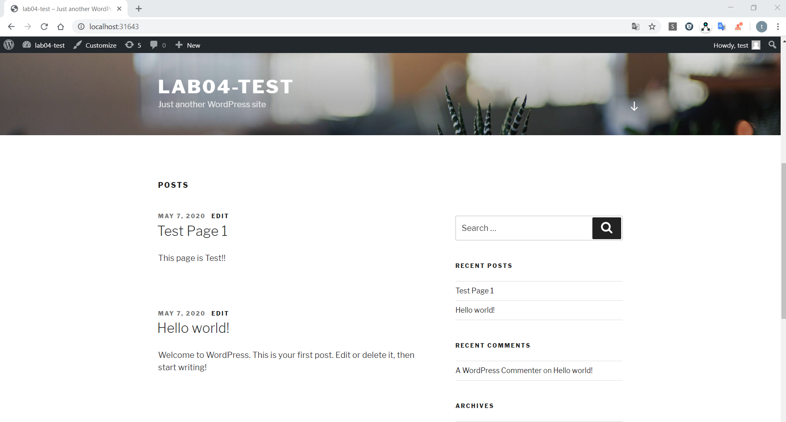
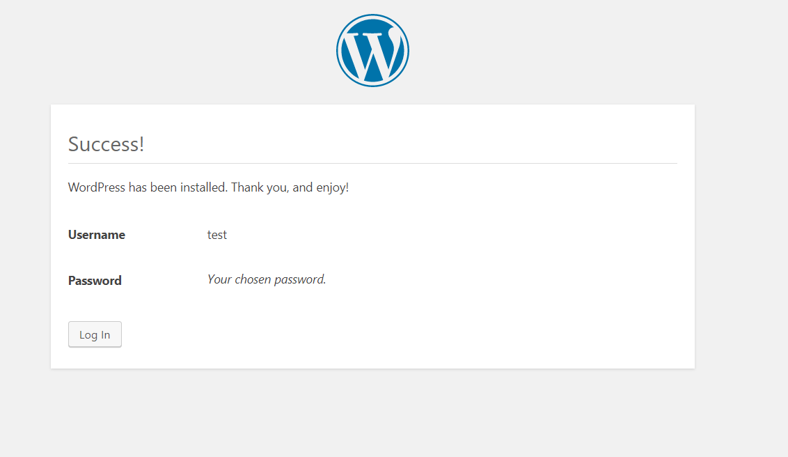
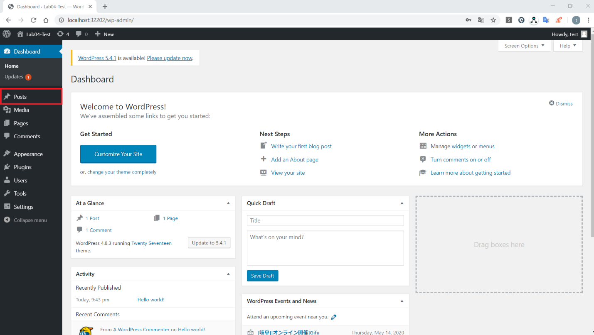
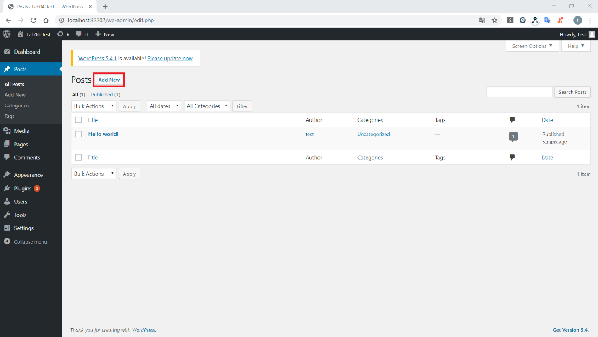
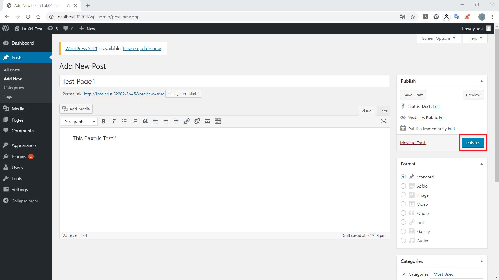
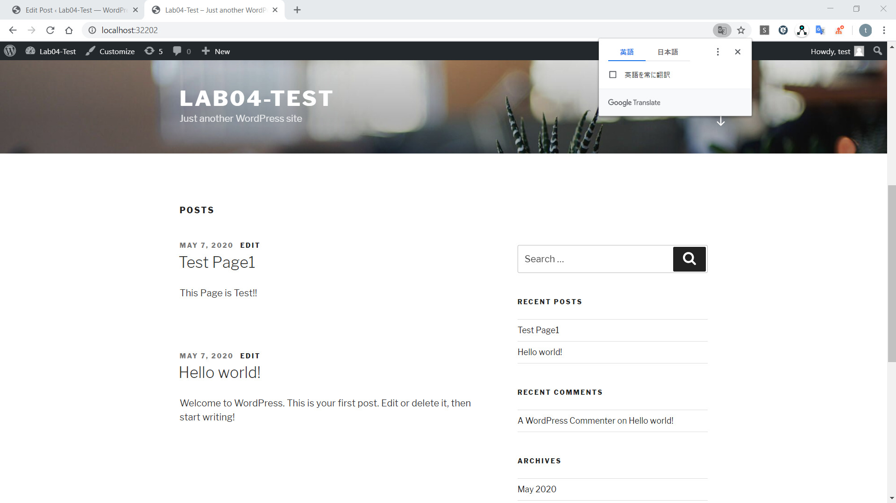

# **Lab 03-2 – Kubernetes の Storage 関連のリソースについての実習**

このLabでは **WordPress** と **MySQLPod** をデプロイし、設定情報やユーザ情報を *PersisitentVolume* に保存するということを確認していきます。


このLabでは、以下のような WordPress をデプロイすることができ、ブラウザからページを投稿したり、閲覧したりすることができます。



WordPress にデプロイするにあたり、WordPress Pod にプラグインなどのデータ、MySQL には WordPress のユーザ情報や投稿ページのデータを保存する必要があります。  
しかしながら、Pod内のデータはPodの再起動などですべて削除されてしまうため、Podの再起動時に毎回ユーザ情報や投稿内容が削除されてしまいます。  
そこで、本Labでは、上記データを保存するための永続ストレージリソースとして、ローカルマシンのディレクトリを *PersistentVolume* として kubernetesクラスタに用意し、*PersistentVolume* にデータを保存するという構成で WordPress をデプロイします。

## ***Step 0 (Docker Desktopの設定、ホスト側の作業ディレクトの設定)***

コンテナ側からホスト側ディレクトリに書き込みができるよう、以下の設定を行います。  
**Note: Docker Desktop の仕様により、以下のディレクトリ以外を使用した場合、デプロイに失敗することがあります。**

1.  (Windowsの場合) **C:¥tmp** ディレクトリを作成し、Docker Desktopの設定 -> Resources -> File Sharing で作成したディレクトリを共有設定する。 **C:¥tmp** に materials の **lab03-2_storage** を配置する。

  

_＊ OS が Windows で WSL を利用しかつ、Docker Desktop の Resources メニューに FILE SHARING の項目が見つからない場合は、`wordpress-mysql-deploy.yaml` の 56 行目 `mountPath: /var/lib/mysq` を **mountPath: /tmp/lib/mysq** に変えてください。_


2.  (Macの場合) **/tmp** ディレクトリに materials の **lab03-2_storage** を配置する。**lab03-2_storage** 以下のディレクトリとファイルにパーミッション(777)を設定する。  
例： chmod -R 777 /tmp/lab03-2_storage

**以下のStepの作業ディレクトリは */tmp/lab03-2_storage* ディレクトリです。**

## ***Step 1 (PersistentVolume の作成)***

ローカルマシンのディレクトリを利用し、kubernetesのリソースである *PersistentVolume* として作成します。

1.  デプロイする *PersistentVolume* とその Claim のマニフェストファイル `wordpress-pv-local.yaml` を確認および編集します。  
 *PersistentVolume* として利用するローカルマシンのディレクトリをマニフェストファイルで指定します。  
 ・編集箇所  
 `wordpress-pv-local.yaml` の30行目と55行目(spec.local.pathの値)  
 ・編集内容  
 ホストマシンのディレクトリ(Lab資料の lab03-2_pv/hostpath)を指定  
 ・編集例  
 **Windowsの場合**: _「path: /host_mnt/c/tmp/lab03-2_storage/hostpath」_  
 => C:\\tmp\\lab03-2_storage\\hostpath フォルダをマウントする    
 **Mac,Linuxの場合**: _「path: /tmp/lab03-2_storage/hostpath」_  
 => /tmp/lab03-2_storage/hostpath ディレクトリをマウントする  
 _＊ /tmpがシンボリックリンクの場合はPersistentVolumeのデプロイが成功してもその後のPodのデプロイが失敗することがあります。実ディレクトリを使用してください。また使用するディレクトリはDocker desktopのFile sharingが設定されているディレクトリまたはその配下である必要があります。_

```yaml
kind: StorageClass          # VolumeBindingModeが違う2種類のStorageClassを定義
apiVersion: storage.k8s.io/v1
metadata:
  name: local-storage
provisioner: kubernetes.io/no-provisioner
volumeBindingMode: Immediate
---
kind: StorageClass
apiVersion: storage.k8s.io/v1
metadata:
  name: local-storage-wait
provisioner: kubernetes.io/no-provisioner
volumeBindingMode: WaitForFirstConsumer
---
apiVersion: v1
kind: PersistentVolume        # ローカルマシンのディレクトリをPVとして作成
metadata:
  name: pv-frontend       # WordPress Pod用のPV
  labels:
    app: wordpress
    tier: pv-frontend
spec:
  capacity:
    storage: 1Gi
  accessModes:
  - ReadWriteOnce
  persistentVolumeReclaimPolicy: Retain
  storageClassName: local-storage-wait
  local:
    path: <input your localmachine directory path>
  nodeAffinity:
    required:
      nodeSelectorTerms:
      - matchExpressions:
        - key: kubernetes.io/hostname
          operator: In
          values:
          - docker-desktop
---
apiVersion: v1
kind: PersistentVolume        # ローカルマシンのディレクトリをPVとして作成
metadata:
  name: pv-mysql          # MySQL Pod用のPV
  labels:
    app: wordpress
    tier: pv-mysql
spec:
  capacity:
    storage: 1Gi
  accessModes:
  - ReadWriteOnce
  persistentVolumeReclaimPolicy: Retain
  storageClassName: local-storage
  local:
    path: <input your localmachine directory path>
  nodeAffinity:
    required:
      nodeSelectorTerms:
      - matchExpressions:
        - key: kubernetes.io/hostname
          operator: In
          values:
          - docker-desktop
---
apiVersion: v1
kind: PersistentVolumeClaim
metadata:
  name: pv-claim-frontend  # WordPress 用のPVClaim
spec:
  selector:
    matchLabels:
      app: wordpress
      tier: pv-frontend
  accessModes:
    - ReadWriteOnce
  storageClassName: local-storage-wait
  resources:
    requests:
      storage: 1Gi
---
apiVersion: v1
kind: PersistentVolumeClaim
metadata:
  name: pv-claim-mysql     # MySQL 用のPVClaim
spec:
  selector:
    matchLabels:
      app: wordpress
      tier: pv-mysql
  accessModes:
    - ReadWriteOnce
  storageClassName: local-storage
  resources:
    requests:
      storage: 1Gi
```

 WordPress、MySQL それぞれのPod用に *PersistentVolume* を作成し、`PersistentVolumeClaim` で割り当てます。本Labでは `StorageClass`の VolumeBindingMode の違いを確認するために、WordPress で利用するPVの `StorageClass`は *Immediate*、MySQLで利用するPVの `StorageClass`は *WaitForFirstConsumer* に設定してあります。

2.  マニフェストファイル `wordpress-pv-local.yaml` をデプロイし確認します。

```sh
$ kubectl apply -f wordpress-pv-local.yaml
storageclass.storage.k8s.io/local-storage created
storageclass.storage.k8s.io/local-storage-wait created
persistentvolume/pv-frontend created
persistentvolume/pv-mysql created
persistentvolumeclaim/pv-claim-frontend created
persistentvolumeclaim/pv-claim-mysql created

$ kubectl get pvc,pv
NAME STATUS VOLUME CAPACITY ACCESS MODES STORAGECLASS AGE
persistentvolumeclaim/pv-claim-frontend Pending local-storage-wait 34s
persistentvolumeclaim/pv-claim-mysql Bound pv-mysql 1Gi RWO local-storage 34s

NAME CAPACITY ACCESS MODES RECLAIM POLICY STATUS CLAIM STORAGECLASS REASON AGE
persistentvolume/pv-frontend 1Gi RWO Retain Available local-storage-wait 34s
persistentvolume/pv-mysql 1Gi RWO Retain Bound default/pv-claim-mysql local-storage 34s
```

 デプロイした *PersistentVolume*、pv-frontend と pv-mysql の STATUS がそれぞれ *Available* と *Bound* で作成されることを確認します。PVCのSTATUSも確認すると、pv-claim-frontend は *Pending*、pv-claim-mysql は *Bound* となっており、それぞれの要求した `StorageClass` の VolumeBindingMode に対応した動作をしていることが確認できます。  
 また、アプリケーションのデプロイ後には pv-frontend には WordPress のプラグインなどが保存され、pv-mysql には WordPress のユーザ情報や投稿内容などが保存されます。  
 これで、WordPress に必要な kubernetes クラスタの永続ストレージリソースを用意することができました。

## ***Step 2 (MySQL、WordPress Pod のデプロイ)***

MySQL、WordPress のPodはStep1で作成した*PersistentVolume*を必要な永続データを書き込むディレクトリにマウントします。  
1.  MySQL をデプロイするマニフェストファイル`wordpress-mysql-deploy.yaml`を確認します。  
     Secret(MySQLのパスワード)、MySQL Podアクセスのための Service、MySQL の Deployment の3つを定義しています。(編集の必要はありません。)

```yaml
apiVersion: v1
kind: Secret
metadata:             # MySQLのパスワード情報
  name: mysql-secret
type: Opaque          # スキーマレスでsecret を定義するタイプ
data:                 # 渡したい値を Key: Value の形式で定義
  MYSQL_ROOT_PASSWORD: cGFzc3dvcmRzZWM=  # 「passwordsec」のbase64エンコード
---
apiVersion: v1
kind: Service
metadata:
  name: wordpress-mysql
  labels:
    app: wordpress
spec:
  ports:
    - port: 3306
  selector:
    app: wordpress
    tier: mysql
  clusterIP: None
---
apiVersion: apps/v1
kind: Deployment
metadata:
  name: wordpress-mysql
  labels:
    app: wordpress
spec:
  selector:
    matchLabels:
      app: wordpress
      tier: mysql
  strategy:
    type: Recreate
  template:
    metadata:
      labels:
        app: wordpress
        tier: mysql
    spec:
      containers:
      - image: mysql:5.6
        name: mysql
        env:
        - name: MYSQL_ROOT_PASSWORD
          valueFrom:
            secretKeyRef:
              name: mysql-secret
              key: MYSQL_ROOT_PASSWORD
        ports:
        - containerPort: 3306
          name: mysql
        volumeMounts:       # /var/lib/mysqlディレクトリにマウント
        - name: mysql-persistent-storage
          mountPath: /var/lib/mysql
      volumes:              # PVC経由で作成したMySQL用PVを割り当てる
      - name: mysql-persistent-storage
        persistentVolumeClaim:
          claimName: pv-claim-mysql
```

2.  マニフェストファイル `wordpress-mysql-deploy.yaml` をデプロイし、確認します。

```sh
$ kubectl apply -f wordpress-mysql-deploy.yaml
secret/mysql-secret created
service/wordpress-mysql created
deployment.apps/wordpress-mysql created

$ kubectl get pod -o wide
NAME READY STATUS RESTARTS AGE IP NODE NOMINATED NODE READINESS GATES
wordpress-mysql-849d8d5cbb-q4ppk 1/1 Running 0 6s 10.1.2.96 docker-desktop <none> <none>
```

3.  WordPress をデプロイするマニフェストファイル`wordpress-deploy.yaml`を確認します。  
    SecretはMySQLデプロイ時にデプロイした Secret を利用しています。WordPress Podアクセスのための Service、WordPress の Deployment の2つを定義しています。  
   (編集の必要はありません。)

```yaml
apiVersion: v1
kind: Service      # ブラウザからのアクセス用にNodePortを作成
metadata:
  name: wordpress
  labels:
    app: wordpress
spec:
  ports:
    - port: 80
  selector:
    app: wordpress
    tier: frontend
  type: NodePort
---
apiVersion: apps/v1
kind: Deployment
metadata:
  name: wordpress
  labels:
    app: wordpress
spec:
  selector:
    matchLabels:
      app: wordpress
      tier: frontend
  strategy:
    type: Recreate
  template:
    metadata:
      labels:
        app: wordpress
        tier: frontend
    spec:
      containers:
      - image: wordpress:4.8-apache
        name: wordpress
        env:             # MySQLの接続情報(Service名とSecretのデータから値を参照)
        - name: WORDPRESS_DB_HOST
          value: wordpress-mysql
        - name: WORDPRESS_DB_PASSWORD
          valueFrom:
            secretKeyRef:
              name: mysql-secret
              key: MYSQL_ROOT_PASSWORD
        ports:
        - containerPort: 80
          name: wordpress
        volumeMounts:     # /var/www/htmlディレクトリにマウント
        - name: wordpress-persistent-storage
          mountPath: /var/www/html
      volumes:            # PVC経由で作成したWordPress用PVを割り当てる
      - name: wordpress-persistent-storage
        persistentVolumeClaim:
          claimName: pv-claim-frontend
```

4.  マニフェストファイル `wordpress-deploy.yaml` をデプロイし、ここまでにデプロイしたリソースを確認します。

```sh
$ kubectl apply -f wordpress-deploy.yaml
service/wordpress created
deployment.apps/wordpress created

$ kubectl get pod,svc,pvc,pv,secret
NAME READY STATUS RESTARTS AGE
pod/wordpress-6fb5c59555-wsjvz 1/1 Running 0 5s
pod/wordpress-mysql-849d8d5cbb-q4ppk 1/1 Running 0 3m31s

NAME TYPE CLUSTER-IP EXTERNAL-IP PORT(S) AGE
service/kubernetes ClusterIP 10.96.0.1 <none> 443/TCP 9h
service/wordpress NodePort 10.106.51.21 <none> 80:30828/TCP 5s
service/wordpress-mysql ClusterIP None <none> 3306/TCP 3m31s

NAME STATUS VOLUME CAPACITY ACCESS MODES STORAGECLASS AGE
persistentvolumeclaim/pv-claim-frontend Bound pv-frontend 1Gi RWO local-storage-wait 4m3s
persistentvolumeclaim/pv-claim-mysql Bound pv-mysql 1Gi RWO local-storage 4m3s

NAME CAPACITY ACCESS MODES RECLAIM POLICY STATUS CLAIM STORAGECLASS REASON AGE
persistentvolume/pv-frontend 1Gi RWO Retain Bound default/pv-claim-frontend local-storage-wait 4m3s
persistentvolume/pv-mysql 1Gi RWO Retain Bound default/pv-claim-mysql local-storage 4m3s

NAME TYPE DATA AGE
secret/default-token-skbgl kubernetes.io/service-account-token 3 9h
secret/mysql-secret Opaque 1 3m31s
```

 pv-frontend を利用する WordPress Pod が作成されたことにより、対応するPVCが*Bound*されたことが確認できます。  
 ここまでで、WordPress に必要なリソースのデプロイが完了しました。続いてブラウザからデプロイした WordPress にアクセスし、ユーザ登録やページの投稿をしてみます。

## ***Step 3 (WordPress の編集)***

ブラウザから WordPress にアクセスし、初期設定のユーザ作成やページの投稿などをしてみます。  
1.  ブラウザから WordPress にアクセスします。URL に  
    「http://localhost:{wordpress ServiceのNodePort}」を指定します。  
    本資料の場合では、http://localhost:30828 となります。


 初期設定の画面が開くので、任意の値を入力して初期設定を完了させます。  
 インストールが成功すると以下のように表示されます。

 

 「Log in」ボタンから先ほど入力したユーザ名とパスワードでログインします。

2.  ページを投稿します。  
 ログインすると以下のような DashBoard が表示されるので、左メニューから「Posts」を選択します。

 

 「Add New」ボタンをクリックします。

 

 

 タイトルやページの内容を編集し「Publish」ボタンから投稿します。

3.  再度別タブで「http://localhost:{wordpress ServiceのNodePort}」へアクセスし、投稿内容の確認をします。

  

 アクセスすると上記のように初期設定で指定したSite Titleや先ほど投稿したページを確認することができます。  
 また、ローカルマシンからマウントした、ディレクトリ(*/tmp/lab03-2_storage/hostpath* ディレクトリ配下の 「*mysql*」と「*wordpress*」ディレクトリ)を確認すると、デプロイした WordPress の設定情報などのデータが保存されていることが確認できます。

## ***Step 4 (Pod の再起動による PV 上データ保持の確認)***

Podに障害が発生し、再起動が起こってしまった場合の動作を確認してみます。

1.  MySQL のPodを落としてみます。

```sh
$ kubectl scale --replicas=0 deploy/wordpress-mysql
deployment.extensions/wordpress-mysql scaled
```

 `replicas`の数を0にすることで疑似障害を発生させます。  
 ブラウザから WordPress にアクセスすると以下のようなページが表示され、MySQL にアクセスできていないことを確認することができます。

 

 Pod内のディレクトリに直接データを保持している場合、Podが削除されたことにより、ユーザ情報や先ほど投稿したページの情報も削除されてしまいます。  
 本Labでは上記のデータをマウントしたローカルマシンのディレクトリに保存しているため、削除されず、保持されています。

2.  MySQLのPodを復旧させ、疑似障害前の WordPress の内容が保持されていることを確認します。

```sh
$ kubectl scale --replicas=1 deploy/wordpress-mysql
deployment.extensions/wordpress-mysql scaled
```

 ブラウザを更新すると、疑似障害前に投稿したページなどが保持されたままになっていることを確認できます。  
 このように、*PersistentVolume* を利用することで、永続データをPodでも扱うことができます。

## ***Step 5 (リソースの削除)***

1.  デプロイしたリソースを削除します。

```sh
$ kubectl delete -f wordpress-deploy.yaml
service "wordpress" deleted
deployment.apps "wordpress" deleted

$ kubectl delete -f wordpress-mysql-deploy.yaml
secret "mysql-secret" deleted
service "wordpress-mysql" deleted
deployment.apps "wordpress-mysql" deleted

$ kubectl delete -f wordpress-pv-local.yaml
storageclass.storage.k8s.io "local-storage" deleted
storageclass.storage.k8s.io "local-storage-wait" deleted
persistentvolume "pv-frontend" deleted
persistentvolume "pv-mysql" deleted
persistentvolumeclaim "pv-claim-frontend" deleted
persistentvolumeclaim "pv-claim-mysql" deleted
```

 Podが利用したPVではローカルマシンのディレクトリをマウントして利用していたので、そのディレクトリのデータも削除します。  
 本Lab資料のディレクトリ、*/tmp/lab03-2_storage/hostpath* 配下の「*mysql*」と「*wordpress*」ディレクトリ内にデータが保存されているため、そちらをすべて削除します。

 以上でリソースの削除が完了します。  
 こちらで本Labは完了です。


#### 参考
[Persistent Volumeを使用したWordpressとMySQLをデプロイする](https://kubernetes.io/ja/docs/tutorials/stateful-application/mysql-wordpress-persistent-volume/)
