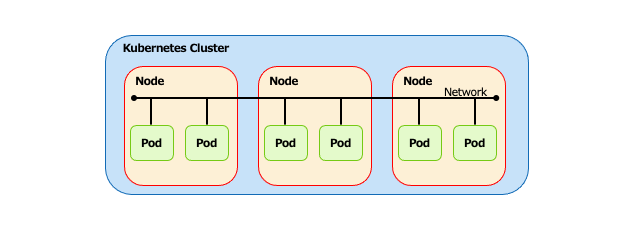
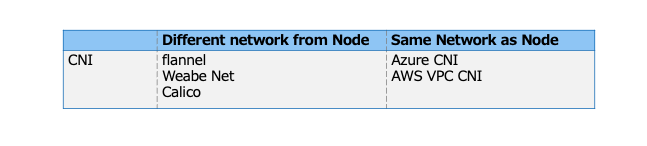
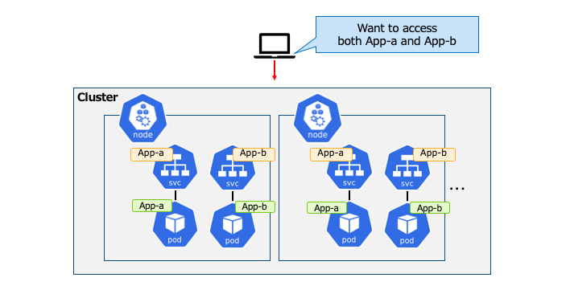
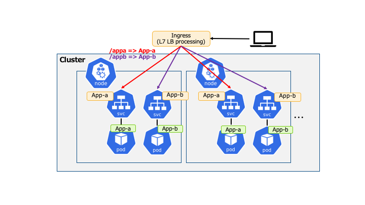
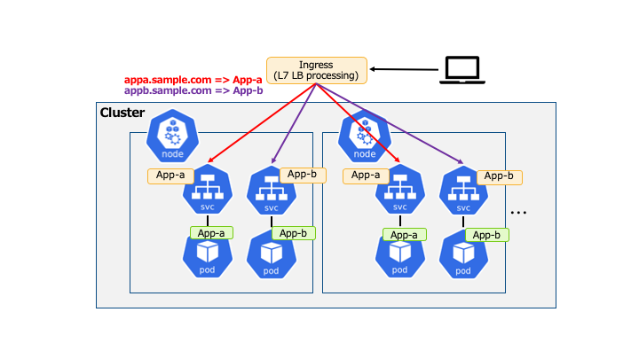
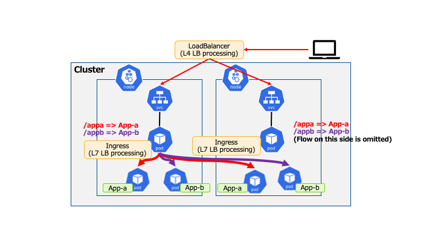
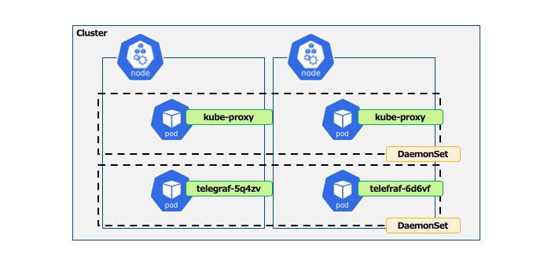

# Kubernetes のマルチノード構成の基本について学ぶ

## 概要

* マルチノード構成について学ぶ
  * Network
    * Node間通信
    * 複数Node間のロードバランシング
  * DaemonSet
    * Podを扱うリソース\(特殊な ReplicaSet というイメージ\)

## Kubernetes Cluster - Node 間通信

* 別Node上のPod間で疎通を可能にするために追加のネットワークプラグインを導入する必要がある

## Container Network Interface

* ContainerNetworkInterface\(CNI\) とは
  * マルチノードでPod間通信を可能にするためのプラグインのこと
  * クラウドプロバイダーごとに独自のプラグインをデフォルトで用意している
    * 構築時に選択することも可能である  

* 以下にPodがNodeと同じネットワークに所属するかどうかで大きく分類していることを示す

## 複数 Node のロードバランシング

## LoadBalancer の配置

* クラスタ外部へ LoadBalancer を配置する
  * Ingressリソース\(L7ロードバランサ\) or LoadBalancer リソース\(L4ロードバランサ\)  

* 大きく分けて配置は2パターンある
  * クラスタ外部でL7ロードバランス処理をする
    * ex: AWS ELBでL7ロードバランス処理し、直接各NodeのPodへ
  * クラスタ内部のPodでL7ロードバランス処理をする
    * ex: AWS ELBでL4ロードバランス処理をし、L7ロードバランス処理Podへ、そこから各Podへ
  * どちらの場合も、外部システム\(Cloudサービス\)のロードバランサ リソースを利用するためその機能や独自の仕様を抑えておくことが重要となる

## クラスタ外部に Ingress 配置例(パスべースルーティング)

## クラスタ外部に Ingress 配置例 (Hostヘッダによるルーティング)

## クラスタ内部に Ingress 配置例 (パターン3)

* Ingress として動作させるPodは以下のようなものがあり選択可能である
  * Ingress Nginx、Ambassador、Contour

## DaemonSet とは

* デフォルトですべての WorkerNode に 1Podずつ配置される
  * 1Pod/Node のため`replicas`の指定はない
  * 特定のNodeのみ指定 \(*nodeSelector*\) や labelによる条件の指定 \(*affinity*\) は可能である  

* デーモンやエージェントを配置するために利用されることが多い
  * ログ収集デーモン:fluentd
  * ログ収集エージェント:telegraf
  * ストレージデーモン:ceph

## DaemonSet の例

