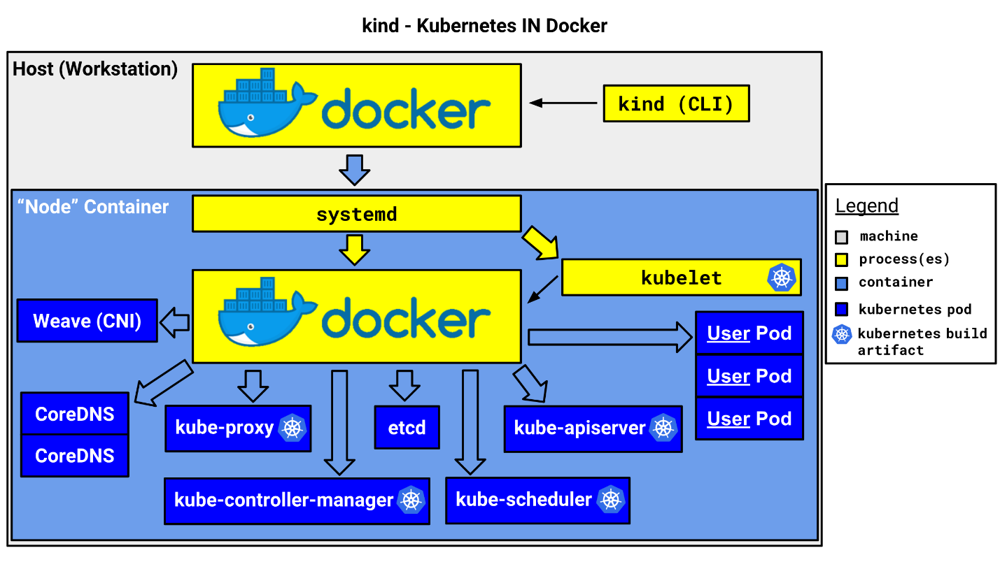
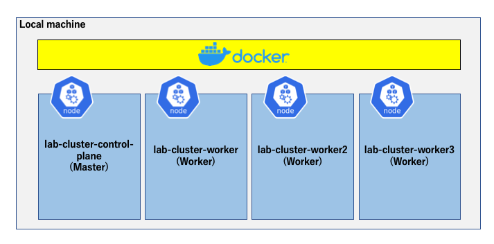

# **Lab 04-1 – マルチノード Kubernetes 環境の準備**

**ローカルマシンで `kind` コマンドのセットアップが完了している場合、Step1 は必要ありません。**  
**本手順書は kind v0.8.1 時点での手順となります。**

このLabでは Kubernetes 構築ツールである **kind** を利用して、マルチノードクラスタをローカルマシンの Docker 上に構築します。



<https://kind.sigs.k8s.io/docs/design/initial>より

`kind` とは、Docker 上に Kuberentes に必要なコンポーネントが構成された Master/Worker Node をコンテナで作成することで、ローカルマシンでマルチノードKubernetesクラスタ環境構築・テストができるツールです。  
本Labは、`kind` のインストールと、Lab04-2 で使用するためのマルチノードクラスタ作成・削除の手順となります。  
作成するクラスタは次の図のような Master 1台 + Worker 3台 という構成です。



## ***Step 1 (kind のインストール)***

1.  ローカルマシンに `kind` をインストールします。

 **<u>・Macの場合</u>**

```sh
$ curl -Lo ./kind https://kind.sigs.k8s.io/dl/v0.8.1/kind-$(uname)-amd64
$ chmod +x ./kind
$ mv ./kind <PATHの通った任意のディレクトリ>kind
```

 **<u>・Windowsの場合</u>**

```sh
// カレントディレクトリにkind.exeをダウンロード
$ curl -Lo kind.exe https://kind.sigs.k8s.io/dl/v0.8.1/kind-windows-amd64
```

 ダウンロードした kind.exe ファイルを PATH が通った任意のフォルダに移動します。

2.  `kind`がインストールされていることを確認します。  
    `kind`のバージョンが表示されることを確認します。以下は Windows での表示例です。

```sh
$ kind version
kind v0.8.1 go1.14.2 windows/amd64
```

## ***Step 2 (マルチノードクラスタの作成)***

Step1でインストールした`kind`で Docker上にクラスタ作成します。  
**＊ 作業ディレクトリは *materials/lab04-1_kind* ディレクトリです。**  
**＊ クラスタ用の Node コンテナイメージは 1.5GB程度あります。**

1.  ローカルマシンにインストールされた `kubectl` のバージョンを確認します。

```sh
// Server Versionの表示は接続しているクラスタの有無によって異なります。
$ kubectl version --short
Client Version: v1.15.5
Server Version: v1.15.11
```

 `kubectl` のバージョンは Kubernetes のバージョンに対して前後1マイナーバージョンまで対応しています。  
 本手順書の場合、`kubectl`のバージョンが 1.15 であるため対応する Kubernetes のバージョンは 1.14\~1.16 となっています。

 `kubectl`のバージョンをもとに、`kind` で作成するクラスタのコンフィグファイル `cluster-config.yaml`を確認します。

```yaml
# this config file contains all config fields with comments
# NOTE: this is not a particularly useful config file
kind: Cluster
apiVersion: kind.x-k8s.io/v1alpha4
# 1 control plane node and 3 workers
nodes:
# the control plane node config
- role: control-plane
  image: kindest/node:v1.15.11@sha256:6cc31f3533deb138792db2c7d1ffc36f7456a06f1db5556ad3b6927641016f50
  kubeadmConfigPatches:
  - |
    kind: InitConfiguration
    nodeRegistration:
      kubeletExtraArgs:
        node-labels: "ingress-ready=true"
  # for Ingress access
  extraPortMappings:
  - containerPort: 80
    hostPort: 80
    protocol: TCP
  - containerPort: 443
    hostPort: 443
    protocol: TCP
# the three workers
- role: worker
  image: kindest/node:v1.15.11@sha256:6cc31f3533deb138792db2c7d1ffc36f7456a06f1db5556ad3b6927641016f50
  kubeadmConfigPatches:
  - |
    kind: JoinConfiguration
    nodeRegistration:
      kubeletExtraArgs:
        read-only-port: "10255"
- role: worker
  image: kindest/node:v1.15.11@sha256:6cc31f3533deb138792db2c7d1ffc36f7456a06f1db5556ad3b6927641016f50
  kubeadmConfigPatches:
  - |
    kind: JoinConfiguration
    nodeRegistration:
      kubeletExtraArgs:
        read-only-port: "10255"
- role: worker
  image: kindest/node:v1.15.11@sha256:6cc31f3533deb138792db2c7d1ffc36f7456a06f1db5556ad3b6927641016f50
  kubeadmConfigPatches:
  - |
    kind: JoinConfiguration
    nodeRegistration:
      kubeletExtraArgs:
        read-only-port: "10255"
```

 `nodes`フィールド配下の `image`フィールドで各Nodeのイメージにより Kubernetes のバージョンを指定しています。コンフィグファイルで指定しているバージョンが自身の `kubectl`のバージョンに対応していない場合、以下の Nodeイメージのリストから対応するバージョンのイメージにコンフィグファイルを変更する必要があります。  
 変更箇所は Master 1 + Worker 3 の image で計4か所です。  
 イメージのリストは Releases · kubernetes-sigs/kind (<https://github.com/kubernetes-sigs/kind/releases>) を参照してください。  
 **(＊ 2020/07/07時点では Lab04-2 は Kuberentes1.15 想定)**

2.  `kind` コマンドからクラスタを構築します。

```sh
$ kind create cluster --name lab-cluster --config cluster-config.yaml
Creating cluster "lab-cluster" ...
• Ensuring node image (kindest/node:v1.15.11) 🖼 ...
✓ Ensuring node image (kindest/node:v1.15.11) 🖼
• Preparing nodes 📦 📦 📦 📦 ...
✓ Preparing nodes 📦 📦 📦 📦
• Writing configuration 📜 ...
✓ Writing configuration 📜
• Starting control-plane 🕹️ ...
✓ Starting control-plane 🕹️
• Installing CNI 🔌 ...
✓ Installing CNI 🔌
• Installing StorageClass 💾 ...
✓ Installing StorageClass 💾
• Joining worker nodes 🚜 ...
✓ Joining worker nodes 🚜
Set kubectl context to "kind-lab-cluster"
You can now use your cluster with:

kubectl cluster-info --context kind-lab-cluster

Have a question, bug, or feature request? Let us know! https://kind.sigs.k8s.io/#community 🙂
```

 `--name` オプション: 作成するクラスタ名  
 `--config` オプション: 作成するクラスタのコンフィグ

3.  Node が表示されることを確認します。

```sh
// Nodeの確認
$ kubectl get node
NAME STATUS ROLES AGE VERSION
lab-cluster-control-plane Ready master 109s v1.15.11
lab-cluster-worker Ready <none> 57s v1.15.11
lab-cluster-worker2 Ready <none> 57s v1.15.11
lab-cluster-worker3 Ready <none> 57s v1.15.11

// Dockerコンテナとして動作していることを確認
$ docker ps
CONTAINER ID IMAGE COMMAND CREATED STATUS PORTS NAMES
797a39678308 kindest/node:v1.15.11 "/usr/local/bin/entr…" 11 hours ago Up 3 minutes 0.0.0.0:80->80/tcp, 0.0.0.0:443->443/tcp, 127.0.0.1:59391->6443/tcp lab-cluster-control-plane
d80f5bececd1 kindest/node:v1.15.11 "/usr/local/bin/entr…" 11 hours ago Up 3 minutes lab-cluster-worker2
83dad29e5e77 kindest/node:v1.15.11 "/usr/local/bin/entr…" 11 hours ago Up 3 minutes lab-cluster-worker3
87a761a40855 kindest/node:v1.15.11 "/usr/local/bin/entr…" 11 hours ago Up 3 minutes lab-cluster-worker
```

 以上で、ローカルマシンの Docker 上にマルチノードクラスタ構築ができました。  
 次の Step3 は Lab04-2 が完了後実施してください。

## ***Step 3 (クラスタの削除)***

以下はすべてのlab終了後に行ってください。

1.  `kind` コマンドでクラスタを削除します。

```sh
$ kind delete cluster --name lab-cluster
Deleting cluster "lab-cluster" ...

$ kind get clusters
No kind clusters found.

// Step2の手順2で確認したDockerコンテナが削除されていることを確認
$ docker ps

```

 以上でクラスタの削除が完了となります。
