## **Lab 04-2 – クラスタ監視アプリのデプロイ**

**作業ディレクトリは *materials/lab04-2_sts-ds* ディレクトリです。**  

このLabでは`kind`を利用してローカルマシンの Docker 上に構成したマルチノードkubernetes クラスタに、influxDB、telegraf、grafanaをデプロイし、Node監視ダッシュボードを作成してみます。  
下記がデプロイの構成イメージです。`kind`で構成する特殊な環境のため、Ingress の動作を行う *ingress-nginx* Pod は Master Node にのみ存在し、*ingress-nginx* Pod の 80番ポートとローカルマシンの 80番ポートとポートフォワーディングされます。

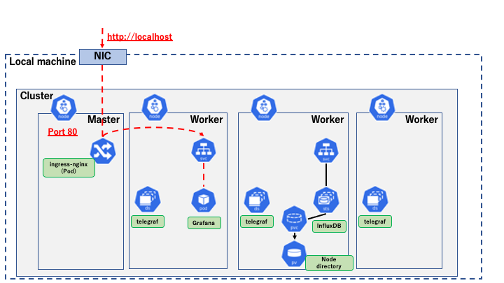

このLabでは InfluxDB、telegraf、Grafana をデプロイします。それぞれの役割は以下の図のようになっています。

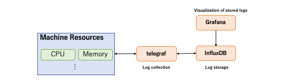

また、デプロイする kubernetesリソースは以下のようになります。  

**・InfluxDB(ログ保存)**  
StatefulSet + PersistentVolume + PersistentVolumeClaim  

**・telegraf(ログの収集)**  
DaemonSet

**・Grafane(ログの可視化)**  
Deployment + Ingress

デプロイ後、ブラウザから Grafana へアクセスし、次のような各Nodeのモニタリングダッシュボードを作成してみましょう。(イメージですので、ダッシュボードは自由に作成していただいて問題ありません。)

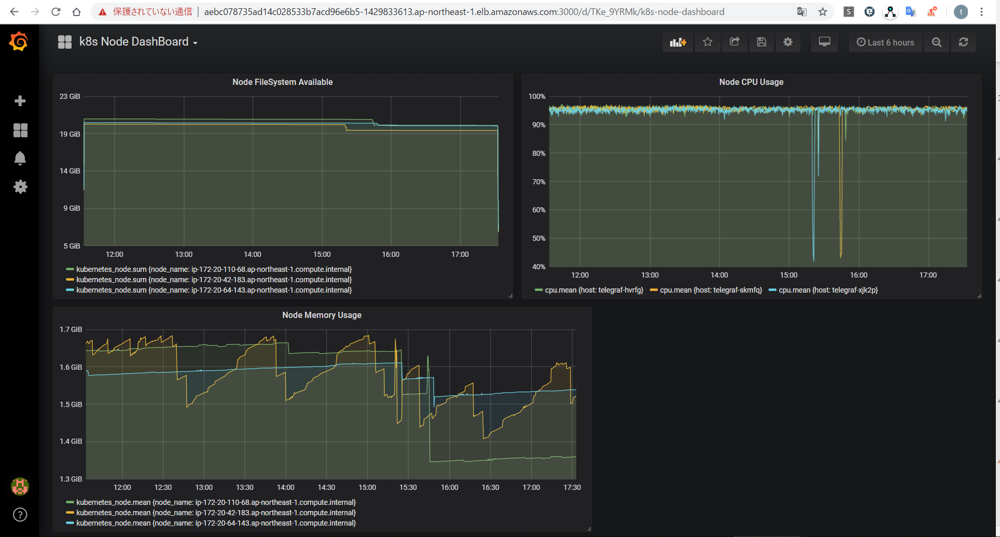

## ***Step 1 (Ingress のデプロイ)***

1.  外部アクセス用の **Ingress Nginx Controller** をデプロイします。

```sh
$ kubectl apply -f https://raw.githubusercontent.com/kubernetes/ingress-nginx/master/deploy/static/provider/kind/deploy.yaml
namespace/ingress-nginx created
serviceaccount/ingress-nginx created
configmap/ingress-nginx-controller created
clusterrole.rbac.authorization.k8s.io/ingress-nginx created
clusterrolebinding.rbac.authorization.k8s.io/ingress-nginx created
role.rbac.authorization.k8s.io/ingress-nginx created
rolebinding.rbac.authorization.k8s.io/ingress-nginx created
service/ingress-nginx-controller-admission created
service/ingress-nginx-controller created
deployment.apps/ingress-nginx-controller created
validatingwebhookconfiguration.admissionregistration.k8s.io/ingress-nginx-admission created
clusterrole.rbac.authorization.k8s.io/ingress-nginx-admission created
clusterrolebinding.rbac.authorization.k8s.io/ingress-nginx-admission created
job.batch/ingress-nginx-admission-create created
job.batch/ingress-nginx-admission-patch created
role.rbac.authorization.k8s.io/ingress-nginx-admission created
rolebinding.rbac.authorization.k8s.io/ingress-nginx-admission created
serviceaccount/ingress-nginx-admission created

$ kubectl get pod -n ingress-nginx
NAME READY STATUS RESTARTS AGE
ingress-nginx-admission-create-fkr2b 0/1 Completed 0 3m17s
ingress-nginx-admission-patch-jlnjl 0/1 Completed 2 3m17s
ingress-nginx-controller-55784674bf-hhc57 1/1 Running 0 3m28s
```

 ingress-nginx-controller Pod 起動が完了後、ブラウザから http://localhost へアクセスすると *404 Not Found* ページが表示されます。  
 本Labで作成したクラスタ環境では、ローカルマシンから localhost の 80番ポートから nginx-ingress-controller の 80番ポートへアクセスできます。

## ***Step 2 (InfluxDB のデプロイ)***

ログ保存用の InfluxDB をデプロイします。デプロイする kubernetesリソースは下記の通りです。  

**・NameSpace**  
monitoring: モニタリング関連のリソースをデプロイする用のNameSpace  

**・Secret**  
influxdb-secret: データベース名、ユーザ名、パスワード

**・StatefulSet**  
influxdb: InfluxDB の StatefulSet。今回は 1 *replicas* (Masterのみ)の構成です。  
PVCのテンプレートを宣言でき、そのPVCから *Dynamic Provisioning* によって作成されたPVをマウントし利用します。

**・PersistentVolumeClaim(PVC)**  
StatefulSet に定義可能な *VolumClaimTemplates* フィールドによって生成します。

**・PersistentVolume(PV)**  
InfluxDB のデータストレージとして利用します。上記のPVCから *Dynamic Provicioning* の機能により自動でリソースが作成されます。

**・Service**  
StatefulSet 用のService。仮想の ClusterIP を介さず、Podのホスト名で名前解決を可能にする。今回の場合、*influxdb-0.influxdb* で名前解決可能にします。

1.  デプロイするマニフェストファイル、`influxdb-deploy.yaml`を確認します。

```yaml
apiVersion: v1
kind: Namespace       # ログ監視用のNamespaceを作成
metadata:
  name: monitoring
---
apiVersion: v1
kind: Secret          # InfluxDBの接続情報
metadata:
  name: influxdb-secret
  namespace: monitoring
type: Opaque          # スキーマレスでsecret を定義するタイプ
data:                 # 渡したい値を Key: Value の形式で定義
  INFLUXDB_DATABASE: bG9jYWxfbW9uaXRvcmluZw==  # 「local_monitoring」
  INFLUXDB_USERNAME: c2FtcGxl                  # 「sample」のbase64エンコード
  INFLUXDB_PASSWORD: cGFzc3dvcmQ=              # 「password」のbase64エンコード
---
apiVersion: apps/v1
kind: StatefulSet     # InfluxDB Pod 用StatefulSet(PVを持つPod)
metadata:
  namespace: monitoring
  labels:
    app: influxdb
  name: influxdb
spec:
  replicas: 1         # Master1台構成
  selector:
    matchLabels:
      app: influxdb
  serviceName: influxdb
  template:
    metadata:
      labels:
        app: influxdb
    spec:
      containers:
      - envFrom:
        - secretRef:
            name: influxdb-secret
        image: docker.io/influxdb:1.6.4
        name: influxdb
        volumeMounts:                   # PVをマウント
        - mountPath: /var/lib/influxdb
          name: var-lib-influxdb
  volumeClaimTemplates:                 # PVC
  - metadata:
      name: var-lib-influxdb
    spec:
      accessModes: ["ReadWriteOnce"]
      resources:
        requests:
          storage: 1Gi
---
apiVersion: v1
kind: Service
metadata:
  name: influxdb
  namespace: monitoring
spec:
  clusterIP: None
  selector:
    app: influxdb
```

2.  **influxdb** をデプロイします。

```sh
$ kubectl apply -f influxdb-deploy.yaml
namespace/monitoring created
secret/influxdb-secret created
statefulset.apps/influxdb created
service/influxdb created

$ kubectl get pod,sts,pv -o wide -n monitoring
NAME READY STATUS RESTARTS AGE IP NODE NOMINATED NODE READINESS GATES
pod/influxdb-0 1/1 Running 0 55s 10.244.3.4 lab-cluster-worker <none> <none>

NAME READY AGE CONTAINERS IMAGES
statefulset.apps/influxdb 1/1 55s influxdb docker.io/influxdb:1.6.4

NAME CAPACITY ACCESS MODES RECLAIM POLICY STATUS CLAIM STORAGECLASS REASON AGE VOLUMEMODE
persistentvolume/pvc-3348244c-bfb8-4bb5-bf26-8a6dcd97a04b 1Gi RWO Delete Bound monitoring/var-lib-influxdb-influxdb-0 standard 53s Filesystem
```

 マニフェストファイルには *PersistentVolume* の定義はしていませんが、リソースが作成されていることが確認できます。これは、PVC作成時に自動でPVを作成する「*Dynamic Provicioning*」という機能によるものです。  
 下記のように `StorageClass` を確認すると、「standard」という `StorageClass` がデフォルトに設定されていることがわかります。  
 本Lab環境で利用する *PersistentVolume* は「HostPath」という、Podが稼働する Worker Node のディレクトリを利用しているリソースです。

```sh
$ kubectl get sc
NAME PROVISIONER AGE
standard (default) rancher.io/local-path 18m

$ kubectl describe sc standard
Name: standard
IsDefaultClass: Yes
Annotations: kubectl.kubernetes.io/last-applied-configuration={"apiVersion":"storage.k8s.io/v1","kind":"StorageClass","metadata":{"annotations":{"storageclass.kubernetes.io/is-default-class":"true"},"name":"standard"},"provisioner":"rancher.io/local-path","reclaimPolicy":"Delete","volumeBindingMode":"WaitForFirstConsumer"}
,storageclass.kubernetes.io/is-default-class=true
Provisioner: rancher.io/local-path
Parameters: <none>
AllowVolumeExpansion: <unset>
MountOptions: <none>
ReclaimPolicy: Delete
VolumeBindingMode: WaitForFirstConsumer
Events: <none>
```

 作成されたPVの詳細を確認します。

```sh
$ kubectl describe pv -n monitoring
Name: pvc-3348244c-bfb8-4bb5-bf26-8a6dcd97a04b
Labels: <none>
Annotations: pv.kubernetes.io/provisioned-by: rancher.io/local-path
Finalizers: [kubernetes.io/pv-protection]
StorageClass: standard
Status: Bound
Claim: monitoring/var-lib-influxdb-influxdb-0
Reclaim Policy: Delete
Access Modes: RWO
VolumeMode: Filesystem
Capacity: 1Gi
Node Affinity:
Required Terms:
Term 0: kubernetes.io/hostname in [lab-cluster-worker]
Message:
Source:
Type: HostPath (bare host directory volume)
Path: /var/local-path-provisioner/pvc-3348244c-bfb8-4bb5-bf26-8a6dcd97a04b
HostPathType: DirectoryOrCreate
Events: <none>
```

 利用している Worker Node のディレクトリパスを`Source`フィールドで確認できます。  
 また、`Node Affinity`フィールドからどの Worker Node 上のリソースかも確認ができます。本手順書の場合は、「*lab-cluster-worker*」という名前の Worker Node 上にリソースが存在します。

## ***Step 3 (telegraf のデプロイ)***

続いてログ収集を行う **telegraf** をデプロイします。各Nodeのログを収集するPodをそれぞれのNodeマシンへデプロイするため、DaemonSet を利用します。DaemonSet を利用する理由については後述します。

デプロイする kubernetes リソースは下記の通りです。  
**・Secret**  
telegraf-secret: InfluxDBの接続情報

**・ConfigMap**  
telegraf-config: telegrafの設定情報

**・DaemonSet**  
telegraf: 各Nodeのログを収集するDaemonSet

1.  デプロイするマニフェストファイル、`telegraf-deploy.yaml` を確認します。

```yaml
apiVersion: v1
kind: Secret                                    # InfluxDBの接続情報
metadata:
  name: telegraf-secret
  namespace: monitoring
type: Opaque
data: 
  INFLUXDB_DB: bG9jYWxfbW9uaXRvcmluZw==         # 「local_monitoring」
  INFLUXDB_USER: c2FtcGxl                       # 「sample」のbase64エンコード
  INFLUXDB_USER_PASSWORD: cGFzc3dvcmQ=          # 「password」のbase64エンコード
  INFLUXDB_URL: aHR0cDovL2luZmx1eGRiLTAuaW5mbHV4ZGI6ODA4Ng==   # 「http://influxdb-0.influxdb:8086」
---
apiVersion: v1
kind: ConfigMap                                 # telegrafの設定情報
metadata:
  name: telegraf-config
  namespace: monitoring
data:                                           # logの保存先(influxdb)とlog収集先(k8s)の設定値
  telegraf.conf: |+
    [[outputs.influxdb]]
      urls = ["$INFLUXDB_URL"]
      database = "$INFLUXDB_DB"
      username = "$INFLUXDB_USER"
      password = "$INFLUXDB_USER_PASSWORD"
    [[inputs.statsd]]
    [[inputs.cpu]]
    [[inputs.disk]]
    [[inputs.diskio]]
    [[inputs.kernel]]
    [[inputs.mem]]
    [[inputs.processes]]
    [[inputs.swap]]
    [[inputs.system]]
    [[inputs.docker]]
    [[inputs.kubernetes]]
      url = "http://$TELEGRAF_KUBERNETES_ENDPOINT:10255"
---
apiVersion: apps/v1
kind: DaemonSet                                 # telegraf Pod を配置するDaemonSet
metadata:
  namespace: monitoring
  name: telegraf
spec:
  selector:
    matchLabels:
      app: telegraf
  minReadySeconds: 5
  template:
    metadata:
      labels:
        app: telegraf
    spec:
      containers:
        - image: telegraf:1.10.0
          name: telegraf
          env:                                  # Podが配置されているNodeのホスト名
          - name: TELEGRAF_KUBERNETES_ENDPOINT
            valueFrom:
              fieldRef:
                fieldPath: spec.nodeName
          envFrom:                              # InfluxDBへの接続情報
            - secretRef:
                name: telegraf-secret
          volumeMounts:                         # telegrafの設定情報をファイルとしてマウント
            - name: telegraf-config-volume
              mountPath: /etc/telegraf/telegraf.conf
              subPath: telegraf.conf
              readOnly: true
      volumes:                                  # ConfigMapを指定     
        - name: telegraf-config-volume
          configMap:
            name: telegraf-config
```

2.  telegraf をデプロイします。

```sh
$ kubectl apply -f telegraf-deploy.yaml
secret/telegraf-secret created
configmap/telegraf-config created
daemonset.apps/telegraf created

$ kubectl get pod,ds,sts,svc -n monitoring -o wide
NAME READY STATUS RESTARTS AGE IP NODE NOMINATED NODE READINESS GATES
pod/influxdb-0 1/1 Running 0 17m 10.244.3.4 lab-cluster-worker <none> <none>
pod/telegraf-6lbcc 1/1 Running 0 3m11s 10.244.3.6 lab-cluster-worker <none> <none>
pod/telegraf-9r4v4 1/1 Running 0 3m12s 10.244.2.3 lab-cluster-worker2 <none> <none>
pod/telegraf-gdfnf 1/1 Running 0 3m11s 10.244.1.5 lab-cluster-worker3 <none> <none>

NAME DESIRED CURRENT READY UP-TO-DATE AVAILABLE NODE SELECTOR AGE CONTAINERS IMAGES SELECTOR
daemonset.extensions/telegraf 3 3 3 3 3 <none> 3m12s telegraf telegraf:1.10.0 app=telegraf

NAME READY AGE CONTAINERS IMAGES
statefulset.apps/influxdb 1/1 17m influxdb docker.io/influxdb:1.6.4

NAME TYPE CLUSTER-IP EXTERNAL-IP PORT(S) AGE SELECTOR
service/influxdb ClusterIP None <none> <none> 17m app=influxdb
```

 telegraf は DaemonSet のため、telegraf の Pod が各Nodeに 1つずつデプロイされていることが確認できます。このように、DaemonSet は各Nodeに １つずつPodを配置したい場合に活用できます。ReplicaSet や StatefulSet のようにPodの数である `replicas` の設定は存在しません。  
 kind環境における CNI「kindnet」といった system コンポーネントも何種類かは DaemonSet であり、「`kubectl get ds -A`」で確認することができます。

## ***Step 4 (Grafana の作成)***

InfluxDB へ収集したログを可視化するための **Grafana** をデプロイします。  
デプロイするリソースは下記の通りです。

**・Secret**  
grafana-secret: Grafana ダッシュボードへアクセスするための資格情報

**・Deployment**  
grafana: Grafana 用 Deployment

**・Service**  
grafana: Grafana ダッシュボードへアクセスするためのService

**・Ingress**  
grafana: nginx-ingress-controller に反映するルーティングルール

1.  デプロイするマニフェストファイル、`grafana-deploy.yaml` を確認します。

```yaml
apiVersion: v1
kind: Secret        # Grafanaダッシュボードのログイン情報
metadata:
  name: grafana-secret
  namespace: monitoring
type: Opaque
data: 
  GF_SECURITY_ADMIN_USER: YWRtaW4=                   # 「admin」
  GF_SECURITY_ADMIN_PASSWORD: bGFiLWdyYWZhbmExMjM=   # 「lab-grafana123」
---
apiVersion: apps/v1
kind: Deployment     # Grafana PodのDeployment
metadata:
  namespace: monitoring
  labels:
    app: grafana
  name: grafana
spec:
  replicas: 1
  selector:
    matchLabels:
      app: grafana
  template:
    metadata:
      labels:
        app: grafana
    spec:
      containers:
      - envFrom:
        - secretRef:
            name: grafana-secret
        image: docker.io/grafana/grafana:5.3.2
        name: grafana
---
kind: Service
apiVersion: v1
metadata: 
  name: grafana-svc
  namespace: monitoring
spec:
  selector:
    app: grafana
  ports: 
  - port: 3000
---
apiVersion: extensions/v1beta1
kind: Ingress          # Grafana Pod へアクセスするためのIngress
metadata:
  name: grafana
  namespace: monitoring
spec:
  rules:
  - http:
      paths:
      - path: /
        backend:
          serviceName: grafana-svc
          servicePort: 3000
```

2.  Grafana をデプロイします。

```sh
$ kubectl apply -f grafana-deploy.yaml
secret/grafana-secret created
deployment.apps/grafana created
service/grafana-svc created
ingress.extensions/grafana created

$ kubectl get pod,ds,sts,svc -n monitoring -o wide
NAME READY STATUS RESTARTS AGE IP NODE NOMINATED NODE READINESS GATES
pod/grafana-85784cf989-z7x42 1/1 Running 0 72s 10.244.2.4 lab-cluster-worker2 <none> <none>
pod/influxdb-0 1/1 Running 0 26m 10.244.3.4 lab-cluster-worker <none> <none>
pod/telegraf-6lbcc 1/1 Running 0 12m 10.244.3.6 lab-cluster-worker <none> <none>
pod/telegraf-9r4v4 1/1 Running 0 12m 10.244.2.3 lab-cluster-worker2 <none> <none>
pod/telegraf-gdfnf 1/1 Running 0 12m 10.244.1.5 lab-cluster-worker3 <none> <none>

NAME DESIRED CURRENT READY UP-TO-DATE AVAILABLE NODE SELECTOR AGE CONTAINERS IMAGES SELECTOR
daemonset.extensions/telegraf 3 3 3 3 3 <none> 12m telegraf telegraf:1.10.0 app=telegraf

NAME READY AGE CONTAINERS IMAGES
statefulset.apps/influxdb 1/1 26m influxdb docker.io/influxdb:1.6.4

NAME TYPE CLUSTER-IP EXTERNAL-IP PORT(S) AGE SELECTOR
service/grafana-svc ClusterIP 10.108.97.65 <none> 3000/TCP 72s app=grafana
service/influxdb ClusterIP None <none> <none> 26m app=influxdb
```

 これで Grafana ダッシュボードへアクセスに必要なリソースをデプロイすることができました。

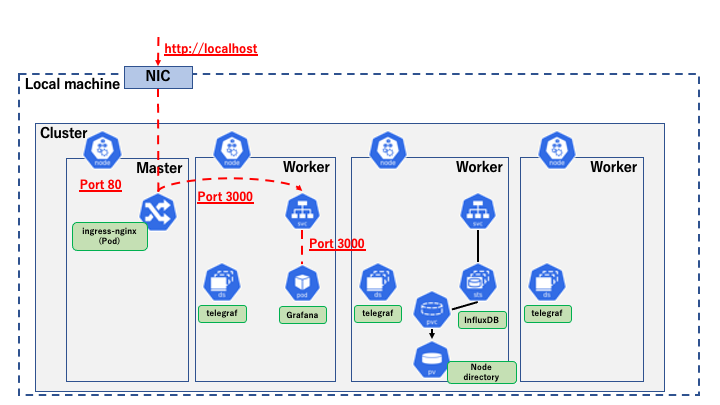

3.  ブラウザから Grafana ダッシュボードへアクセスし、初期設定を行います。

 ブラウザで Grafana ダッシュボードへ http アクセスすると次のようなログイン画面が表示されます。  
 **URL: http://localhost**

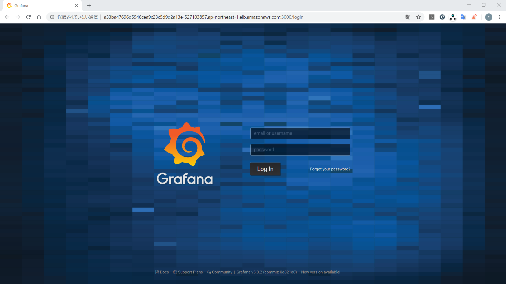

 ログインの資格情報は「`grafana-deploy.yaml`」でデプロイした `grafana-secret` に格納されています。デフォルトでは以下のようになっています。  
 username: admin  
 password: lab-grafana123

 ログインすると次のような Home Dashboard 画面が表示されるので、「Add data source」から InfluxDB への接続設定を行います。

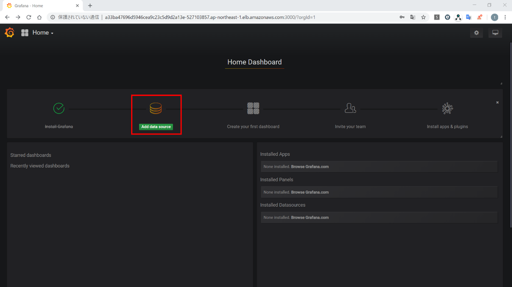

 Setting 画面が表示されるので、以下のように設定します。

 **Name**: k8s metrics  
 **Type**: InfluxDB  
 **HTTP**  
 **- URL**: http://influxdb-0.influxdb:8086  
   => StatefulSetの場合、\<Podホスト名>.\<Service名>で名前解決可能(＊)  
 **InfluxDB Details**  
 **- Database**: local_monitoring  
 **- User**: sample  
 **- Password**: password  
   => influxdb-secretに格納されています。

 設定入力後、「Save & Test」をクリックします。設定が正常に行われると、「Data source is working」と表示されます。

  ＊ StatefulSet Pod の名前解決  
  通常、Pod間通信には Service を利用しアクセスし、Podホスト名による名前解決はできません。StatefulSet を利用した Primary/Secondary 構成時は、Primary へのアクセスメインとしたいので、Service 経由でアクセスすると負荷分散されてしまうので常時 Primary へのアクセスができません。  
  今回のように StatefulSet と特殊な clusterIP:None とした Service(Headless Service) を利用することで、Pod名を指定したアクセスが可能となります。

 続いて、Grafana DashBoard の設定ファイルをインポートします。

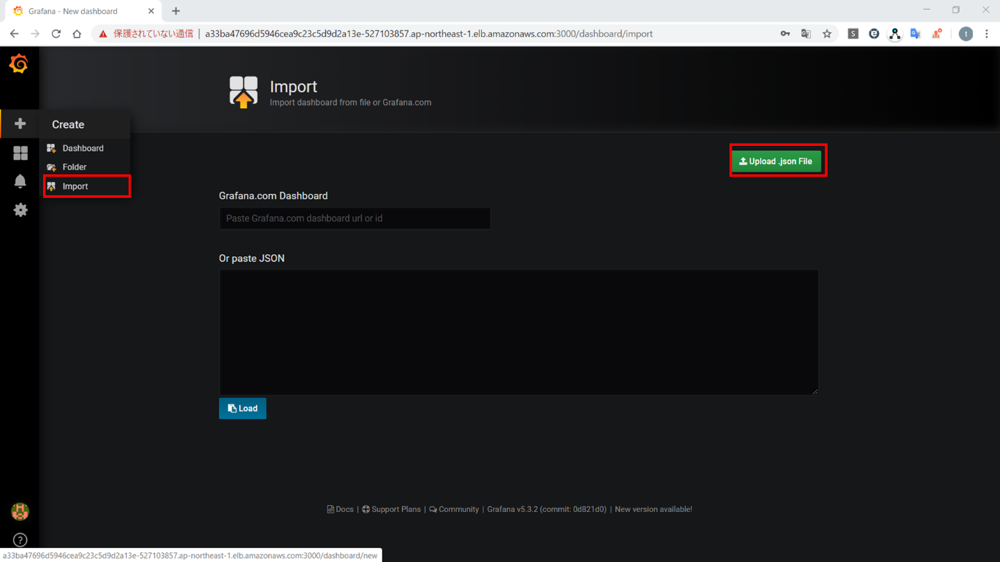

 左メニューから「Import」を選択し、「Upload .json File」をクリックし、*/materials/ lab04-2_sts-ds/grafana-config* ディレクトリ配下 `grafana-config.json` ファイルを選択します。  
 以下のように表示されるため、「k8s metrics」を先ほど作成した Data source を選択し、「Import」をクリックします。

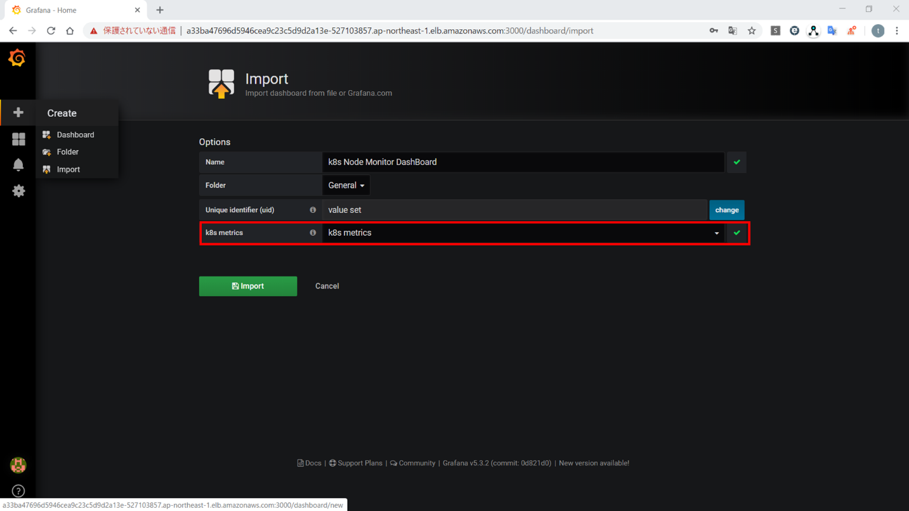

 Import が正常に行われると、以下のようなダッシュボードが表示されます。

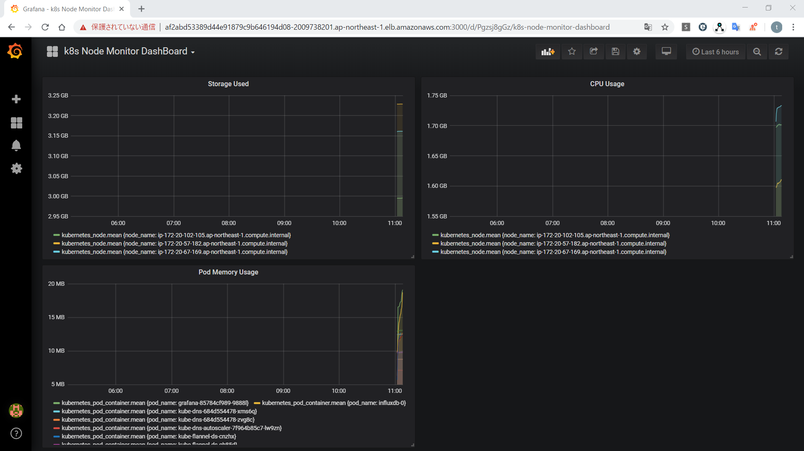

 このダッシュボードは3つのグラフが表示されます。それぞれ、各 Worker Node のストレージ使用量とメモリ使用量が上段に、Podのメモリ使用量が下段にグラフ化されています。  
 DaemonSet により配置された各Nodeの telegraf Pod が kubelet API 経由で取得したメトリックスを InfluxDB へ格納し、そのデータを利用し Grafana がグラフを作成しています。  
 kubernetes のログ管理としては本Labのように、各Nodeにログ収集を行うエージェントを配置するパターンや、Podにログ収集を行うコンテナを内包するパターン(サイドカーパターン)といった方法が利用されます。

4.  Grafanaのカスタマイズ(任意)

 グラフの追加など、Grafana をカスタマイズしてみましょう。  
 既存グラフの編集はグラフタイトルクリック \> Edit から行えます。  
 新規グラフの追加はダッシュボード画面上の「Add panel」 から行えます。  
 ・telegraf 取得メトリックス一覧  
 github(<https://github.com/influxdata/telegraf/tree/master/plugins/inputs/kubernetes>) の *Metrics* 章参照

## ***Step 5(StatefulSet の Node 移動)***

PVが割り当てられているPodを移動させるさいには、PVが利用しているリソース(EKS,AKSといったクラウドサービスの場合、PVに利用されるストレージサービスなど)の制限に注意しましょう。  
本Labでは influxdb-0 Pod は Worker Node のディレクトリがPVとして割り当てられています。  
各 Worker Node で利用されるPVのディレクトリには、別 Worker Node からのアクセスはできません。  
一例として、Node worker-1 に sample-pv が作成されていて、Node worker-2 上にPodがスケジューリングされ、そのPodが sample-pv を割り当てようとするとPodが立ち上がらないということになります。  
PVの制限に注意して influxdb-0 Pod を実際に次の図のようにNode移動させてみましょう。

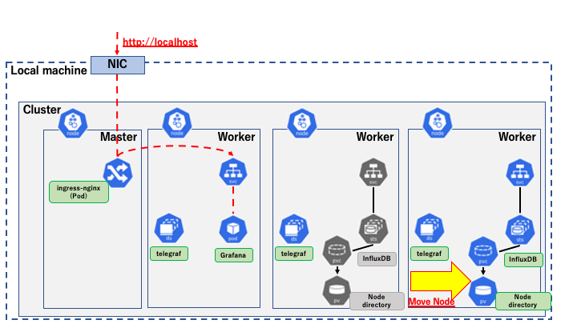

Nodeを移動させる場合、Podは再作成されPVは新規PVが割り当てられるため、Pod内のデータは削除され、PVのデータは新規PVのデータになってしまいます。そのため、移動前の Grafana のグラフを表示したい場合データベースのデータをリストアする必要があります。  
本Labでは、Nodeを移動させる前に influxdb-0 Pod 内にアクセスし、`influxd` コマンドを利用しバックアップを取得しておきます。Node 移動後取得しておいたバックアップからリストアします。

1.  influxdb-0 Pod を移動する準備を行います。  
    influxdb-0 Pod が配置されているNode名を確認します。

```sh
// influxdb-0 Podが配置されている Node とその AZ の確認
$ kubectl get pod influxdb-0 -n monitoring -o=jsonpath='{.spec.nodeName}'
lab-cluster-worker
```

 同じNodeにスケジュールされないように、Nodeにスケジュール対象外フラグを設定します。  
 本手順書の場合、フラグを設定するNodeは「**lab-cluster-worker**」です。  
 _**influxdb-0 Podが配置されていたもともとのNodeとしてテキストファイルなどにメモしておきましょう。**_

```
// NodeのSTATUSを確認
$ kubectl get node lab-cluster-worker
NAME STATUS ROLES AGE VERSION
lab-cluster-worker Ready <none> 129m v1.15.11
// Nodeへスケジュール対象外のフラグ設定
$ kubectl cordon lab-cluster-worker
node/lab-cluster-worker cordoned

// NodeのSTATUSを確認
$ kubectl get node lab-cluster-worker
NAME STATUS ROLES AGE VERSION
lab-cluster-worker Ready,SchedulingDisabled <none> 130m v1.15.11
```

 `kubectl cordon` コマンドで対象のNodeがスケジューリングの対象外となりました。  
 Node の STATUS で *SchedulingDisabled* と表示されていることが確認できます。これ以降のPodのデプロイでは *SchedulingDisabled* のNodeは対象から外れます。  
 cordon ではスケジュール対象外にしたNode上の既存Podはそのまま稼働します。  
 Grafana のダッシュボードから、グラフが正常に表示されていることを確認します。

2.  InfluxDB のバックアップを取得します。

```sh
$ kubectl exec -n monitoring -it influxdb-0 bash

//influxdb-0 Pod内
<strong>root@influxdb-0:/# influxd backup -portable -database local_monitoring /tmp/influxdb-bak
2020/07/07 22:29:48 backing up metastore to /tmp/influxdb-bak/meta.00
2020/07/07 22:29:48 backing up db=local_monitoring
2020/07/07 22:29:48 backing up db=local_monitoring rp=autogen shard=2 to /tmp/influxdb-bak/local_monitoring.autogen.00002.00 since 0001-01-01T00:00:00Z
2020/07/07 22:29:49 backup complete:
2020/07/07 22:29:49 /tmp/influxdb-bak/20200707T222948Z.meta
2020/07/07 22:29:49 /tmp/influxdb-bak/20200707T222948Z.s2.tar.gz
2020/07/07 22:29:49 /tmp/influxdb-bak/20200707T222948Z.manifest
root@influxdb-0:/# ls /tmp/influxdb-bak/
20200707T222948Z.manifest 20200707T222948Z.meta 20200707T222948Z.s2.tar.gz

//influxdb-0 Pod からexit
root@influxdb-0:/# exit
```

 バックアップデータをPod内からローカルマシンへコピーします。

```
// ローカルマシン
$ kubectl cp influxdb-0:/tmp/influxdb-bak ./bak-dir -n monitoring
tar: Removing leading `/' from member names

$ ls ./bak-dir/
20200707T222948Z.manifest 20200707T222948Z.meta 20200707T222948Z.s2.tar.gz

```

 ＊　`kubectl cp \<コピー元> \<コピー先>`  
    Pod内のディレクトリを指定する場合、\<Pod名>:\<Pod内ディレクトリパス> とします。

3.  influxdb-0 Pod を移動させます。  
   `kubectl delete` コマンドを利用し、influxdb-0 Pod を再作成することでNode移動を行います。しかし、StatefulSet はPodの再作成時、同じPVCを利用しPVを割り当てようとします。  
   本LabのようにNodeを移動させる場合はPVとPodがスケジュールされるNodeが異なってしまうためPodが起動しなくなってしまいます。Podを起動させるためにはPVCを削除し、新たなPVCでPVを割り当てる必要があります。  
   influxdb-0 に割り当てられているPVの *Reclaim Policy* は *Delete* のため、PVCを削除するとNode上のディレクトリも削除されます。influxdb-0 のバックアップはすでに取得済みですが、*Reclaim Policy* を *Retain* にして、Node上のディレクトリを保持するようにしましょう。

```sh
// influxdb-0に割り当てられているPVの確認(PVCの確認)
$ kubectl get pod influxdb-0 -n monitoring -o jsonpath='{.spec.volumes[*].persistentVolumeClaim.claimName}'
var-lib-influxdb-influxdb-0

// 確認したPVCに割り当てられているPVの確認(CLAIMが上記で確認したPVC名である)
//　本Labの環境ではPVは1つであるが、複数ある場合はこのような方法などで確認します。
$ kubectl get pv
NAME CAPACITY ACCESS MODES RECLAIM POLICY STATUS CLAIM STORAGECLASS REASON AGE
pvc-3348244c-bfb8-4bb5-bf26-8a6dcd97a04b 1Gi RWO Delete Bound monitoring/var-lib-influxdb-influxdb-0 standard 157m
```

 確認したPVに対して *Reclaim Policy* を変更します。  
 ＊  \<INPUT YOUR PV NAME> に上記で確認したPV名を入力します。  
    本手順書の場合PV名は「**pvc-3348244c-bfb8-4bb5-bf26-8a6dcd97a04b**」です。

 **・Macの場合**

```sh
// Reclaim Policyの変更
$ kubectl patch persistentvolume/<INPUT YOUR PV NAME> -n monitoring -p '{"spec":{"persistentVolumeReclaimPolicy":"Retain"}}'
persistentvolume/<INPUT YOUR PV NAME> patched

// Reclaim Policyが変更されたことを確認
$ kubectl get pv
NAME CAPACITY ACCESS MODES RECLAIM POLICY STATUS CLAIM STORAGECLASS REASON AGE
pvc-3348244c-bfb8-4bb5-bf26-8a6dcd97a04b 1Gi RWO Retain Bound monitoring/var-lib-influxdb-influxdb-0 standard 161m
```

 **・Windowsの場合**

```sh
$ kubectl edit persistentvolume/<INPUT YOUR PV NAME>
// 以下のようにテキストエディタが立ち上がり、PVのyamlを直接編集できます。
// 以下の編集箇所の編集が完了したら、上書き保存し、テキストエディタを閉じます。
// テキストエディタを閉じ、編集が完了すると以下のように表示されます。
// 表示されない場合は Enterキーを押してみてください。
persistentvolume/<INPUT YOUR PV NAME> edited

// Reclaim Policyが変更されたことを確認
$ kubectl get pv
NAME CAPACITY ACCESS MODES RECLAIM POLICY STATUS CLAIM STORAGECLASS REASON AGE
pvc-3348244c-bfb8-4bb5-bf26-8a6dcd97a04b 1Gi RWO Retain Bound monitoring/var-lib-influxdb-influxdb-0 standard 161m
```

 **・編集箇所**  
 **spec.persistentVolumeReclaimPolicy** フィールドの値を「**Retain**」に変更

 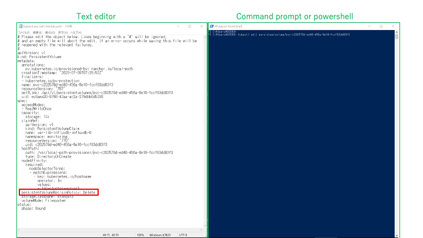

 *Reclaim Policy* を *Retain* に変更できたのでPVCを削除し、Podの再作成を行います。

```sh
// StatefulSetのscaleを0にしてPodを削除
$ kubectl scale --replicas=0 sts/influxdb -n monitoring
statefulset.apps/influxdb scaled

// PVCの削除
$ kubectl delete persistentvolumeclaim/var-lib-influxdb-influxdb-0 -n monitoring
persistentvolumeclaim "var-lib-influxdb-influxdb-0" deleted

// PVCが削除され、PVがReleasedになっていることを確認
$ kubectl get pv,pvc -A
NAME CAPACITY ACCESS MODES RECLAIM POLICY STATUS CLAIM STORAGECLASS REASON AGE
persistentvolume/pvc-3348244c-bfb8-4bb5-bf26-8a6dcd97a04b 1Gi RWO Retain Released monitoring/var-lib-influxdb-influxdb-0 standard 172m
```

 PVに利用されているNodeのディレクトリも削除されずに残っていることを確認しましょう。  
 lab-cluster-worker は influxdb-0 Pod がもともと配置されていた Node です。

```SH
// PVの情報から利用されているNodeのディレクトリパスを確認
$ kubectl get persistentvolume/pvc-3348244c-bfb8-4bb5-bf26-8a6dcd97a04b -o jsonpath='{.spec.hostPath.path}'
/var/local-path-provisioner/pvc-3348244c-bfb8-4bb5-bf26-8a6dcd97a04b

// docker exec コマンドを使い、Nodeコンテナ内でlsコマンドを実行することで確認
$ docker exec lab-cluster-worker ls /var/local-path-provisioner/pvc-3348244c-bfb8-4bb5-bf26-8a6dcd97a04b
data
meta
wal
```

 ここで、influxdb の scale を 0から1 に戻すとPodが再起動されます。  
 ここでPVに関して注意が必要な点として、`StorageClass` の volumeBindingMode の動作があげられます。  
 volumeBindingMode は _Immediate_ と _waitForFirstConsumer_ の2種類のモードがあります。*Dyanmic Provisioning* により、それぞれ以下のような動作となります。

 **・Immediate(デフォルト)**  
 PVCが作成されるとPVの Bind と実体の作成が行われる。  
 **・waitForFirstConsumer**  
 PVCを利用するPodが作成されるまで、PVの Bind と実体の作成を待機する。

 デフォルトの _Immediate_ モードでは、Podのスケジューリングより先にPVの実体が作成されてしまいます。そのため、Podのスケジューリング条件を知らないため、PVはPodがスケジューリングできない AZ に作成されてしまい、Podが立ち上がらないということが起こりえます。  
 volumeBindingMode を _waitForFirstConsumer_ に設定した StorageClass を利用することで回避することが可能です。なお、本Lab環境で利用している `StorageClass` はデフォルトで volumeBindingMode が _waitForFirstConsumer_ に設定されているため、問題ありません。

```SH
$ kubectl describe sc
Name: standard
IsDefaultClass: Yes
Annotations: kubectl.kubernetes.io/last-applied-configuration={"apiVersion":"storage.k8s.io/v1","kind":"StorageClass","metadata":{"annotations":{"storageclass.kubernetes.io/is-default-class":"true"},"name":"standard"},"provisioner":"rancher.io/local-path","reclaimPolicy":"Delete","volumeBindingMode":"WaitForFirstConsumer"}
,storageclass.kubernetes.io/is-default-class=true
Provisioner: rancher.io/local-path
Parameters: <none>
AllowVolumeExpansion: <unset>
MountOptions: <none>
ReclaimPolicy: Delete
VolumeBindingMode: WaitForFirstConsumer
Events: <none>
```

 influxdb StatefulSet のscaleを 1に戻します。

```sh
$ kubectl scale --replicas=1 sts/influxdb -n monitoring
statefulset.apps/influxdb scaled

// Pod起動完了後
$ kubectl get pod,pv,pvc -n monitoring
NAME READY STATUS RESTARTS AGE
pod/grafana-85784cf989-z7x42 1/1 Running 0 167m
pod/influxdb-0 1/1 Running 0 52s
pod/telegraf-6lbcc 1/1 Running 0 179m
pod/telegraf-9r4v4 1/1 Running 0 179m
pod/telegraf-gdfnf 1/1 Running 0 179m

NAME CAPACITY ACCESS MODES RECLAIM POLICY STATUS CLAIM STORAGECLASS REASON AGE
persistentvolume/pvc-3348244c-bfb8-4bb5-bf26-8a6dcd97a04b 1Gi RWO Retain Released monitoring/var-lib-influxdb-influxdb-0 standard 3h13m
persistentvolume/pvc-a19e4f63-cfec-45d7-ab89-e6d8726b10ef 1Gi RWO Delete Bound monitoring/var-lib-influxdb-influxdb-0 standard 51s

NAME STATUS VOLUME CAPACITY ACCESS MODES STORAGECLASS AGE
persistentvolumeclaim/var-lib-influxdb-influxdb-0 Bound pvc-a19e4f63-cfec-45d7-ab89-e6d8726b10ef 1Gi RWO standard 52s

```

 Grafana のダッシュボードを確認してみると、新たなPVが作成されPodに割り当てられたため移動前のデータが表示されません。続いて、別NodeにPodが作成されたことを確認しましょう。

```sh
// 以前のNodeと異なることを確認
# kubectl get pod -o wide -n monitoring
NAME READY STATUS RESTARTS AGE IP NODE NOMINATED NODE READINESS GATES
grafana-85784cf989-z7x42 1/1 Running 0 168m 10.244.2.4 lab-cluster-worker2 <none> <none>
influxdb-0 1/1 Running 0 2m17s 10.244.2.6 lab-cluster-worker2 <none> <none>
telegraf-6lbcc 1/1 Running 0 3h 10.244.3.6 lab-cluster-worker <none> <none>
telegraf-9r4v4 1/1 Running 0 3h 10.244.2.3 lab-cluster-worker2 <none> <none>
telegraf-gdfnf 1/1 Running 0 3h 10.244.1.5 lab-cluster-worker3 <none> <none>

// PVのNodeの確認
# kubectl describe pv <INPUT YOUR NEW PV>
・・・
Node Affinity:
Required Terms:
Term 0: kubernetes.io/hostname in [lab-cluster-worker2]
Message:
・・・
```

 このように以前割り当てられていたNodeと別NodeにPodが作成され、そのNode上にPVも作成されたことを確認できます。

4.  influxdb のリストアを行います。

```sh
// バックアップデータをinfluxdb-0 PodへコピーしPodへアクセス
$ kubectl cp ./bak-dir/ influxdb-0:/tmp/influxdb-bak -n monitoring
$ kubectl exec -n monitoring -it influxdb-0 bash

//以下influxdb-0 Pod内の操作
root@influxdb-0:/# ls /tmp/influxdb-bak/
20200707T222948Z.manifest 20200707T222948Z.meta 20200707T222948Z.s2.tar.gz

root@influxdb-0:/# influxd restore -portable -db local_monitoring -newdb local_monitoring_bak /tmp/influxdb-bak/
2020/07/07 23:49:53 Restoring shard 2 live from backup 20200707T222948Z.s2.tar.gz

root@influxdb-0:/# influx
Connected to http://localhost:8086 version 1.6.4
InfluxDB shell version: 1.6.4
> use local_monitoring_bak
Using database local_monitoring_bak
> SELECT * INTO local_monitoring..:MEASUREMENT FROM /.*/ GROUP BY *
name: result
time written
---- -------
0 89602
> drop database "local_monitoring_bak"
> exit
// Podから抜ける
root@influxdb-0:/# exit
```

 リストア後、Grafana ダッシュボードを確認するとPod移動前のデータを確認できます。  
 Podの移動作業の間の時間のデータが無いため、以下のように表示されるでしょう。

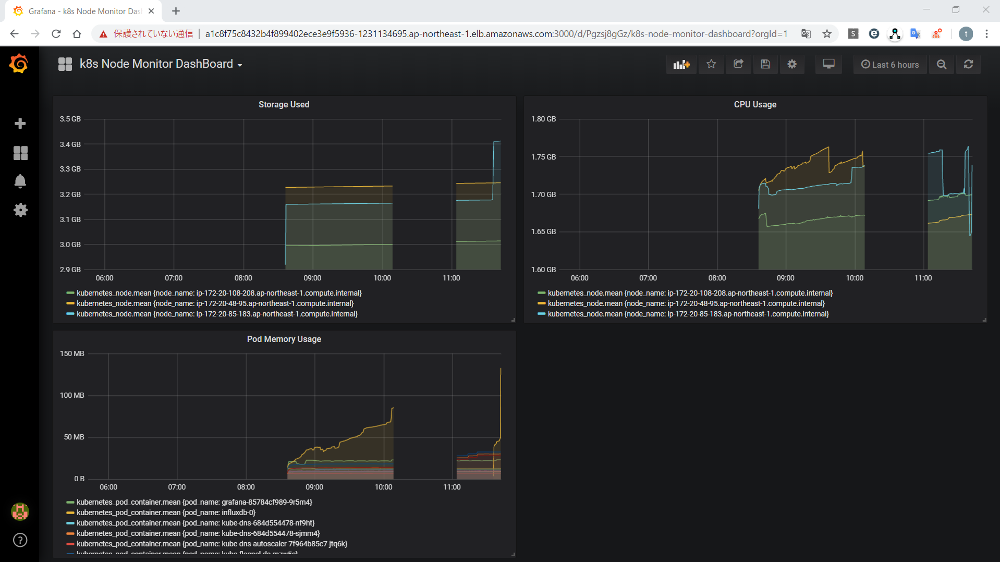

5.  Nodeにスケジュール対象外フラグの設定(`kubectl cordon`)を行ったためそのフラグを削除します。  
    lab-cluster-worker は influxdb-0 Pod がもともと配置されていたNodeです。

```sh
$ kubectl get node lab-cluster-worker
NAME STATUS ROLES AGE VERSION
lab-cluster-worker Ready,SchedulingDisabled <none> 3h39m v1.15.11

// スケジュール対象外フラグ削除
# kubectl uncordon lab-cluster-worker
node/lab-cluster-worker uncordoned

$ kubectl get node lab-cluster-worker
NAME STATUS ROLES AGE VERSION
lab-cluster-worker Ready <none> 3h40m v1.15.11
```

 以上で influxdb-0 Pod のNode移動が完了しました。StatefulSet のようにPVを持つPodを移動する場合、PodとPVのスケジューリングの差異によりPodの作成が失敗する可能性もあるため、Podが利用するPVの `StorageClass` の設定やPVCの設定に注意しましょう。

## ***Step 6(InfluxDB,telegraf,Grafana の削除)***

デプロイしたリソースを削除します。

```sh
$ kubectl delete -f grafana-deploy.yaml
secret "grafana-secret" deleted
deployment.apps "grafana" deleted
service "grafana-svc" deleted
ingress.extensions "grafana" deleted

$ kubectl delete -f telegraf-deploy.yaml
secret "telegraf-secret" deleted
configmap "telegraf-config" deleted
daemonset.apps "telegraf" deleted

$ kubectl delete -f influxdb-deploy.yaml
namespace "monitoring" deleted
secret "influxdb-secret" deleted
statefulset.apps "influxdb" deleted
service "influxdb" deleted

$ kubectl delete -f https://raw.githubusercontent.com/kubernetes/ingress-nginx/master/deploy/static/provider/kind/deploy.yaml
namespace "ingress-nginx" deleted
serviceaccount "ingress-nginx" deleted
configmap "ingress-nginx-controller" deleted
clusterrole.rbac.authorization.k8s.io "ingress-nginx" deleted
clusterrolebinding.rbac.authorization.k8s.io "ingress-nginx" deleted
role.rbac.authorization.k8s.io "ingress-nginx" deleted
rolebinding.rbac.authorization.k8s.io "ingress-nginx" deleted
service "ingress-nginx-controller-admission" deleted
service "ingress-nginx-controller" deleted
deployment.apps "ingress-nginx-controller" deleted
validatingwebhookconfiguration.admissionregistration.k8s.io "ingress-nginx-admission" deleted
clusterrole.rbac.authorization.k8s.io "ingress-nginx-admission" deleted
clusterrolebinding.rbac.authorization.k8s.io "ingress-nginx-admission" deleted
job.batch "ingress-nginx-admission-create" deleted
job.batch "ingress-nginx-admission-patch" deleted
role.rbac.authorization.k8s.io "ingress-nginx-admission" deleted
rolebinding.rbac.authorization.k8s.io "ingress-nginx-admission" deleted
serviceaccount "ingress-nginx-admission" deleted
```

以上で本 Lab は終了となります。Lab 04-1 の Step3 にもどり、`kind` で作成したクラスタを削除しましょう。
