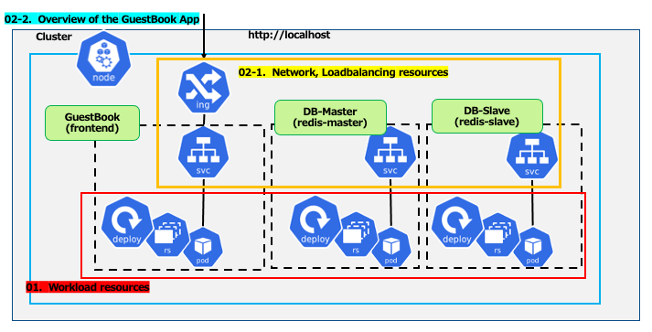
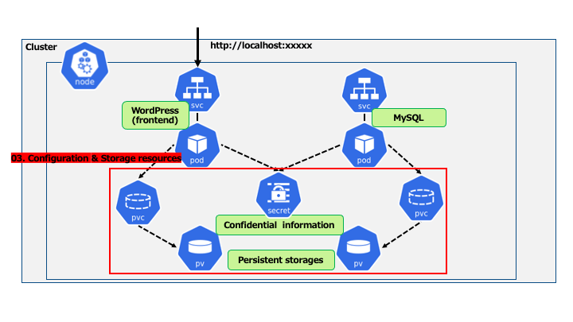

# Kubernetes Learning Overview

## コースの目的

Kubernetes環境を管理・運用するために必要な知識・スキルを習得することを目的とする。

## Kubernetesとは

* コンテナオーケストレーションシステムのデファクトスタンダードである
  * Cloud Native Computing Foundation\(CNCF\)がホストするオープンソースプロジェクト

* クラスタ環境を構成でき、以下のような機能をサポートする
  * ローリングアップグレード
  * セルフヒーリング
  * コンテナの配置先Node\(ホスト\)をスケジューリング\(自動配置\)
  * サービスディスカバリとロードバランシング
  * スケーリング/オートスケーリング
  * 宣言的なコード\(yamlやjson\)によるリソースの管理\(Infrastructure as Code\)

## 補足 – コンテナとは

* ゲストOSを必要としない軽量な仮想環境である
  * ホストOSのカーネルを共有利用する
* アプリケーションにフォーカスしている
  * 必要なミドルウェアや依存ライブラリのパッケージング
* __Docker__ ： コンテナエンジンのデファクトスタンダード

## Kubernetes の運用・管理イメージ

* __クラスタ__
  * MasterとWorkerというServerで構成される
* __kubectl__
  * Kuberenetesクラスタの操作を行うコマンド
  * Master Serverにコマンドによるリクエストが送信される

## コースコンテンツ

* Fundamental
  * Kubernetesの基本要素についての学習です

## Fundamentalコースについて – 前半

  * 目的
    * Kubernetesの基本的な要素について理解する
  * 前半では以下のようなKubernetes独自のリソースの基本について学ぶ  
    ローカルマシンでシングル構成のKubernetes環境を利用
    * __Workload__  __リソース__  __\-1__
      * コンテナの実行に関するリソース
    * __Network、Loadbalancing__  __リソース__
      * コンテナ間通信や、コンテナを外部公開するようなエンドポイントを提供するリソース
  * 前半の最後に学習したリソースを利用し、Kubernetes公式サンプルのGuestBookアプリをデプロイ

## Fundamentalコースについて – 後半

  * 後半では以下のようなKubernetes独自のリソースおよびマルチノード構成の基本について学ぶ
    * __Configuration、Storage__  __リソース__
      * 設定/機密情報/永続化ボリュームなどに関するリソース
    * __Workload__  __リソース__  __\- 2__
      * Storage リソースに関連したリソース
    * __マルチノードKubernetesクラスタ__
      * Network
  * 後半の最後に学習したリソースを利用し、Kubernetesクラスタ監視アプリをデプロイ

## コースアジェンダ – 前半

  * Lecture
    * 00 – Fundamentalコース概要
    * 01 – KubernetesのWorkloadリソースについての学習
    * 02 – KubernetesのNetwork、Loadbalancingリソースについての学習

  * Lab
    * 01 – KubernetesのWorkloadリソースについての実習
    * 02\-1 – KubernetesのNetwork、Loadbalancingリソースについての実習
    * 02\-2 – GuestBookアプリのデプロイ

## コースの流れ – 前半 GuestBookアプリ構成まで

  

## コースアジェンダ – 後半

  * Lecture
    * 03 – KubernetesのConfiguration、Storageリソースについての学習
    * 04 – Kubernetesのマルチノード構成の基本について学ぶ

  * Lab
    * 03\-1 - KubernetesのConfiguration関連のリソースについての実習
    * 03\-2 - KubernetesのStorage関連のリソースについての実習
    * 04\-1 – マルチノードKubernetes環境の準備
    * 04\-2 – クラスタ監視アプリのデプロイ

## コースの流れ – 後半

  

  

## Labで利用するkubernetes環境

  * 前半 - _Docker for Desktop_ を利用したシングルノードクラスタ環境でLabを実施
  * 後半 - _Docker\+kind_ を利用したマルチノードクラスタ環境でLabを実施

  * (参考) その他の __Kubernetes__  __環境の種類__
    * __ローカル__  __Kubernetes__
      * Minikube
      * Docker for Desktop
      * Docker \+ kind
    * __ツールで構築した__  __Kubernetes__  __環境__
      * kubeadm
      * Rancher
      * kops
    * __マネージド__  __Kubernetes__  __サービス__
      * Google Kubernetes Engine\(GKE\)
      * Elastic Container Service for Kubernetes\(EKS\)
      * Azure Kubernetes Service\(AKS\)

# Course Agenda

|Session #|Session                                  | Type  |Contents Description       |Duration (h)|Material                               |
|:-----:|-----------------------------------------|:------:|---------------------------|---|--------------------------------------------|
|1|Kubernetes の Workload リソースについての学習|Lecture|Pod, Replicaset, Deployment|1|[k8s-01_Lec-workloads_resource](../JP/k8s-01_Lec-workloads_resource.md)|
|1|Kubernetes の Workload リソースについての実習|Lab|Pod, Replicaset, Deployment|1|[k8s-01_lab-Pod-RS-Deployment](../JP/k8s-01_lab-Pod-RS-Deployment.md)|
|2|Kubernetes のネットワーク、LB リソースについての学習|Lecture|Service, Ingress, CoreDNS|1|[k8s-02_0_Lec-discovery_lb_resource](../JP/k8s-02_0_Lec-discovery_lb_resource.md)|
|2|Kubernetes のネットワーク、LB リソースについての実習|Lab|Service, Ingress|1|[k8s-02_1_lab-Service-Ingress_internal](../JP/k8s-02_1_lab-Service-Ingress_internal.md)|
|2|GuestBook アプリのデプロイ|Lab|Pod, Replicaset, Deployment, Deploying a sample application|1|[k8s-02_2_lab-GuestBook-Deploy](../JP/k8s-02_2_lab-GuestBook-Deploy.md)|
|3|Kubernetes の Config & Storage リソースについての学習|Lecture|PV, PVC, ConfigMap, Secret, StatefulSet, StorageClass|1| [k8s-03_0_Lec-config_storage_resource](../JP/k8s-03_0_Lec-config_storage_resource.md)|
|3|Kubernetes の Config 関連のリソースについての実習|Lab|ConfigMap, Secret|1|[k8s-03_1_lab-ConfigMap-Secret](../JP/k8s-03_1_lab-ConfigMap-Secret.md)   |
|3|Kubernetes の Storage 関連のリソースについての実習|Lab|StorageClass, PV, PVC|1|[k8s-03_2_lab-Storage](../JP/k8s-03_2_lab-Storage.md)  |
|4|Kubernetesのマルチノード構成の基本について学ぶ|Lecture|Multi-Node cluster, CNI プラグイン, DamesonSet, Ingress + Loadbalancer|1|[k8s-04_0_Lec-multinode](../JP/k8s-04_0_Lec-multinode.md)   |
|4|マルチノード Kubernetes 環境の準備 |Lab| Kind, DaemonSet, Ingress|1|[k8s-04_1_lab-kind_multiplenode_cluster](../JP/k8s-04_1_lab-kind_multiplenode_cluster.md)  |
|4|クラスタ監視アプリのデプロイ|Lab|Kind, DaemonSet, Ingress|1|[k8s-04_2_lab-statefulset-daemonset_env_kind](../JP/k8s-04_2_lab-statefulset-daemonset_env_kind.md)  |

**＊ Lab で使用している material などは [こちら](../../conf) を参照してください**  
**ここにある文書に記載されている操作内容などについては、VANTIQ 株式会社 社内において検証されたものです。ご利用の際は、ご自身の責任においてお願いいたします。**
